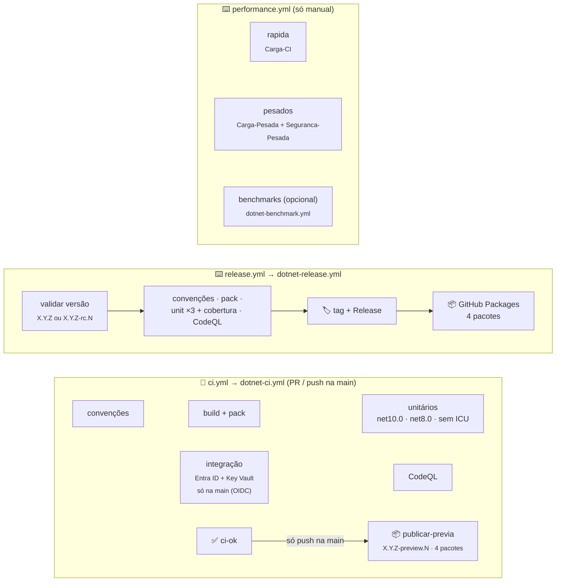

[🏠 TEC.Security](../../README.md) › [📚 Documentação](../../docs/README.md) › ⚙️ CI/CD

# ⚙️ CI/CD e publicação

> Os três workflows do TEC.Security são curtos: chamam os workflows reutilizáveis do
> [tec-workflows](https://github.com/tudoemcodigo/tec-workflows) e só declaram o que é deste repositório (solução, testes,
> parâmetros de carga e Variables do Entra ID e do Azure).

## 📑 Sumário

- [🎯 Visão geral](#-visão-geral)
- [📂 Arquivos](#-arquivos)
- [🔀 ci.yml](#-ciyml)
- [📦 release.yml](#-releaseyml)
- [⏱️ performance.yml](#️-performanceyml)
- [🔑 Variables e Secrets](#-variables-e-secrets)
- [🚀 Como publicar](#-como-publicar)
- [🛡️ Segurança](#️-segurança)
- [❓ Solução de problemas](#-solução-de-problemas)

---

## 🎯 Visão geral

| Evento | Workflow | O que roda | Publica? |
|---|---|---|:---:|
| `pull_request` para a `main` / `merge_group` | `ci.yml` | Convenções, build + pack, unitários em matriz, integração (se pula: sem OIDC em PR), CodeQL → check `ci-ok` | ❌ |
| `push` na `main` (merge) | `ci.yml` | O mesmo, **com** Entra ID e Key Vault de testes via OIDC, e, com `ci-ok` verde, `publicar-previa` | ✅ `<Version>-preview.N` |
| `schedule` segunda 06:00 UTC / manual | `ci.yml` | O mesmo na `main`, **com** Entra ID e Key Vault de testes via OIDC; CodeQL e auditoria com regras e vulnerabilidades novas | ❌ |
| Manual (**Performance**) | `performance.yml` | Input `suite`: `pesadas` (padrão, `Carga-Pesada` + `Seguranca-Pesada`), `rapida` (`Carga-CI`) ou `todas`; parâmetros e, se pedido, benchmarks | ❌ |
| Manual (**Publicar versão**) | `release.yml` | Convenções, pack, unitários ×3 + cobertura e CodeQL, depois tag, Release e push dos 4 pacotes | ✅ `X.Y.Z` ou `-rc.N` |

Os testes de carga não rodam no PR nem na publicação: tempo de parede em runner compartilhado é ruidoso e não pode
bloquear PR nem versão.

> [!NOTE]
> O antigo `codeql.yml` e o script `resumo-testes.py` foram **removidos**: o CodeQL roda dentro do CI central
> (`dotnet-ci.yml`) e o resumo dos testes é feito pela action `test-summary` do tec-workflows.

---

## 📂 Arquivos

| Arquivo | Função |
|---|---|
| [`ci.yml`](ci.yml) | Validação de PR, do push na `main` (com publicação da prévia) e semanal na `main`, com `dotnet-ci.yml@v1` |
| [`release.yml`](release.yml) | Publicação de versão estável ou `-rc.N`, com `dotnet-release.yml@v1` |
| [`performance.yml`](performance.yml) | Testes de carga e benchmarks só sob demanda (manual), com `dotnet-test.yml@v1` e `dotnet-benchmark.yml@v1` |
| [`../dependabot.yml`](../dependabot.yml) · [`../zizmor.yml`](../zizmor.yml) | Canônicos do tec-workflows (não editar aqui) |

Não há scripts de integração (`.github/scripts/`): os testes usam serviços do Azure, e as variáveis chegam por `azure-env`
depois do login OIDC.

---

## 🔀 ci.yml

| Entrada | Valor |
|---|---|
| `solution` | `TEC.Security.slnx` |
| `private-feed` | `true` (depende de `TEC.Core` e `TEC.Vault` do feed `tec-interno`) |
| `unit-tests` | `TEC.Security.Tests /*/*/*/*[Category!=Integracao]` |
| `integration-tests` | `TEC.Security.Tests /*/*/*/*[Category=Integracao]` |
| `azure-client-id` / `azure-tenant-id` | `vars.AZURE_CLIENT_ID` / `vars.TEC_TESTES_TENANT_ID` |
| `azure-env` | Aplicadas **só depois** do login no Azure (tabela abaixo) |

| Variável do teste (`azure-env`) | Vem de |
|---|---|
| `TEC_TESTES_VAULT_URI` | `vars.TEC_TESTES_VAULT_URI` (organização) |
| `TEC_TESTES_TENANT_ID` | `vars.TEC_TESTES_TENANT_ID` (organização) |
| `TEC_TESTES_SECURITY_ENTRA_API_CLIENT_ID` | `vars.TEC_SECURITY_ENTRA_API_CLIENT_ID` (repositório) |
| `TEC_TESTES_SECURITY_ENTRA_CLIENT_ID` | `vars.TEC_SECURITY_ENTRA_CLIENT_ID` (repositório) |
| `TEC_TESTES_SECURITY_ENTRA_CERTIFICATE_NAME` | `vars.TEC_SECURITY_ENTRA_CERTIFICATE_NAME` (repositório) |
| `TEC_TESTES_SECURITY_ENTRA_ROLE` | `vars.TEC_SECURITY_ENTRA_ROLE` (repositório) |

- Gatilhos: `pull_request` e `merge_group` para a `main`, `push` na `main`, `schedule` (segunda 06:00 UTC) e manual.
- Permissões: `contents: read` no topo; o job recebe também `pull-requests`, `actions`, `security-events` (leitura),
  `packages: write` (só o `publicar-previa` publica, no push na `main`) e `id-token: write` (OIDC, usado só na integração).
- No push na `main`, depois do `ci-ok` verde, o job `publicar-previa` publica os 4 pacotes como
  `<Version do Directory.Build.props>-preview.N` (N sequencial por versão, reinicia a cada nova `<Version>`; ex.: `0.0.1-preview.3`). Se a tag `v<Version>` já existe,
  o CI não falha: valida tudo normalmente, o `build + pack` emite um `::notice::` e o `publicar-previa` é pulado (suba a
  `<Version>` para voltar a gerar prévias). Em PR nada é publicado.
- Sem testes de carga: `Carga-CI`, `Carga-Pesada` e `Seguranca-Pesada` ficam no `performance.yml`.
- `concurrency` por ref no PR, cancelando execuções antigas do mesmo PR; fora de PR, um grupo por execução (nenhum push na `main` perde a prévia).
- Em PR o login OIDC não acontece: as variáveis de `azure-env` não chegam e os 2 testes de integração se pulam com o motivo.
- PR só de documentação (`docs/`, LICENSE, CHANGELOG, READMEs de `.github/`) pula os jobs pesados. Os READMEs das pastas dos
  pacotes vão no `.nupkg` e **não** contam como só documentação.

---

## 📦 release.yml

Disparo manual (**Actions → Publicar versão → Run workflow**) com a entrada `versao` (`X.Y.Z` ou `X.Y.Z-rc.N`; prévias
saem do `ci.yml` no push na `main`).

| Entrada | Valor |
|---|---|
| `version` | `${{ inputs.versao }}` |
| `solution` / `private-feed` / `unit-tests` | Os mesmos do `ci.yml` |

Sequência: valida a versão (disparado **da `main`**; a tag `vX.Y.Z` não pode existir) → convenções, pack, unitários ×3
(com relatório de cobertura) e CodeQL em paralelo → só com **todos** verdes cria a tag e o Release e publica os 4
pacotes no GitHub Packages. Sem integração (já passou no PR e no push da `main`) e sem carga.
`concurrency: publicar-versao` sem cancelamento.

Permissões do job: `contents: write` (tag/Release), `packages: write` (push), `actions`/`security-events: read`
(CodeQL), `id-token: write` (exigido pela assinatura do workflow de testes reutilizável).

---

## ⏱️ performance.yml

Só manual (`workflow_dispatch`): os testes de carga não rodam no PR nem na publicação, porque tempo de parede em runner
compartilhado é ruidoso e não pode bloquear PR nem versão.

| Entrada | Padrão | Variável | Uso |
|---|---|---|---|
| `suite` | `pesadas` | — | `pesadas` (job `pesados`), `rapida` (job `rapida`) ou `todas` |
| `soak_segundos` | `600` | `TEC_CARGA_SOAK_SEGUNDOS` | Duração do soak em processo |
| `api_segundos` | `120` | `TEC_CARGA_API_SEGUNDOS` | Carga sustentada na API protegida |
| `tenants` | `100000` | `TEC_CARGA_TENANTS` | Tenants no teste de volume do cadastro |
| `identidades` | `200000` | `TEC_CARGA_IDENTIDADES` | Identidades no teste de volume do cache de permissões |
| `benchmarks` | `false` | — | Roda também o `TEC.Security.Benchmarks` (`dotnet-benchmark.yml`, `net8.0` × `net10.0`) |
| `benchmark_filtro` | `*` | — | Filtro do BenchmarkDotNet |

- Job `rapida`: `TEC.Security.LoadTests [Category=Carga-CI]` (segundos), artefato `carga`.
- Job `pesados`: `TEC.Security.LoadTests [Category=Carga-Pesada]` e `TEC.Security.Tests [Category=Seguranca-Pesada]`,
  `timeout-minutes: 120`, artefato `pesados`. Sem login no Azure.
- Os relatórios de carga são gravados em `$TEC_CARGA_RELATORIOS/carga.md` (pasta definida pelo workflow central) e
  publicados no resumo da execução.
- `concurrency: performance-<ref>` sem cancelamento.

> [!TIP]
> Medição de tempo em runner compartilhado tem ruído: compare **tendências** entre execuções, não números absolutos.

---

## 🔑 Variables e Secrets

**Organização** `tudoemcodigo` (*Settings → Secrets and variables*), com acesso aos repositórios `lib-tec-*`:

| Nome | Tipo | Uso |
|---|---|---|
| `AZURE_CLIENT_ID` | Variable | Application ID da aplicação federada de CI (OIDC) |
| `TEC_TESTES_TENANT_ID` | Variable | Tenant do login e dos testes |
| `TEC_TESTES_VAULT_URI` | Variable | URI do Key Vault exclusivo de testes (`https://<cofre-de-testes>.vault.azure.net/`) |
| `PACKAGES_READ_TOKEN` | Secret **do Dependabot** | PAT classic `read:packages` para o Dependabot restaurar `TEC.Core` e `TEC.Vault` |

**Repositório** `lib-tec-security` (*Settings → Secrets and variables → Actions → Variables*):

| Nome | Uso |
|---|---|
| `TEC_SECURITY_ENTRA_API_CLIENT_ID` | Client id da app registration da API de testes |
| `TEC_SECURITY_ENTRA_CLIENT_ID` | Client id da aplicação cliente de testes |
| `TEC_SECURITY_ENTRA_CERTIFICATE_NAME` | Nome do certificado da aplicação cliente no cofre de testes |
| `TEC_SECURITY_ENTRA_ROLE` | App role da API concedido à aplicação cliente (opcional) |

Elas são repassadas aos testes com o prefixo `TEC_TESTES_SECURITY_*`. O repositório não precisa de nenhum Secret de
Actions: o restore e a publicação usam o `GITHUB_TOKEN` efêmero e o Azure usa OIDC.

Configurar o login federado e as app registrations de teste (uma vez)

1. Entra ID → *App registrations* → aplicação dedicada ao CI (a de `AZURE_CLIENT_ID`).
2. *Certificates & secrets* → **Federated credentials** → *GitHub Actions deploying Azure resources*: organização
   `tudoemcodigo`, repositório `lib-tec-security`, entidade **Branch**, branch `main` (issuer
   `https://token.actions.githubusercontent.com`, audience `api://AzureADTokenExchange`). Use o mesmo formato de subject
   dos outros `lib-tec-*` da organização.
3. No cofre de testes → *Access control (IAM)*: **Key Vault Certificate User** e **Key Vault Crypto User** para a
   aplicação de CI, **somente nesse cofre** (o teste lê o certificado e assina a client assertion no cofre).
4. App registrations de teste: uma **API** (com app role para aplicações) e uma **aplicação cliente** com a permissão de
   aplicação na API (*admin consent*) e o certificado do cofre como credencial.
5. Crie as Variables das tabelas acima.

---

## 🚀 Como publicar

1. As dependências TEC.* (`TEC.Core`, `TEC.Vault`) já estão no feed na versão referenciada.
2. Regenere e commite o lock em modo pacote:
   `dotnet restore TEC.Security.slnx --force-evaluate`.
3. Atualize o [CHANGELOG](../../CHANGELOG.md) e confira a `Version` do `Directory.Build.props`.
4. PR → `ci / ci-ok` verde → merge. O CI do push na `main` publica a prévia `<Version>-preview.N`.
5. Versão estável ou rc: **Actions → Publicar versão → Run workflow** (da `main`) com a versão (ex.: `0.0.1` ou
   `0.0.1-rc.1`).
6. Primeira publicação: em *Package settings* de cada pacote, visibilidade **pública** e acesso dos repositórios da
   organização.
7. Para gerar novas prévias depois de publicar `X.Y.Z`, suba a `Version` do `Directory.Build.props` para a próxima
   (com a tag `v<Version>` existente, o CI da `main` valida tudo, mas não publica prévia até esse ajuste).

| Pacote publicado | Pasta |
|---|---|
| `TEC.Security` | `TEC.Security/` |
| `TEC.Security.AspNetCore` | `TEC.Security.AspNetCore/` |
| `TEC.Security.EntraId` | `TEC.Security.EntraId/` |
| `TEC.Security.Testing` | `TEC.Security.Testing/` |

> [!IMPORTANT]
> Os quatro pacotes saem sempre com a **mesma versão**. O GitHub Packages não permite sobrescrever: uma versão publicada
> não pode ser repetida.

---

## 🛡️ Segurança

| Controle | Como |
|---|---|
| Menor privilégio | `contents: read` no topo; escrita só no `release.yml` e no `publicar-previa` do `ci.yml` (`packages: write`, push na `main`); `id-token: write` só nos jobs de teste |
| Azure sem segredo | OIDC só na `main` e fora de PR; a credencial federada só aceita o subject da `main` |
| Actions fixadas | Terceiros por SHA, tec-workflows por `v1`; `zizmor` audita; Dependabot com cooldown de 7 dias |
| Sem credencial no disco | `persist-credentials: false` em todo checkout (workflows centrais) |
| Sem pacote órfão | Tag + Release antes do push; release só com todos os portões verdes |
| Cadeia de suprimentos | `restore --locked-mode`, `NuGetAudit` como erro, `packageSourceMapping`, CodeQL `security-extended` |

> [!WARNING]
> Dê à aplicação de CI acesso **apenas ao cofre de testes** e use app registrations de teste sem permissões em recursos
> de produção.

---

## ❓ Solução de problemas

Testes de integração aparecem como pulados

Esperado em pull request e no `performance.yml`. Na `main`, confira se as Variables da organização e do repositório
existem e estão liberadas para este repositório, e se o passo de login no Azure (OIDC) concluiu. A mensagem do teste diz o
que faltou.

<code>AADSTS700213</code> / <code>No matching federated identity record</code>

O subject da credencial federada não bate com o da execução (repositório `lib-tec-security`, branch `main`). Confira a
credencial e se o workflow foi disparado da `main`.

Integração falha com <code>VAULT_ACESSO_NEGADO</code> ou certificado não encontrado

A aplicação de CI não tem *Certificate User*/*Crypto User* no cofre de testes (a propagação leva minutos), ou
`TEC_SECURITY_ENTRA_CERTIFICATE_NAME` não corresponde ao nome do certificado.

<code>NU1100</code>, <code>401</code> ou <code>403</code> ao restaurar <code>TEC.Core</code>/<code>TEC.Vault</code>

Pacote ainda não publicado, privado ou sem acesso deste repositório. Publique as dependências antes e libere o acesso em
*Package settings*.

<code>A tag vX.Y.Z já existe</code> / <code>Execute a partir da main</code>

Escolha outra versão ou dispare o **Publicar versão** selecionando a branch `main`.

Push na <code>main</code> não gerou prévia

A `Version` do `Directory.Build.props` já foi lançada (a tag `v<Version>` existe). O CI não falha: valida tudo
(convenções, build + pack, unitários, integração, CodeQL, `ci-ok`), o `build + pack` emite o aviso *"A versão X já foi
publicada (tag vX): nenhuma prévia gerada..."* e o `publicar-previa` é pulado. É o esperado quando o componente fica
numa versão publicada e recebe só correções. Para voltar a gerar prévias, abra um PR subindo a `Version` para a próxima.

---
[🏠 TEC.Security](../../README.md) · [📚 Documentação](../../docs/README.md) · [🧪 Testes](../../docs/testes.md)
