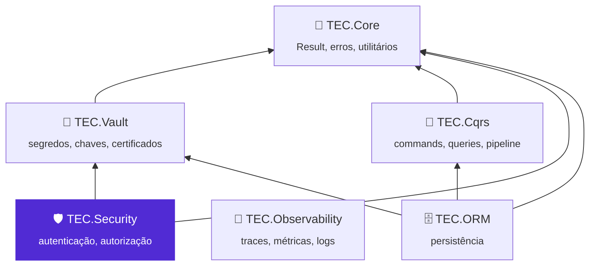
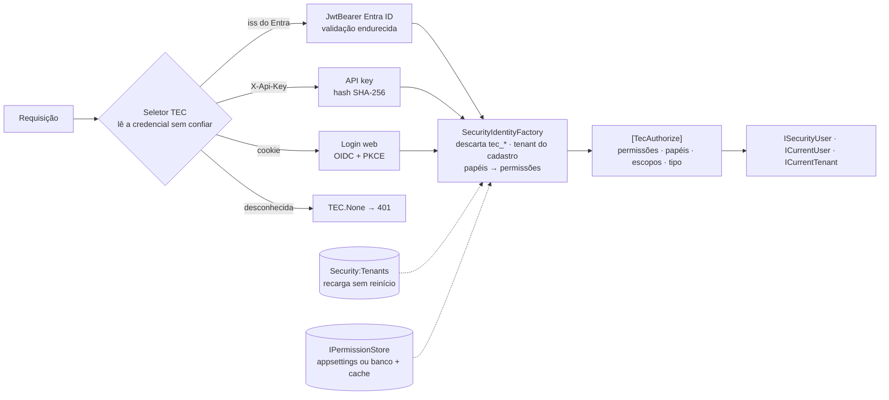

<div align="center">


# 🛡️ TEC.Security

**Autenticação e autorização com uma única API para qualquer provedor de login: fechado por padrão, multi-tenant e sem segredos na aplicação.**

Microsoft Entra ID · Vários provedores ao mesmo tempo · `[TecAuthorize]` por permissão · Tenants por configuração · API keys · Login web (OIDC + PKCE) · Chamadas entre serviços e On-Behalf-Of · Workers · .NET 8 e 10 · Native AOT

[](https://github.com/tudoemcodigo/lib-tec-security/actions/workflows/ci.yml)
[](#-compatibilidade)
[](#-compatibilidade)
[](CHANGELOG.md)
[](LICENSE)

[📥 Instalação](#-instalação) · [🚀 Início rápido](#-início-rápido) · [📚 Documentação](docs/README.md) · [📝 Changelog](CHANGELOG.md) · [⚙️ CI/CD](.github/workflows/README.md)

</div>

---

## 📑 Sumário

- [✨ Por que usar](#-por-que-usar)
- [📦 Pacotes](#-pacotes)
- [🧬 Ecossistema TEC](#-ecossistema-tec)
- [📥 Instalação](#-instalação)
- [🚀 Início rápido](#-início-rápido)
- [🧭 O que tem dentro](#-o-que-tem-dentro)
- [📚 Documentação](#-documentação)
- [⚡ Compatibilidade](#-compatibilidade)
- [🛡️ Segurança](#️-segurança)
- [🧪 Testes](#-testes)
- [🤝 Contribuição](#-contribuição)
- [🏷️ Versionamento](#️-versionamento)
- [📄 Licença](#-licença)

---

## ✨ Por que usar

| Sem o TEC.Security | Com o TEC.Security |
|---|---|
| Cada sistema configura `AddJwtBearer` de um jeito; alguém desliga `ValidateAudience` "para funcionar" | Validação endurecida em todo provedor; os controles obrigatórios **não podem** ser desligados (a aplicação não sobe), nem por `PostConfigure` |
| Endpoint esquecido sem `[Authorize]` fica público | Fechado por padrão: sem atributo, exige identidade; `[TecAuthorize]` + `[AllowAnonymous]` impede a subida |
| Código lê `roles`, `scp`, `realm_access`... de cada provedor | `ISecurityUser` com id, tenant, papéis, escopos e permissões normalizados, iguais para qualquer provedor |
| Multi-tenant aceitando "qualquer tenant" do Entra ID | Só tenants **ativos** no cadastro (appsettings com recarga, ou banco); desativar vale na próxima requisição |
| Claim `permissions` injetado por um IdP mal configurado vira permissão | Claims `tec_*` vindos do provedor são descartados; tenant e permissões vêm do cadastro da aplicação |
| Client secret no `appsettings` para chamar outra API | Identidade gerenciada federada, Workload Identity ou certificado assinando **dentro** do cofre |
| Token de serviço enviado para qualquer URL (SSRF) | Token anexado só aos `AllowedHosts`, com HTTPS |
| 401/403 em formatos diferentes, com o motivo da recusa | `ApiResponse` padrão do TEC.Core; motivo só no log de auditoria e nas métricas |

- ✅ **Um atributo para tudo:** `[TecAuthorize]` em controllers, Minimal APIs, gRPC, hubs SignalR e Blazor.
- ✅ **Vários provedores ao mesmo tempo:** o esquema é escolhido por requisição (emissor, header, cookie).
- ✅ **Seguro sob carga:** limites contra tokens inflados, cache de permissões com uma consulta por identidade, tempo
  constante nas API keys, nada de token ou segredo em log.
- ✅ **Fora do HTTP também:** identidade de sistema e `RunAs` para workers e filas.

## 📦 Pacotes

| Pacote | Para que serve | Quando instalar | Depende de |
|---|---|---|---|
| [`TEC.Security`](TEC.Security/README.md) | Núcleo sem ASP.NET Core: `ISecurityUser`, `ICurrentUser`, `ICurrentTenant`, `ISecurityContext`, tenants, `IPermissionStore`, API keys, `AccessTokenHandler`, erros e telemetria | Vem com os outros; sozinho em workers sem HTTP | `TEC.Core`, `Microsoft.Extensions.*` |
| [`TEC.Security.AspNetCore`](TEC.Security.AspNetCore/README.md) | Escolha do provedor por requisição, JWT endurecido, `[TecAuthorize]`, políticas fechadas, 401/403 padronizados, API key, login web, base para provedores | APIs e sites ASP.NET Core (vem com o provedor) | `TEC.Security`, `Microsoft.AspNetCore.Authentication.JwtBearer` e `.OpenIdConnect` |
| [`TEC.Security.EntraId`](TEC.Security.EntraId/README.md) | Microsoft Entra ID: API, login web, client credentials e On-Behalf-Of, multi-tenant pelo cadastro, credenciais sem segredo | Aplicações que usam o Entra ID | `TEC.Security.AspNetCore`, `TEC.Vault`, `Azure.Identity` |
| [`TEC.Security.Testing`](TEC.Security.Testing/README.md) | Emissor de tokens para testar **a sua** API, bloqueado fora de Development, Testing e Test | Projetos de teste | `TEC.Security.AspNetCore` |

Os quatro pacotes saem sempre com a mesma versão e trazem `lib/net8.0` e `lib/net10.0`, a documentação XML em português e
um README próprio.

## 🧬 Ecossistema TEC



O TEC.Security decide **quem** executa cada operação. A identidade que ele normaliza chega aos outros componentes pelo
`ICurrentUser` do TEC.Core, sem que eles dependam dele.

| Componente | Relação com o TEC.Security |
|---|---|
| 🧰 [TEC.Core](https://github.com/tudoemcodigo/lib-tec-core) | Dependência: `ICurrentUser` (implementado aqui), `Result`/`Error`, `AppException`, `ApiResponse`, `SingleFlight`, `Base64UrlEncoder`, `BoundedFileReader` |
| 🔐 [TEC.Vault](https://github.com/tudoemcodigo/lib-tec-vault) | Dependência do `TEC.Security.EntraId`: certificado e segredo da aplicação; client assertion assinada no cofre |
| 🧭 [TEC.Cqrs](https://github.com/tudoemcodigo/lib-tec-cqrs) | Independente: `[AuthorizeRequest]` avalia a identidade normalizada |
| 🗄️ [TEC.ORM](https://github.com/tudoemcodigo/lib-tec-orm) | Independente: a auditoria lê o `ICurrentUser` registrado aqui |
| 📡 [TEC.Observability](https://github.com/tudoemcodigo/lib-tec-observability) | Independente: assina o Meter e o ActivitySource `TEC.Security` |

## 📥 Instalação

Os pacotes estão no **GitHub Packages** da organização `tudoemcodigo`, que sempre exige autenticação (mesmo para leitura).
Crie um PAT *classic* com o escopo `read:packages`, registre a origem com o nome `tec-interno` e instale o provedor (ele
traz `TEC.Security.AspNetCore` e `TEC.Security`):

```bash
dotnet nuget add source https://nuget.pkg.github.com/tudoemcodigo/index.json -n tec-interno -u <usuario> -p <PAT>

dotnet add package TEC.Security.EntraId --version 0.0.1
dotnet add package TEC.Security.Testing --version 0.0.1    # só no projeto de testes
```

> [!IMPORTANT]
> Versão atual: **0.0.1** (ainda não publicada). Para evitar *dependency confusion*, mapeie `TEC.*` só para a origem
> `tec-interno` no `nuget.config` da aplicação (`packageSourceMapping`).

## 🚀 Início rápido

**1. Configure a API, os tenants e as permissões** no `appsettings.json` (nenhum valor é segredo):

```json
{
  "Security": {
    "RequireTenant": true,
    "EntraId": {
      "Api": { "TenantId": "<tenant-id>", "ClientId": "<client-id-da-api>", "MultiTenant": true }
    },
    "Tenants": {
      "contoso": { "Name": "Contoso", "IdentityProviders": { "EntraId": [ "<tenant-id-do-cliente>" ] } }
    },
    "Permissions": {
      "Roles": { "Gerente": [ "pedidos:ler", "pedidos:cancelar" ] }
    }
  }
}
```

**2. Registre a segurança** no `Program.cs`:

```csharp
using TEC.Security.Abstractions;
using TEC.Security.AspNetCore;
using TEC.Security.AspNetCore.Authorization;
using TEC.Security.DependencyInjection;
using TEC.Security.EntraId;

var builder = WebApplication.CreateBuilder(args);

builder.Services.AddTecSecurity(builder.Configuration, security => security
    .AddAspNetCore()
    .AddEntraIdApi("Funcionarios", builder.Configuration.GetSection("Security:EntraId:Api")));

var app = builder.Build();

app.MapGet("/pedidos", (ISecurityUser usuario) => $"Pedidos do tenant {usuario.TenantId}")
   .RequireTecAuthorization(permissions: "pedidos:ler");
app.MapGet("/saude", () => "ok").AllowAnonymous();

app.Run();
```

**3. Proteja controllers** com o mesmo atributo:

```csharp
using Microsoft.AspNetCore.Mvc;
using TEC.Security.AspNetCore.Authorization;

[ApiController, Route("pedidos")]
[TecAuthorize(Permissions = "pedidos:ler")]
public sealed class PedidosController : ControllerBase
{
    [HttpDelete("{id:guid}"), TecAuthorize(Permissions = "pedidos:cancelar", Kinds = TecPrincipalKinds.User)]
    public IActionResult Cancelar(Guid id) => NoContent();
}
```

Endpoints sem atributo já exigem identidade, 401/403 saem no formato do TEC.Core e configuração errada ou insegura derruba
a **subida**, não a primeira requisição. App registration, login web, API keys e workers: [📚 documentação](docs/README.md).

## 🧭 O que tem dentro



| Recurso | Peças principais |
|---|---|
| 👤 Identidade normalizada | `ISecurityUser`, `TecClaimTypes`, `SecurityIdentityFactory`, `ExternalIdentity` |
| 🔐 Autorização | `[TecAuthorize]`, `RequireTecAuthorization`, `TecPrincipalKinds`, `FallbackPolicy` fechada |
| 🏢 Tenants e permissões | `ITenantRegistry`, `ICurrentTenant`, `IPermissionStore`, `UsePermissionStore<T>()` com cache |
| 🪪 Entra ID | `AddEntraIdApi`, `AddEntraIdWebLogin`, `MapTecWebLogin`, credenciais `ManagedIdentityFederation`/`WorkloadIdentity`/`Certificate` |
| 🔁 Serviços | `AddEntraIdClient`, `AddEntraIdAccessToken`, `AddEntraIdOnBehalfOf`, `CachingAccessTokenProvider` |
| 🔑 API keys | `ApiKeyGenerator`, `AddApiKeys`, `Security:ApiKeys` |
| 🤖 Workers | `ISecurityContext.CreateSystemPrincipalAsync`, `RunAs` |
| 🧱 Extensão | `AddJwtBearerProvider`, `AddWebLoginProvider`, `JwtHardening` |
| 🧪 Testes | `TestTokenIssuer`, `AddTestJwt` |

## 📚 Documentação

| Arquivo | O que responde |
|---|---|
| [⚙️ Configuração](docs/configuracao.md) | Como registrar, todas as chaves de `Security`, recarga e validações na subida |
| [🔐 Autorização](docs/autorizacao.md) | Como usar `[TecAuthorize]`, o que é fechado por padrão, 401 × 403 |
| [👤 Identidade e permissões](docs/identidade-e-permissoes.md) | `ISecurityUser`, claims normalizados, fonte de permissões e cache |
| [🏢 Tenants](docs/tenants.md) | Cadastro de tenants, vínculo com o Entra ID, cadastro em banco |
| [🪪 Provedor Entra ID](docs/provedor-entra-id.md) | API, login web, credenciais sem segredo, multi-tenant, app registration |
| [🔁 Chamadas entre serviços](docs/chamadas-entre-servicos.md) | Client credentials, On-Behalf-Of, `AllowedHosts`, falhas do provedor |
| [🔑 API keys](docs/api-keys.md) | Gerar, cadastrar, rotacionar e limitar tentativas |
| [🤖 Workers](docs/workers.md) | Identidade de sistema, `RunAs`, filas e TEC.Cqrs fora do HTTP |
| [🧱 Novo provedor](docs/novo-provedor.md) | Como plugar outro IdP com as mesmas garantias |
| [🧬 Integrações TEC](docs/integracoes-tec.md) | Core, Vault, Cqrs, ORM e Observability |
| [📈 Observabilidade](docs/observabilidade.md) | Métricas, traces, eventos de log e alertas |
| [❌ Erros](docs/erros.md) | Códigos de `SecurityErrors`, respostas e exceções |
| [🛡️ Segurança](docs/seguranca.md) | Modelo de ameaças, controles com os testes, limites, riscos residuais e checklist |
| [🧪 Testes](docs/testes.md) | Testar a sua API; categorias, integração, carga, variáveis `TEC_TESTES_*`/`TEC_CARGA_*` |
| [💻 Desenvolvimento local](docs/desenvolvimento.md) | Como compilar (feed `tec-interno` por padrão, repositórios vizinhos sob demanda) e regenerar lock files |
| [⚙️ CI/CD](.github/workflows/README.md) | Workflows, gatilhos, Variables e como publicar |

## ⚡ Compatibilidade

| Item | Suporte |
|---|---|
| .NET | `net8.0` e `net10.0` (LTS), mesma API pública; pacotes de autenticação do ASP.NET Core da versão de cada runtime |
| Native AOT / trimming | ✅ `IsAotCompatible` em todos os pacotes: binding de configuração gerado em compilação, JSON do 401/403 com `JsonSerializerContext`, logs por *source generator* |
| Sem ICU (`InvariantGlobalization`) | ✅ testado no CI (todos os formatos aceitam só ASCII) |
| Hospedagem | Controllers, Razor Pages, Minimal APIs, gRPC, SignalR (inclusive métodos de hub), Blazor (`AuthorizeRouteView`), workers |
| Nuvens do Entra ID | Pública, US Gov e China |
| Sistemas | Windows, Linux e macOS; containers e Kubernetes (Workload Identity) |

## 🛡️ Segurança

Zero Trust: todo token é validado por inteiro (algoritmos só RS\*/PS\*/ES\*, emissor exato, audiência, validade de 30 s de
tolerância), claims `tec_*` do provedor são descartados, o tenant vem só do cadastro, as respostas não revelam o motivo da
recusa e nenhum token, segredo ou dado pessoal vai para log, trace ou métrica.

> [!CAUTION]
> Autorização não isola dados: filtre as consultas pelo `TenantId` da identidade. O componente também **não** faz rate
> limiting: use o `RateLimiter` do ASP.NET Core ou o gateway. Modelo de ameaças e checklist:
> [docs/seguranca.md](docs/seguranca.md). Vulnerabilidades: não abra *issue* pública; escreva para
> [roberto@roberto.inf.br](mailto:roberto@roberto.inf.br).

## 🧪 Testes

```bash
dotnet test --project TEC.Security.Tests -c Release --treenode-filter "/*/*/*/*[Category!=Integracao]"       # unitários
dotnet test --project TEC.Security.Tests -c Release --treenode-filter "/*/*/*/*[Category=Integracao]"        # pula sem ambiente
dotnet test --project TEC.Security.LoadTests -c Release --treenode-filter "/*/*/*/*[Category=Carga-CI]"      # carga rápida
```

181 testes unitários por TFM em `TEC.Security.Tests` (TUnit + FsCheck: ponta a ponta, fuzzing, DoS, vazamento, tempo
constante), 2 de integração com Entra ID e Key Vault reais (`Integracao`, pulados com motivo sem as variáveis
`TEC_TESTES_*`), 8 de carga rápida (`Carga-CI`), 3 `Seguranca-Pesada` e 6 `Carga-Pesada`, estes três grupos só sob
demanda no `performance.yml` manual. Para testar a **sua** API, use o `TEC.Security.Testing`. Detalhes em
[docs/testes.md](docs/testes.md).

## 🤝 Contribuição

Branch a partir da `main` → código **e** testes (inclusive entradas hostis) → `dotnet test` nos dois alvos → CHANGELOG e
`docs/` atualizados → pull request com o check `ci / ci-ok` verde. Como compilar (credencial do feed `tec-interno`,
modo local com `-p:TecUseLocalProjects=true`): [docs/desenvolvimento.md](docs/desenvolvimento.md).

## 🏷️ Versionamento

[SemVer](https://semver.org/lang/pt-BR/), uma versão para os quatro pacotes (`Directory.Build.props`). Enquanto for `0.x`,
mudanças incompatíveis podem ocorrer em versões MINOR; um membro novo em interface (`ISecurityUser`, `ITenantRegistry`,
`IPermissionStore`, `IAccessTokenProvider`) ou uma validação que recusa configuração antes aceita contam como incompatíveis.
Cada merge na `main` publica a prévia `<Version>-preview.N`; versões estáveis e `-rc.N` saem só pelo workflow
**Publicar versão** ([CI/CD](.github/workflows/README.md)).

## 📄 Licença

[MIT](LICENSE) · Criado e mantido por **Roberto Oliveira**, equipe **Tudo em Código** · [github.com/tudoemcodigo](https://github.com/tudoemcodigo)
