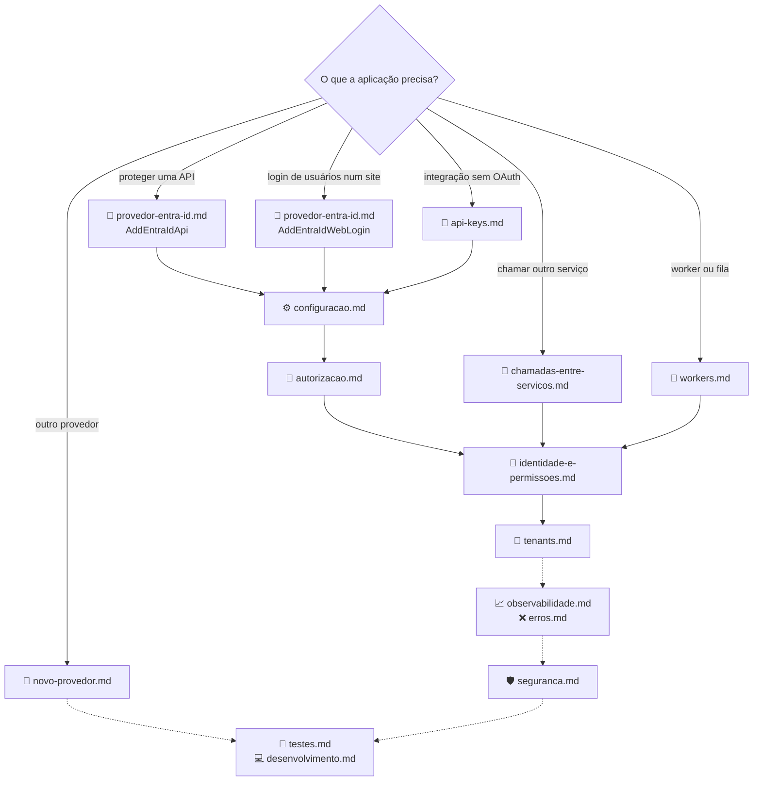

[🏠 TEC.Security](../README.md) › 📚 Documentação

# 📚 Documentação do TEC.Security

> Referência completa dos quatro pacotes (`TEC.Security`, `TEC.Security.AspNetCore`, `TEC.Security.EntraId` e
> `TEC.Security.Testing`): como usar, opções, erros e cuidados de segurança, conferidos com o código.

## 📑 Sumário

- [🗂️ Temas](#️-temas)
- [🗺️ Mapa dos temas](#️-mapa-dos-temas)
- [📐 Convenções desta documentação](#-convenções-desta-documentação)

---

## 🗂️ Temas

| # | Tema | O que responde |
|:-:|---|---|
| 1 | [⚙️ Configuração](configuracao.md) | Como registrar (`AddTecSecurity`, `SecurityBuilder`, `AddAspNetCore`), todas as chaves da seção `Security`, recarga e o que impede a subida |
| 2 | [🔐 Autorização](autorizacao.md) | Como exigir permissões, papéis, escopos, tipos e esquemas com `[TecAuthorize]`/`RequireTecAuthorization`; fechado por padrão; 401 × 403 |
| 3 | [👤 Identidade e permissões](identidade-e-permissoes.md) | `ISecurityUser`, claims normalizados, `SecurityIdentityFactory`, `IPermissionStore`, cache de permissões, `SecurityRules` |
| 4 | [🏢 Tenants](tenants.md) | Cadastro de tenants, vínculo com os tenants dos provedores, recarga sem reinício, `ITenantRegistry` próprio |
| 5 | [🪪 Provedor Entra ID](provedor-entra-id.md) | API protegida, login web (OIDC + PKCE), credenciais sem segredo, multi-tenant, app registration |
| 6 | [🔁 Chamadas entre serviços](chamadas-entre-servicos.md) | Client credentials e On-Behalf-Of em `HttpClient`, `AllowedHosts`, `CachingAccessTokenProvider`, falhas do provedor |
| 7 | [🔑 API keys](api-keys.md) | Gerar, cadastrar, rotacionar e limitar tentativas de API keys guardadas só como hash |
| 8 | [🤖 Workers](workers.md) | Identidade de sistema, `RunAs`, mensageria e TEC.Cqrs fora do HTTP |
| 9 | [🧱 Novo provedor](novo-provedor.md) | Como plugar outro IdP: `JwtProviderDefinition`, `WebLoginDefinition`, `JwtHardening` e a lista de algoritmos |
| 10 | [🧬 Integrações TEC](integracoes-tec.md) | TEC.Core, TEC.Vault, TEC.Cqrs, TEC.ORM e TEC.Observability |
| 11 | [📈 Observabilidade](observabilidade.md) | Métricas, traces, eventos de log e alertas |
| 12 | [❌ Erros](erros.md) | `SecurityErrors`, respostas 401/403, exceções e diagnóstico |
| 13 | [🛡️ Segurança](seguranca.md) | Modelo de ameaças com o teste de cada controle, controles obrigatórios, limites, riscos residuais e checklist |
| 14 | [🧪 Testes](testes.md) | `TEC.Security.Testing` para a sua API; categorias, segurança, integração, carga, benchmarks e variáveis `TEC_TESTES_*`/`TEC_CARGA_*` |
| 15 | [💻 Desenvolvimento local](desenvolvimento.md) | Como compilar (feed `tec-interno` por padrão, repositórios vizinhos sob demanda) e regenerar lock files |

Fora de `docs/`: [⚙️ CI/CD](../.github/workflows/README.md) · [📝 Changelog](../CHANGELOG.md) · READMEs dos pacotes
([TEC.Security](../TEC.Security/README.md), [AspNetCore](../TEC.Security.AspNetCore/README.md),
[EntraId](../TEC.Security.EntraId/README.md), [Testing](../TEC.Security.Testing/README.md)).

---

## 🗺️ Mapa dos temas

---

## 📐 Convenções desta documentação

| Convenção | Significado |
|---|---|
| Fonte da verdade | O código atual: nomes, assinaturas, padrões, códigos de erro, eventos de log e métricas foram conferidos nele |
| Estrutura | Cada tema tem breadcrumb, 📑 Sumário, 🎯 Visão geral, 🚀 Uso, ⚙️ Opções, ❌ Erros, 🛡️ Segurança, ❓ Perguntas frequentes e rodapé de navegação |
| Termos | *Identidade normalizada*: principal criado pelo `SecurityIdentityFactory` (claims `tec_*` com a marca `tec_normalized`). *Provedor*: tipo de IdP (`EntraId`, `ApiKey`, `Test`, `System`). *Esquema*: nome de registro no ASP.NET Core (ex.: `Funcionarios`) |
| `Result` | Métodos que retornam `Result`/`Result<T>` do [TEC.Core](https://github.com/tudoemcodigo/lib-tec-core) usam os códigos de [`SecurityErrors`](erros.md); recusas de credencial nunca lançam: viram 401/403 |
| Configuração inválida | Falha na **subida** (`InvalidOperationException` ou `OptionsValidationException`), citando o esquema e a regra |
| Placeholders | Valores entre `< >` (`<tenant-id>`, `<client-id-da-api>`, `<nome-do-cofre>`) são do seu ambiente; `contoso`, `Funcionarios` e `pedidos:ler` são exemplos |
| `CancellationToken` | Omitido das tabelas quando é o último parâmetro opcional |
| Alertas | `[!NOTE]` comportamento · `[!TIP]` boa prática · `[!IMPORTANT]` requisito · `[!WARNING]` armadilha · `[!CAUTION]` risco de segurança |

---
[🏠 README](../README.md) · [⚙️ Configuração](configuracao.md) ➡️
