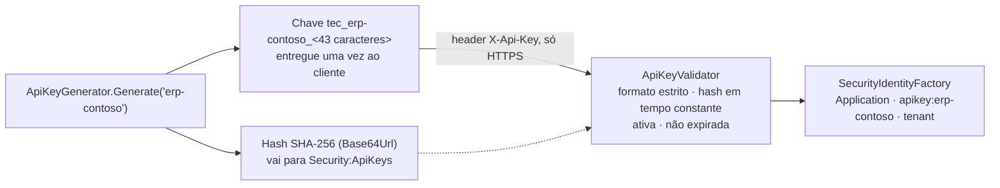
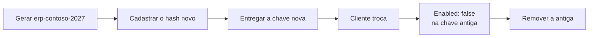

[🏠 TEC.Security](../README.md) › [📚 Documentação](README.md) › 🔑 API keys

# 🔑 API keys

> Como autenticar integrações que não falam OAuth (ERP, scripts, parceiros) com chaves de 256 bits guardadas só como hash,
> com validade obrigatória, tenant e permissões próprias.

## 📑 Sumário

- [🎯 Visão geral](#-visão-geral)
- [🚀 Uso](#-uso)
  - [Gerar uma chave](#gerar-uma-chave)
  - [Cadastrar e habilitar](#cadastrar-e-habilitar)
  - [Chamar a API](#chamar-a-api)
  - [Rotacionar e revogar](#rotacionar-e-revogar)
  - [Limitar tentativas](#limitar-tentativas)
- [⚙️ Opções](#️-opções)
- [❌ Erros](#-erros)
- [🛡️ Segurança](#️-segurança)
- [❓ Perguntas frequentes](#-perguntas-frequentes)

---

## 🎯 Visão geral



| Característica | Detalhe |
|---|---|
| Formato | `tec_{id}_{segredo}`: id público (minúsculas, dígitos e hífen, 3 a 40) + 32 bytes aleatórios em Base64Url canônico do TEC.Core (43 caracteres) |
| Armazenamento | Só o SHA-256 do segredo, em Base64Url (43 caracteres). O segredo nunca é guardado nem registrado |
| Comparação | Hash sempre calculado e comparado em tempo constante, inclusive para id desconhecido (o tempo não revela quais ids existem) |
| Identidade | `Application`, id `apikey:{id}`, `ClientId` = id, nome = `Name` (ou o id), tenant e papéis/permissões do cadastro |
| Transporte | Só no header configurado (padrão `X-Api-Key`), só por HTTPS (fora de Development). Nunca na query string |
| Validade | `ExpiresOn` **obrigatório**: chave sem validade é recusada |

Por ter 256 bits de entropia, um hash rápido basta (não há dicionário possível). O prefixo `tec_` permite que ferramentas
de varredura de segredos (ex.: GitHub secret scanning com padrão personalizado) encontrem chaves vazadas.

---

## 🚀 Uso

### Gerar uma chave

```csharp
using TEC.Security.ApiKeys;

var nova = ApiKeyGenerator.Generate("erp-contoso");
Console.WriteLine(nova.Key);    // entregue ao ERP por canal seguro, uma única vez, e não guarde
Console.WriteLine(nova.Hash);   // vai para Security:ApiKeys:Keys:erp-contoso:Hash
// nova.ToString() mostra KeyId e Hash, nunca a chave
```

Rode num utilitário interno ou num teste descartável; a chave não pode ser recuperada depois (só o hash fica).

### Cadastrar e habilitar

```json
"Security": {
  "ApiKeys": {
    "HeaderName": "X-Api-Key",
    "Keys": {
      "erp-contoso": {
        "Hash": "<hash gerado por ApiKeyGenerator>",
        "Name": "ERP da Contoso",
        "TenantId": "contoso",
        "Roles": [],
        "Permissions": [ "pedidos:ler", "pedidos:criar" ],
        "Enabled": true,
        "ExpiresOn": "2027-06-30T00:00:00Z"
      }
    }
  }
}
```

```csharp
builder.Services.AddTecSecurity(builder.Configuration, security => security
    .AddAspNetCore()
    .AddApiKeys());   // esquema "ApiKey"
```

```csharp
// Endpoint só para integrações por API key
app.MapPost("/integracao/pedidos", () => Results.Ok())
   .RequireTecAuthorization(permissions: "pedidos:criar", schemes: "ApiKey", kinds: TecPrincipalKinds.Application);
```

O cadastro é recarregado sem reiniciar (inclusive `HeaderName`). O `TenantId` da chave precisa existir e estar ativo em
`Security:Tenants`.

### Chamar a API

```bash
curl -H "X-Api-Key: tec_erp-contoso_<segredo>" https://api.contoso.com/integracao/pedidos -X POST
```

Se a requisição trouxer também `Authorization`, o token bearer tem precedência na escolha do esquema.

### Rotacionar e revogar



- O id faz parte da chave: rotacionar é **gerar outra chave com outro id** e manter as duas ativas durante a troca.
- Revogar na hora: `"Enabled": false` (ou remover a entrada). Vale na próxima requisição.
- Use validades curtas (ex.: 6 a 12 meses) e um alerta no log 3110 com motivo `chave expirada`.

### Limitar tentativas

O componente **não** faz rate limiting. Proteja os endpoints que aceitam API key com o `RateLimiter` do ASP.NET Core (ou
no gateway/WAF):

```csharp
using System.Threading.RateLimiting;
using Microsoft.AspNetCore.RateLimiting;

builder.Services.AddRateLimiter(o =>
{
    o.RejectionStatusCode = StatusCodes.Status429TooManyRequests;
    o.AddPolicy("integracao", http => RateLimitPartition.GetFixedWindowLimiter(
        http.Connection.RemoteIpAddress?.ToString() ?? "desconhecido",
        _ => new FixedWindowRateLimiterOptions { PermitLimit = 60, Window = TimeSpan.FromMinutes(1) }));
});

app.UseRateLimiter();
app.MapGroup("/integracao").RequireRateLimiting("integracao").RequireTecAuthorization(schemes: "ApiKey");
```

---

## ⚙️ Opções

**`ApiKeyOptions`** (seção `Security:ApiKeys`, com recarga)

| Chave | Padrão | Descrição |
|---|---|---|
| `HeaderName` | `X-Api-Key` | Header da chave: letras, dígitos e hífen; nunca `Authorization` |
| `Keys` | vazio | Chaves por id (o id faz parte da chave) |

**`ApiKeyDefinition`**

| Chave | Padrão | Descrição |
|---|---|---|
| `Hash` | — | **Obrigatório.** SHA-256 do segredo em Base64Url canônico (43 caracteres), como gerado por `ApiKeyGenerator` |
| `Name` | `null` | Nome de exibição (ex.: sistema integrado) |
| `TenantId` | `null` | Tenant da aplicação (precisa existir e estar ativo) |
| `Roles` | vazio | Papéis da chave (convertidos pelo `IPermissionStore`) |
| `Permissions` | vazio | Permissões diretas (somadas às do `IPermissionStore`) |
| `Enabled` | `true` | Chave ativa |
| `ExpiresOn` | — | **Obrigatório.** Expiração (UTC) |

**`ApiKeyGenerator`** (`TEC.Security.ApiKeys`, estático)

| Membro | Descrição |
|---|---|
| `Generate(string keyId)` | Nova chave → `GeneratedApiKey` (`KeyId`, `Key`, `Hash`; `ToString()` sem a chave) |
| `ComputeHash(string secret)` | SHA-256 (Base64Url) do segredo |
| `Prefix` / `SecretBytes` / `MaxKeyLength` | `"tec_"` / `32` / `128` |

**`ApiKeyValidator`** (Singleton): `ProviderName` (`"ApiKey"`), `HeaderName`, `Validate(string? presented, string scheme = "ApiKey")`
→ `ExternalIdentity?` (`null` = recusada; motivo só no log).

**`AddApiKeys(string scheme = "ApiKey")`** registra o esquema. `SecurityAspNetCoreOptions.ApiKeyRequiresHttps` (padrão
`true`, desligado em Development) exige HTTPS.

---

## ❌ Erros

| Erro | Quando ocorre | O que fazer |
|---|---|---|
| `ArgumentException` | `Generate` com id fora do formato | Minúsculas, dígitos e hífen, 3 a 40 |
| `OptionsValidationException` na subida | `HeaderName` inválido ou `Authorization`; id fora do formato; entrada vazia; `Hash` ausente, malformado ou **não canônico**; `ExpiresOn` ausente; `TenantId`, papel ou permissão fora do formato | Corrija o cadastro (as mensagens nunca contêm hashes) |
| Log 3111 (uma vez por versão inválida) | Recarga inválida do cadastro | Ignorada: a última versão válida continua valendo. A releitura acontece no máximo 1×/s |
| `InvalidOperationException` | `AddApiKeys` duas vezes, ou sem `AddAspNetCore` | Registre uma vez, depois de `AddAspNetCore()` |
| 401 + log 3110 (auditoria, com o id) | `formato inválido`, `id desconhecido`, `segredo incorreto`, `chave desativada`, `chave expirada`, `cadastro inválido` | Gere outra chave ou corrija o cadastro |
| 401 + log 3202 | `mais de um header de API key`, `API key recebida sem HTTPS` | Um header só; HTTPS (atrás de proxy, `UseForwardedHeaders`) |
| 401 + log 3001 | Tenant da chave inexistente ou inativo | Cadastre/ative o tenant |

Toda recusa responde igual (401 `SEGURANCA_NAO_AUTENTICADO`): o cliente não descobre se o id existe.

---

## 🛡️ Segurança

> [!CAUTION]
> Não há limite de tentativas no componente: sem `RateLimiter` (ou gateway), um atacante pode testar chaves livremente
> (inviável pela entropia, mas gera carga e ruído). Veja [Limitar tentativas](#limitar-tentativas).

> [!WARNING]
> Logs de acesso de proxies, APM e servidores costumam registrar headers. Mascare o header da API key (e `Authorization`)
> em toda a cadeia.

- Formato estrito e canônico: variações de uma mesma chave (bits finais diferentes no Base64Url) são recusadas; entradas
  acima de 128 caracteres nem são processadas.
- O hash cadastrado também precisa ser canônico (recusado na validação das opções).
- Os buffers com o segredo gerado são zerados depois do uso.
- Uma recarga inválida do cadastro nunca libera chaves: vale a última versão válida (ou nenhuma).

---

## ❓ Perguntas frequentes

<details>
<summary>Perdi a chave. Consigo recuperá-la?</summary>

Não: só o hash foi guardado. Gere outra chave (com outro id) e desative a antiga.

</details>

<details>
<summary>Posso aceitar a chave na query string?</summary>

Não. A query string aparece em logs e históricos; a chave só é lida do header configurado.

</details>

<details>
<summary>A chave é válida, mas recebo 401.</summary>

Chave expirada, desativada, sem `ExpiresOn`, tenant inativo, dois headers ou requisição sem HTTPS fora de Development. O
log 3110 (ou 3202) traz o motivo e o id.

</details>

---
⬅️ [🔁 Chamadas entre serviços](chamadas-entre-servicos.md) · [📚 Índice](README.md) · [🤖 Workers](workers.md) ➡️
