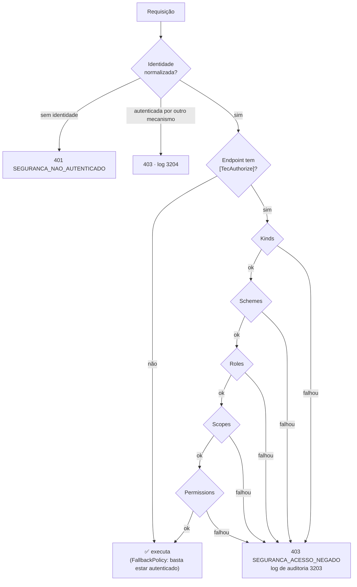

[🏠 TEC.Security](../README.md) › [📚 Documentação](README.md) › 🔐 Autorização

# 🔐 Autorização

> Como exigir permissões, papéis, escopos, tipos de identidade e esquemas com um único atributo, por que tudo já nasce
> fechado e como ficam as respostas 401 e 403.

## 📑 Sumário

- [🎯 Visão geral](#-visão-geral)
- [🚀 Uso](#-uso)
  - [Controllers e Razor Pages](#controllers-e-razor-pages)
  - [Minimal APIs, grupos, gRPC e hubs](#minimal-apis-grupos-grpc-e-hubs)
  - [Blazor](#blazor)
  - [Autorização por recurso](#autorização-por-recurso)
  - [401 × 403](#401--403)
- [⚙️ Opções](#️-opções)
- [❌ Erros](#-erros)
- [🛡️ Segurança](#️-segurança)
- [❓ Perguntas frequentes](#-perguntas-frequentes)

---

## 🎯 Visão geral



- **Fechado por padrão:** `AddAspNetCore()` define `DefaultPolicy` e `FallbackPolicy` com `TecAuthenticatedRequirement`:
  endpoint sem atributo exige identidade autenticada **e** normalizada pelo TEC.Security. Só `[AllowAnonymous]` abre um
  endpoint.
- **Um atributo para tudo:** `[TecAuthorize]` vale em controllers, Razor Pages, Minimal APIs (`RequireTecAuthorization`),
  gRPC, métodos de hub SignalR e no `AuthorizeRouteView` do Blazor. A regra viaja como nome de policy codificado
  (`TEC|p=...|k=...`), resolvido pelo provedor de policies do componente; assim, vale em qualquer caminho que leia
  `IAuthorizeData`.
- **Semântica:** dentro de uma propriedade, valores separados por vírgula são **alternativas** (basta um); entre
  propriedades, **todas** precisam ser atendidas; com vários atributos (classe + método), **todos** precisam ser atendidos.
- **Só claims normalizados:** a decisão lê `tec_perm`, `tec_role`, `tec_scope`, `tec_kind` e `tec_scheme`, nunca os claims
  crus do token ([👤 Identidade e permissões](identidade-e-permissoes.md)).

---

## 🚀 Uso

### Controllers e Razor Pages

```csharp
using Microsoft.AspNetCore.Mvc;
using TEC.Security.Abstractions;
using TEC.Security.AspNetCore.Authorization;

[ApiController, Route("pedidos")]
[TecAuthorize(Permissions = "pedidos:ler")]                          // vale para todas as actions
public sealed class PedidosController(ISecurityUser usuario) : ControllerBase
{
    [HttpGet]
    public IActionResult Listar() => Ok(usuario.TenantId);

    [HttpPost, TecAuthorize(Permissions = "pedidos:criar,pedidos:admin")]   // ler E (criar OU admin)
    public IActionResult Criar() => StatusCode(StatusCodes.Status201Created);

    [HttpDelete("{id:guid}"), TecAuthorize(Roles = "Gerente", Kinds = TecPrincipalKinds.User)]   // só pessoas
    public IActionResult Excluir(Guid id) => NoContent();

    [HttpGet("integracao"), TecAuthorize(Schemes = "ApiKey", Kinds = TecPrincipalKinds.Application)]
    public IActionResult Integracao() => Ok();
}
```

### Minimal APIs, grupos, gRPC e hubs

```csharp
using TEC.Security.AspNetCore.Authorization;

var pedidos = app.MapGroup("/pedidos").RequireTecAuthorization(permissions: "pedidos:ler");
pedidos.MapPost("/", () => Results.StatusCode(201)).RequirePermission("pedidos:criar");       // atalho: basta uma
pedidos.MapGet("/meus", () => "ok").RequireTecAuthorization(scopes: "access_as_user");  // escopo delegado

app.MapHub<ChatHub>("/hubs/chat").RequireTecAuthorization(kinds: TecPrincipalKinds.User);
app.MapGrpcService<EstoqueService>().RequirePermission("estoque:ler");
```

Chamadas repetidas se somam (como vários atributos). Os valores são validados já no mapeamento.

### Blazor

```razor
@attribute [TecAuthorize(Permissions = "relatorios:ler")]
```

O `AuthorizeRouteView` lê o `IAuthorizeData` do atributo, então a mesma regra protege a página. Use o login web
([🪪 Provedor Entra ID](provedor-entra-id.md#login-web)) para o usuário entrar.

### Autorização por recurso

O atributo decide **se** a pessoa pode chamar o endpoint; a regra que depende do dado (o pedido é do tenant dela?) fica no
código, com `ISecurityUser`:

```csharp
using TEC.Core.Common.Results;
using TEC.Security.Abstractions;
using TEC.Security.Common;

public sealed class CancelarPedido(ISecurityUser usuario, IPedidoRepository pedidos)
{
    public async Task<Result> ExecutarAsync(Guid id, CancellationToken cancellationToken)
    {
        var pedido = await pedidos.ObterAsync(id, cancellationToken);
        if (pedido is null || pedido.TenantId != usuario.TenantId)   // nunca revele que existe em outro tenant
            return Error.NotFound("PEDIDO_NAO_ENCONTRADO", "Pedido não encontrado.");

        if (!usuario.HasPermission("pedidos:cancelar"))
            return SecurityErrors.Forbidden();

        pedido.Cancelar(usuario.Id!);
        return Result.Success();
    }
}
```

Para avaliar a mesma regra do atributo manualmente:

```csharp
var requisito = new TecAuthorizeAttribute { Permissions = "pedidos:cancelar" }.GetRequirement();
var resultado = await authorizationService.AuthorizeAsync(httpContext.User, resource: null, requisito);
```

### 401 × 403

| Situação | Status | Corpo | Log |
|---|:---:|---|---|
| Sem credencial em endpoint protegido | 401 | `SEGURANCA_NAO_AUTENTICADO` | — |
| Credencial recusada (token inválido, API key errada, tenant inativo...) | 401 | `SEGURANCA_NAO_AUTENTICADO` | 3201/3202/3110/3001 |
| Identidade normalizada sem a permissão, papel, escopo, tipo ou esquema | 403 | `SEGURANCA_ACESSO_NEGADO` | 3203 (auditoria) |
| Identidade autenticada por outro mecanismo, sem a normalização do TEC.Security | 403 | `SEGURANCA_ACESSO_NEGADO` | 3204 |

O corpo é o `ApiResponse` do TEC.Core (mesmo formato do TEC.Cqrs.AspNetCore), com `Cache-Control: no-store` e `traceId`:

```json
{
  "success": false,
  "statusCode": 403,
  "message": "Você não tem permissão para realizar esta operação.",
  "errors": [ { "code": "SEGURANCA_ACESSO_NEGADO", "message": "Você não tem permissão para realizar esta operação." } ],
  "timestamp": "2026-10-07T12:00:00+00:00",
  "traceId": "<trace-id>"
}
```

No 401 a mensagem é `"Não autenticado."`. Os textos vêm de `ApiResponse.DefaultMessages` do TEC.Core; o motivo da negação
**nunca** vai para a resposta (só para o log e as métricas). Redirecionamentos do login web e respostas já escritas não são
alterados. Detalhes de todos os códigos: [❌ Erros](erros.md).

---

## ⚙️ Opções

**`TecAuthorizeAttribute`** (`TEC.Security.AspNetCore.Authorization`; classe ou método; `AllowMultiple`, herdado)

| Propriedade | Padrão | Descrição |
|---|---|---|
| `Permissions` | `null` | Permissões aceitas, separadas por vírgula (basta uma) |
| `Roles` | `null` | Papéis aceitos (basta um). Comparação exata, diferenciando maiúsculas |
| `Scopes` | `null` | Escopos delegados aceitos (basta um). Tokens de aplicação são **negados** quando informado |
| `Schemes` | `null` (qualquer) | Esquemas aceitos (ex.: `"Funcionarios"`), sem diferenciar maiúsculas |
| `Kinds` | `UserOrApplication` | Tipos de identidade aceitos |
| `GetRequirement()` | — | Requisito equivalente, para `IAuthorizationService` |

**`TecPrincipalKinds`** (`[Flags]`)

| Valor | Significado |
|---|---|
| `User` (1) | Pessoa (login web ou token delegado) |
| `Application` (2) | Aplicação (client credentials, API key) |
| `System` (4) | Identidade de sistema criada pelo próprio processo ([🤖 Workers](workers.md)) |
| `UserOrApplication` (3) | Padrão |
| `Any` (7) | Qualquer identidade autenticada |

**`EndpointConventionBuilderExtensions`**

| Método | Descrição |
|---|---|
| `RequireTecAuthorization<TBuilder>(string? permissions = null, string? roles = null, string? scopes = null, string? schemes = null, TecPrincipalKinds kinds = UserOrApplication)` | Mesmo efeito do atributo |
| `RequirePermission<TBuilder>(params string[] permissions)` | Atalho para permissões (basta uma) |

**Tipos de requisito:** `TecRequirement` (propriedades `Permissions`, `Roles`, `Scopes`, `Schemes`, `Kinds`; listas vazias
não restringem) e `TecAuthenticatedRequirement.Instance` (identidade normalizada, usado pela `DefaultPolicy` e pela
`FallbackPolicy`).

Valores aceitos: letras, dígitos e `_ . : / -`, de 1 a 128 caracteres (`SecurityRules.IsValidName`). Conferência dos
endpoints na subida: `SecurityAspNetCoreOptions.ValidateEndpointsOnStartup` (padrão `true`).

---

## ❌ Erros

| Erro | Quando ocorre | O que fazer |
|---|---|---|
| `InvalidOperationException` na subida: `[TecAuthorize] combinado com [AllowAnonymous] (o endpoint ficaria público)` | `[AllowAnonymous]` no controller e `[TecAuthorize]` na action (ou o contrário) | Remova um dos dois |
| `InvalidOperationException`: `... informado sem nenhum valor` | Propriedade vazia ou só com vírgulas (`Roles = ","`), que degradaria para "qualquer autenticado" | Informe ao menos um valor |
| `InvalidOperationException`: `... contém valor fora do formato` | Valor com espaço, `\|`, `=`, acento... | Use o formato de `SecurityRules.IsValidName` |
| `InvalidOperationException`: `Kinds inválido` | `Kinds` igual a 0 ou com bits desconhecidos | Use os valores de `TecPrincipalKinds` |
| `InvalidOperationException`: `Policy do TEC.Security malformada` | Nome de policy `TEC\|...` montado à mão | Use o atributo ou `RequireTecAuthorization` |
| `NotSupportedException` | Atribuição direta de `IAuthorizeData.Policy`/`Roles`/`AuthenticationSchemes` | Use as propriedades do atributo |
| `ArgumentException` | `RequirePermission()` sem permissão | Informe ao menos uma |
| 403 inesperado | Motivo no log 3203: `permission`, `role`, `scope`, `kind` ou `scheme` | Confira os papéis do token, o mapeamento de permissões e o atributo |

---

## 🛡️ Segurança

> [!CAUTION]
> Autorização **não isola dados**: o atributo garante a permissão, mas filtrar consultas pelo `ISecurityUser.TenantId` é
> responsabilidade da aplicação (o TEC.ORM não filtra por tenant).

> [!WARNING]
> `Scopes` só existem em tokens de usuário. Um endpoint chamado também por serviços deve exigir `Permissions` (app roles
> viram permissões), não `Scopes`, senão os serviços recebem 403.

- Um handler de autorização de terceiros não consegue reverter uma negação: o componente usa `context.Fail` e
  `InvokeHandlersAfterFailure = false`.
- `[Authorize(Roles = "...")]` do ASP.NET Core também funciona (o `RoleClaimType` é `tec_role`), mas não traz a auditoria
  3203 nem a conferência na subida; prefira `[TecAuthorize]`.
- A resposta 403 não revela a permissão exigida, e todas as recusas de credencial respondem igual (sem oráculo).

---

## ❓ Perguntas frequentes

<details>
<summary>Como deixo um endpoint público?</summary>

Use só `[AllowAnonymous]` (ou `.AllowAnonymous()`), sem `[TecAuthorize]` no mesmo endpoint nem no controller.

</details>

<details>
<summary>O usuário tem o papel no Entra ID, mas recebe 403.</summary>

O papel não virou a permissão exigida: `RolesAsPermissions: false` sem mapeamento em `Security:Permissions`, nome
diferente (a comparação diferencia maiúsculas) ou `Kinds`/`Scopes` restringindo o tipo de token. O log 3203 traz o motivo.

</details>

<details>
<summary>Como aceito identidades de sistema num endpoint?</summary>

Endpoints HTTP raramente recebem identidade de sistema (ela só existe dentro do processo). Em handlers chamados por
workers, use `Kinds = TecPrincipalKinds.System` ou `Any` ([🤖 Workers](workers.md)).

</details>

---
⬅️ [⚙️ Configuração](configuracao.md) · [📚 Índice](README.md) · [👤 Identidade e permissões](identidade-e-permissoes.md) ➡️
