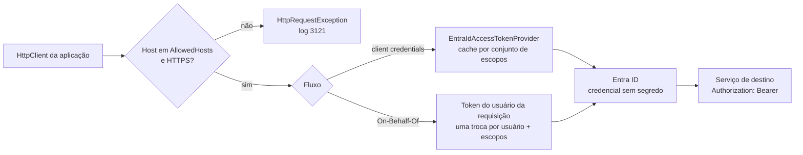
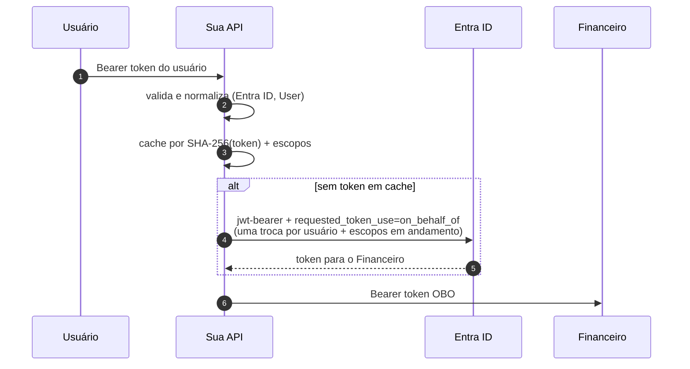

[🏠 TEC.Security](../README.md) › [📚 Documentação](README.md) › 🔁 Chamadas entre serviços

# 🔁 Chamadas entre serviços

> Como um serviço chama outro com token do Entra ID, em nome da própria aplicação (client credentials) ou do usuário da
> requisição (On-Behalf-Of), sem segredo na configuração e sem o token escapar para outro host.

## 📑 Sumário

- [🎯 Visão geral](#-visão-geral)
- [🚀 Uso](#-uso)
  - [Identidade da aplicação](#identidade-da-aplicação)
  - [Client credentials num HttpClient](#client-credentials-num-httpclient)
  - [On-Behalf-Of](#on-behalf-of)
  - [Token direto, sem HttpClient](#token-direto-sem-httpclient)
  - [Provedor de token próprio](#provedor-de-token-próprio)
  - [Tratar a falha do provedor](#tratar-a-falha-do-provedor)
- [⚙️ Opções](#️-opções)
- [❌ Erros](#-erros)
- [🛡️ Segurança](#️-segurança)
- [❓ Perguntas frequentes](#-perguntas-frequentes)

---

## 🎯 Visão geral



| Fluxo | Quem o destino vê | Exige |
|---|---|---|
| Client credentials (`AddEntraIdAccessToken`) | `Application`, com os app roles concedidos à sua aplicação | `AddEntraIdClient` com qualquer credencial |
| On-Behalf-Of (`AddEntraIdOnBehalfOf`) | O mesmo usuário (`oid`), com os escopos delegados | `AddEntraIdClient` com a credencial da app registration da **própria API** e requisição autenticada por token Entra ID de usuário |

---

## 🚀 Uso

### Identidade da aplicação

```json
"Security": {
  "EntraId": {
    "Client": {
      "TenantId": "<tenant-id>",
      "ClientId": "<client-id-desta-aplicacao>",
      "Credential": { "Type": "ManagedIdentityFederation" }
    }
  }
}
```

```csharp
using TEC.Security.DependencyInjection;
using TEC.Security.EntraId;

builder.Services.AddTecSecurity(builder.Configuration, security => security
    .AddEntraIdClient(builder.Configuration.GetSection("Security:EntraId:Client")));
```

Funciona também em workers (não depende de `AddAspNetCore`). Tipos de credencial e papéis no cofre:
[🪪 Provedor Entra ID](provedor-entra-id.md#credencial-da-aplicação).

### Client credentials num HttpClient

```csharp
builder.Services.AddHttpClient<EstoqueClient>(c => c.BaseAddress = new Uri("https://estoque.contoso.com/"))
    .AddEntraIdAccessToken(o =>
    {
        o.Scopes.Add("api://<client-id-do-estoque>/.default");
        o.AllowedHosts.Add("estoque.contoso.com");
    });
```

- O token é obtido uma vez por conjunto de escopos e renovado **5 minutos** antes de expirar; chamadas simultâneas
  disparam uma única obtenção.
- Se a renovação falhar e o token atual ainda valer mais de **30 segundos**, ele continua em uso (log 3122): uma
  instabilidade passageira do Entra ID não derruba as chamadas.
- Um header `Authorization` já presente na requisição é mantido.

### On-Behalf-Of

```csharp
builder.Services.AddHttpClient<FinanceiroClient>(c => c.BaseAddress = new Uri("https://financeiro.contoso.com/"))
    .AddEntraIdOnBehalfOf(o =>
    {
        o.Scopes.Add("api://<client-id-do-financeiro>/access_as_user");
        o.AllowedHosts.Add("financeiro.contoso.com");
    });
```



- Exige `AddEntraIdClient` com credencial da app registration **da própria API** (`ManagedIdentityFederation`,
  `WorkloadIdentity`, `Certificate` ou `ClientSecret`).
- Só dentro de uma requisição autenticada por um esquema Entra ID com token **de usuário** (tokens de aplicação não têm OBO).
- O token é pedido no tenant do usuário (`tid`): funciona em APIs multi-tenant.
- **Uma troca por usuário + escopos em andamento** (`SingleFlight` do TEC.Core): requisições simultâneas do mesmo usuário
  aguardam a mesma troca, sem rajada no Entra ID.
- Cache privado (até 10 mil entradas) até 5 minutos antes da expiração. O token recebido nunca vai em claro para log nem
  para a chave do cache.
- Na app registration da API: *API permissions* → permissão **delegada** da API de destino + consentimento.

### Token direto, sem HttpClient

```csharp
using TEC.Security.Abstractions;

public sealed class Exportador(IAccessTokenProvider tokens)
{
    public async Task<string> TokenAsync(CancellationToken cancellationToken)
    {
        AccessToken token = await tokens.GetTokenAsync(["api://<client-id-do-destino>/.default"], cancellationToken);
        return token.Token;   // ToString() do AccessToken mascara o valor; nunca registre token.Token
    }
}
```

### Provedor de token próprio

Para outro IdP, herde `CachingAccessTokenProvider` (cache, renovação, uma obtenção por conjunto de escopos, métricas e log
sem o token já vêm prontos) e use o `AccessTokenHandler` genérico:

```csharp
using Microsoft.Extensions.Logging;
using TEC.Security.Abstractions;
using TEC.Security.Tokens;

public sealed class KeycloakTokenProvider(IHttpClientFactory http, TimeProvider time, ILogger<KeycloakTokenProvider> logger)
    : CachingAccessTokenProvider("Keycloak", time, logger)
{
    protected override async ValueTask<AccessToken> AcquireTokenAsync(IReadOnlyList<string> scopes, CancellationToken cancellationToken)
    {
        var client = http.CreateClient("keycloak");
        // ... chama o endpoint de token do seu IdP e lê access_token/expires_in com teto de tamanho
        return new AccessToken("<token>", time.GetUtcNow().AddMinutes(5));
    }
}

builder.Services.AddSingleton<IAccessTokenProvider, KeycloakTokenProvider>();
builder.Services.AddHttpClient("relatorios", c => c.BaseAddress = new Uri("https://relatorios.contoso.com/"))
    .AddHttpMessageHandler(sp =>
    {
        var opcoes = new AccessTokenHandlerOptions();
        opcoes.Scopes.Add("relatorios");
        opcoes.AllowedHosts.Add("relatorios.contoso.com");
        return new AccessTokenHandler(sp.GetRequiredService<IAccessTokenProvider>(), opcoes,
            sp.GetService<ILogger<AccessTokenHandler>>());
    });
```

### Tratar a falha do provedor

`SecurityTokenAcquisitionException` deriva de `AppException` do TEC.Core (código `SEGURANCA_PROVEDOR_INDISPONIVEL`, HTTP
502, mensagem genérica). Converta em `Result` com `ToResult()`:

```csharp
using TEC.Core.Common.Results;
using TEC.Security.Tokens;

public async Task<Result> SincronizarAsync(CancellationToken cancellationToken)
{
    try
    {
        await estoque.EnviarAsync(cancellationToken);
        return Result.Success();
    }
    catch (SecurityTokenAcquisitionException exception)
    {
        return exception.ToResult();   // exception.Code == "SEGURANCA_PROVEDOR_INDISPONIVEL"; causa em InnerException
    }
}
```

Dentro de um handler do TEC.Cqrs nem o `try` é necessário: o comportamento de exceções converte qualquer `AppException` em
`Result` (e o TEC.Cqrs.AspNetCore responde 502 padronizado).

---

## ⚙️ Opções

**`EntraIdClientOptions`** (`AddEntraIdClient`)

| Opção | Padrão | Descrição |
|---|---|---|
| `Instance` | `https://login.microsoftonline.com/` | Nuvem oficial (mesmas regras do [provedor](provedor-entra-id.md#️-opções)) |
| `TenantId` | `null` | Tenant da aplicação (GUID). Obrigatório, exceto com `ManagedIdentity` e `Developer` |
| `ClientId` | `null` | Client id da app registration (GUID). Obrigatório, exceto com `ManagedIdentity` e `Developer` |
| `Credential` | `ManagedIdentityFederation` | `EntraIdCredentialOptions` |

**`AccessTokenHandlerOptions`** (`TEC.Security.Tokens`)

| Opção | Padrão | Descrição |
|---|---|---|
| `Scopes` | vazio | Escopos pedidos (ex.: `api://<client-id>/.default`). Obrigatório |
| `AllowedHosts` | vazio | Hosts que podem receber o token (comparação exata do host IDN, sem diferenciar maiúsculas). Obrigatório |
| `AllowHttpForLoopback` | `false` | Aceita HTTP para `localhost`/loopback (desenvolvimento) |
| `IsAllowedDestination(Uri?)` | — | `true` se o token pode ir para o destino: absoluto, sem usuário na URL, HTTPS (ou loopback permitido) e host na lista |
| `Validate()` | — | Confere escopos e hosts (chamado no registro) |

**`CachingAccessTokenProvider`** (base abstrata, `IAccessTokenProvider`, `IDisposable`)

| Membro | Valor | Descrição |
|---|---|---|
| `RefreshBefore` | 5 minutos | Antecedência da renovação |
| `MinimumRemainingLifetime` | 30 segundos | Validade restante mínima para continuar usando o token atual se a renovação falhar |
| `MaxScopeSets` | 1024 | Conjuntos de escopos distintos em cache |
| `ProviderName` | (construtor) | Nome nas métricas e logs |
| `AcquireTokenAsync(scopes, ct)` | abstrato | Obtém um token novo, sem cache |

**Outros tipos:** `IAccessTokenProvider.GetTokenAsync(IReadOnlyList<string> scopes, CancellationToken)` →
`ValueTask<AccessToken>`; `AccessToken(string token, DateTimeOffset expiresOn)` com `Token`, `ExpiresOn` e `ToString()`
mascarado; `AccessTokenHandler(IAccessTokenProvider, AccessTokenHandlerOptions, ILogger<AccessTokenHandler>?)`;
`EntraIdAccessTokenProvider` (registrado por `AddEntraIdClient`).

---

## ❌ Erros

| Erro | Quando ocorre | O que fazer |
|---|---|---|
| `InvalidOperationException` (registro) | `AddEntraIdClient` duas vezes; `Instance` não oficial; credencial inválida (ver [provedor](provedor-entra-id.md#-erros)) | Corrija as opções |
| `InvalidOperationException` (registro) | `AccessTokenHandlerOptions` sem escopo ou sem host válido | Informe `Scopes` e `AllowedHosts` |
| `InvalidOperationException` (criação do handler OBO) | Credencial de `AddEntraIdClient` sem autenticação de cliente (`ManagedIdentity`, `Developer`) ou sem `ClientId` | Use credencial da app registration |
| `HttpRequestException` + log 3121 | Destino fora de `AllowedHosts`, sem HTTPS ou com usuário na URL | Inclua o host exato; `AllowHttpForLoopback` só em desenvolvimento |
| `HttpRequestException` (OBO) | Fora de requisição HTTP; usuário não autenticado por token Entra ID; token de aplicação | OBO só serve para usuários Entra ID |
| `SecurityTokenAcquisitionException` + log 3120 | O provedor falhou e não há token ainda válido (mais de 30 s) em cache | Veja o tipo no log; confira credencial, consentimento e acesso ao cofre |
| `SecurityTokenAcquisitionException` + log 3401 (OBO) | O Entra ID recusou a troca (log com a exceção e o tipo; a mensagem traz só o código OAuth validado, ex.: `invalid_grant`), resposta acima de 64 KB, sem `access_token`, ou `expires_in` fora de 1 s a 24 h | Confira a permissão delegada e o consentimento |
| `InvalidOperationException`: `Mais de 1024 conjuntos de escopos distintos` | Escopos montados dinamicamente | Use conjuntos fixos (ex.: `api://<id>/.default`) |
| `ObjectDisposedException` | `GetTokenAsync` depois do `Dispose` do provedor | Não use o provedor depois de descartado |
| `ArgumentException` | `GetTokenAsync` sem escopo ou com escopo vazio | Informe escopos válidos |

---

## 🛡️ Segurança

> [!CAUTION]
> `AllowedHosts` é a proteção contra exfiltração do token (SSRF, URL adulterada, redirecionamento): o token dá acesso ao
> destino em nome da aplicação. Mantenha a lista mínima e sem hosts controlados por terceiros.

- Redirecionamentos: o `HttpClientHandler` remove o `Authorization` ao seguir um redirect, então o token não acompanha um
  302 para outro domínio.
- A resposta do endpoint de token é lida com teto de 64 KB mesmo sem `Content-Length`; o corpo de erro nunca vai para log
  nem para a exceção (só o código OAuth validado, ou `codigo-invalido`).
- A validade do token OBO usa o `TimeProvider` injetado e recusa `expires_in` absurdo (fora de 1 s a 24 h).
- Prefira `ManagedIdentityFederation`/`WorkloadIdentity`; `Certificate` assina no cofre (chave não exportável);
  `ClientSecret` só como último recurso.

---

## ❓ Perguntas frequentes

<details>
<summary>Qual escopo uso em client credentials?</summary>

Sempre `api://<client-id-do-destino>/.default`: o token traz os app roles concedidos à sua aplicação na API de destino.

</details>

<details>
<summary>Posso chamar um serviço local por HTTP em desenvolvimento?</summary>

Sim, com `AllowHttpForLoopback = true` e `localhost` em `AllowedHosts`. Nunca habilite em produção.

</details>

<details>
<summary>Como o destino diferencia OBO de client credentials?</summary>

No OBO o destino recebe um token de **usuário** (com `scp`); em client credentials, um token de **aplicação** (só `roles`).
No TEC.Security do destino, `Kind` é `User` ou `Application`.

</details>

---
⬅️ [🪪 Provedor Entra ID](provedor-entra-id.md) · [📚 Índice](README.md) · [🔑 API keys](api-keys.md) ➡️
