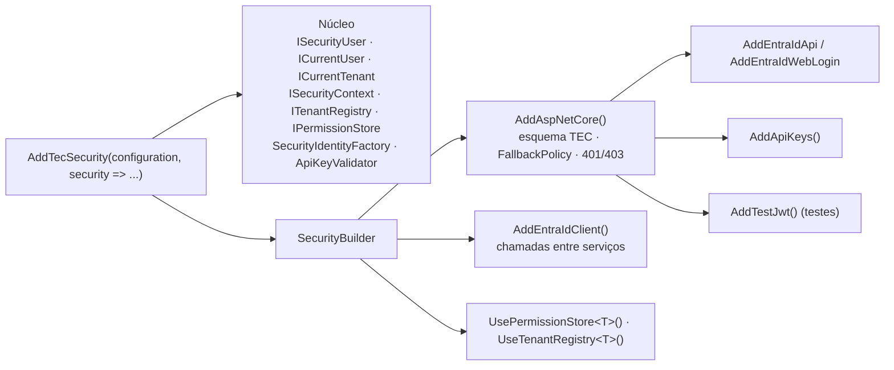

[🏠 TEC.Security](../README.md) › [📚 Documentação](README.md) › ⚙️ Configuração

# ⚙️ Configuração

> Como registrar o TEC.Security (`AddTecSecurity`, `SecurityBuilder`, `AddAspNetCore`), todas as chaves da seção
> `Security` do `appsettings` e o que é validado na subida da aplicação.

## 📑 Sumário

- [🎯 Visão geral](#-visão-geral)
- [🚀 Uso](#-uso)
  - [API protegida](#api-protegida)
  - [Worker sem ASP.NET Core](#worker-sem-aspnet-core)
  - [Fontes próprias de permissões e tenants](#fontes-próprias-de-permissões-e-tenants)
  - [appsettings completo](#appsettings-completo)
  - [Recarga sem reinício](#recarga-sem-reinício)
- [⚙️ Opções](#️-opções)
- [❌ Erros](#-erros)
- [🛡️ Segurança](#️-segurança)
- [❓ Perguntas frequentes](#-perguntas-frequentes)

---

## 🎯 Visão geral



| Peça | Pacote | Papel |
|---|---|---|
| `AddTecSecurity` | `TEC.Security` | Registra o núcleo e lê a seção `Security` (com recarga); devolve o `SecurityBuilder` |
| `SecurityBuilder` | `TEC.Security` | Ponto de extensão: provedores, fonte de permissões e cadastro de tenants |
| `AddAspNetCore` | `TEC.Security.AspNetCore` | Esquema padrão `TEC` (escolhe o provedor por requisição), `DefaultPolicy`/`FallbackPolicy` fechadas, `[TecAuthorize]`, respostas 401/403 padronizadas e conferência dos endpoints na subida |
| `AddEntraIdApi`, `AddEntraIdWebLogin`, `AddEntraIdClient` | `TEC.Security.EntraId` | Provedor Microsoft Entra ID ([🪪 Provedor Entra ID](provedor-entra-id.md), [🔁 Chamadas entre serviços](chamadas-entre-servicos.md)) |
| `AddApiKeys` | `TEC.Security.AspNetCore` | Esquema de API key ([🔑 API keys](api-keys.md)) |

O que `AddTecSecurity` registra:

| Serviço | Tempo de vida | Implementação padrão |
|---|---|---|
| `ISecurityUser`, `ICurrentUser` (TEC.Core), `ICurrentTenant` | Scoped (a mesma instância) | Lê, a cada acesso, o principal atual (`RunAs` → `HttpContext.User`) |
| `ISecurityContext` | Singleton | Identidade de sistema e `RunAs` ([🤖 Workers](workers.md)) |
| `ITenantRegistry` | Singleton | `ConfigurationTenantRegistry` (`Security:Tenants`) ou o tipo de `UseTenantRegistry<T>()` |
| `IPermissionStore` | Singleton | `ConfigurationPermissionStore` (`Security:Permissions`) ou o tipo de `UsePermissionStore<T>()` com cache |
| `SecurityIdentityFactory` | Singleton | Normalização da identidade ([👤 Identidade e permissões](identidade-e-permissoes.md)) |
| `ApiKeyValidator` | Singleton | Cadastro `Security:ApiKeys` |
| `TimeProvider` | Singleton (`TryAdd`) | `TimeProvider.System`; troque por um falso nos testes |

---

## 🚀 Uso

### API protegida

```csharp
using TEC.Security.Abstractions;
using TEC.Security.AspNetCore;
using TEC.Security.AspNetCore.Authorization;
using TEC.Security.DependencyInjection;
using TEC.Security.EntraId;

var builder = WebApplication.CreateBuilder(args);

builder.Services.AddTecSecurity(builder.Configuration, security => security
    .AddAspNetCore(o => o.HubPaths.Add("/hubs/chat"))   // opções de SecurityAspNetCoreOptions
    .AddEntraIdApi("Funcionarios", builder.Configuration.GetSection("Security:EntraId:Api"))
    .AddApiKeys());

var app = builder.Build();
app.UseAuthentication();   // o WebApplication já adiciona os dois quando os serviços existem
app.UseAuthorization();

app.MapGet("/pedidos", (ISecurityUser usuario) => usuario.TenantId)
   .RequireTecAuthorization(permissions: "pedidos:ler");
app.MapGet("/saude", () => "ok").AllowAnonymous();

app.Run();
```

> [!IMPORTANT]
> `AddAspNetCore()` vem **antes** de qualquer provedor ASP.NET Core (`AddEntraIdApi`, `AddEntraIdWebLogin`, `AddApiKeys`,
> `AddTestJwt`); sem ele, o provedor lança `InvalidOperationException` no registro.

### Worker sem ASP.NET Core

```csharp
using TEC.Security.DependencyInjection;
using TEC.Security.EntraId;

builder.Services.AddTecSecurity(builder.Configuration, security => security
    .AddEntraIdClient(builder.Configuration.GetSection("Security:EntraId:Client")));   // opcional: chamar outras APIs
```

Só o pacote `TEC.Security` é necessário para usar `ISecurityContext`, `ISecurityUser` e o cadastro de tenants. O
`TEC.Security.EntraId` (que traz o ASP.NET Core) só entra se o worker chamar serviços com token do Entra ID.

### Fontes próprias de permissões e tenants

```csharp
builder.Services.AddTecSecurity(builder.Configuration, security => security
    .AddAspNetCore()
    .AddEntraIdApi("Funcionarios", builder.Configuration.GetSection("Security:EntraId:Api"))
    .UsePermissionStore<PermissoesDoBanco>(TimeSpan.FromMinutes(2))   // cache de 2 min (Zero desliga; máximo 1 h)
    .UseTenantRegistry<TenantsDoBanco>());                             // cadastro mantido em memória
```

Os dois tipos são registrados como **Singleton**; dependências Scoped (ex.: `DbContext`) vêm de um
`IServiceScopeFactory` dentro do método. Detalhes: [👤 Identidade e permissões](identidade-e-permissoes.md#fonte-própria-de-permissões)
e [🏢 Tenants](tenants.md#cadastro-em-outra-fonte).

### appsettings completo

Nenhuma chave guarda segredo: certificado e client secret ficam no TEC.Vault (só o **nome** vai para a configuração) e a
API key é guardada como hash.

```json
{
  "Security": {
    "RequireTenant": true,
    "RolesAsPermissions": false,

    "EntraId": {
      "Api": {
        "Instance": "https://login.microsoftonline.com/",
        "TenantId": "<tenant-id>",
        "ClientId": "<client-id-da-api>",
        "MultiTenant": true,
        "AllowedTenantIds": [],
        "Audiences": [],
        "AllowedClientApplications": [ "<client-id-do-front>" ],
        "AllowApplicationTokens": true,
        "AcceptV1Tokens": false
      },
      "WebLogin": {
        "TenantId": "<tenant-id>",
        "ClientId": "<client-id-do-site>",
        "CallbackPath": "/signin-oidc",
        "SignedOutCallbackPath": "/signout-callback-oidc",
        "SessionDuration": "01:00:00",
        "RevalidationInterval": "00:05:00",
        "MaxSessionLifetime": "08:00:00",
        "Credential": { "Type": "ManagedIdentityFederation", "ManagedIdentityClientId": "<client-id-da-identidade-gerenciada>" }
      },
      "Client": {
        "TenantId": "<tenant-id>",
        "ClientId": "<client-id-da-api>",
        "Credential": { "Type": "Certificate", "CertificateName": "<certificado-no-cofre>" }
      }
    },

    "Tenants": {
      "contoso":  { "Name": "Contoso Ltda", "Enabled": true,  "IdentityProviders": { "EntraId": [ "<tenant-id-da-contoso>" ] } },
      "fabrikam": { "Name": "Fabrikam",     "Enabled": false, "IdentityProviders": { "EntraId": [ "<tenant-id-da-fabrikam>" ] } }
    },

    "Permissions": {
      "Roles": {
        "Vendedor": [ "pedidos:ler", "pedidos:criar" ],
        "Gerente":  [ "pedidos:ler", "pedidos:criar", "pedidos:cancelar" ]
      },
      "Tenants": {
        "minha-empresa": { "Roles": { "Admin": [ "plataforma:admin" ] } }
      }
    },

    "ApiKeys": {
      "HeaderName": "X-Api-Key",
      "Keys": {
        "erp-contoso": {
          "Hash": "<hash gerado por ApiKeyGenerator>",
          "Name": "ERP da Contoso",
          "TenantId": "contoso",
          "Permissions": [ "pedidos:ler" ],
          "ExpiresOn": "2027-06-30T00:00:00Z"
        }
      }
    }
  }
}
```

```csharp
builder.Services.AddTecSecurity(builder.Configuration, security => security
    .AddAspNetCore()
    .AddEntraIdApi("Funcionarios", builder.Configuration.GetSection("Security:EntraId:Api"))
    .AddEntraIdWebLogin("Web", builder.Configuration.GetSection("Security:EntraId:WebLogin"))
    .AddEntraIdClient(builder.Configuration.GetSection("Security:EntraId:Client"))
    .AddApiKeys());
```

> [!NOTE]
> As seções `Security:EntraId:*` são só uma sugestão de organização: cada `AddEntraId*` recebe a seção que você passar (a
> constante `EntraIdExtensions.SectionName` vale `Security:EntraId`). `Security`, `Security:Tenants`,
> `Security:Permissions` e `Security:ApiKeys` são fixas (constantes `SectionName` de cada classe de opções).

### Recarga sem reinício

| Seção | Recarregada? | Versão inválida |
|---|:---:|---|
| `Security` (`RequireTenant`, `RolesAsPermissions`) | ✅ | — |
| `Security:Tenants` | ✅ | Recusada (log 3101); o cadastro anterior continua valendo |
| `Security:Permissions` | ✅ | — (papéis sem mapeamento não geram permissões) |
| `Security:ApiKeys` (inclusive `HeaderName`) | ✅ | Ignorada (log 3111 uma vez); a última versão válida continua valendo. Releitura no máximo 1×/s |
| `Security:EntraId:*` e opções em código | ❌ | Lidas no registro; inválidas impedem a subida |

> [!WARNING]
> Com vários arquivos de configuração, listas JSON (`[...]`) são mescladas **por índice**. Mantenha o cadastro de tenants
> e de API keys numa única fonte (um arquivo, App Configuration ou o seu `ITenantRegistry`).

---

## ⚙️ Opções

**`AddTecSecurity(this IServiceCollection services, IConfiguration configuration, Action<SecurityBuilder>? configure = null)`**
→ `SecurityBuilder`. Chamado uma única vez.

**`SecurityBuilder`** (`TEC.Security.DependencyInjection`)

| Membro | Descrição |
|---|---|
| `Services` | `IServiceCollection`, para os pacotes de provedor |
| `Configuration` | Configuração da aplicação |
| `Properties` | Estado dos pacotes de extensão, por tipo (uso pelos provedores) |
| `UsePermissionStore<TStore>(TimeSpan? cacheDuration = null)` | Fonte de permissões própria (Singleton) com cache (padrão 5 min, `TimeSpan.Zero` desliga, máximo 1 h). Substitui `Security:Permissions` |
| `UseTenantRegistry<TRegistry>()` | Cadastro de tenants próprio (Singleton). Substitui `Security:Tenants` |

**`SecurityBuilderAspNetCoreExtensions`** (`TEC.Security.AspNetCore`)

| Método | Descrição |
|---|---|
| `AddAspNetCore(Action<SecurityAspNetCoreOptions>? configure = null)` | Integração ASP.NET Core (uma vez) |
| `AddApiKeys(string scheme = "ApiKey")` | Esquema de API key |
| `AddJwtBearerProvider(JwtProviderDefinition definition)` | Provedor bearer com os padrões endurecidos (uso pelos pacotes de provedor) |
| `GetSchemes()` / `GetAspNetCoreOptions()` | Esquemas registrados e opções (uso pelos pacotes de provedor) |

**`SecurityAspNetCoreOptions`** (em código, `AddAspNetCore(o => ...)`)

| Opção | Padrão | Descrição |
|---|---|---|
| `HubPaths` | vazio | Caminhos de hubs SignalR que aceitam o token em `access_token` na query (WebSocket/SSE não mandam header). Nunca `/` |
| `MaxTokenLength` | `16384` | Tamanho máximo do token, em caracteres (1024 a 262144). Maior é recusado antes de qualquer processamento |
| `ValidateEndpointsOnStartup` | `true` | Confere `[TecAuthorize]` dos endpoints na subida |
| `ApiKeyRequiresHttps` | `true` | API key só por HTTPS (desligado automaticamente em Development) |
| `DefaultScheme` (const) | `"TEC"` | Esquema padrão (policy scheme) que escolhe o provedor |
| `NoCredentialsScheme` (const) | `"TEC.None"` | Esquema das requisições sem credencial reconhecida |

**`SecurityOptions`** (seção `Security`)

| Chave | Padrão | Descrição |
|---|---|---|
| `RequireTenant` | `false` | Toda identidade (exceto sistema) precisa de tenant cadastrado e ativo; sem tenant → 401 |
| `RolesAsPermissions` | `true` | Os próprios papéis contam como permissões (somados aos do `IPermissionStore`). Use `false` em APIs multi-tenant |

As demais seções têm a página própria: `Security:Tenants` em [🏢 Tenants](tenants.md#️-opções), `Security:Permissions` em
[👤 Identidade e permissões](identidade-e-permissoes.md#️-opções) e `Security:ApiKeys` em [🔑 API keys](api-keys.md#️-opções).

---

## ❌ Erros

A aplicação **não sobe** (falha fechada) quando a configuração é inválida ou insegura. As opções dos esquemas são criadas
por um `IHostedService` na subida: o erro aparece na inicialização, não na primeira requisição.

| Exceção | Quando ocorre | O que fazer |
|---|---|---|
| `InvalidOperationException` | `AddTecSecurity`, `AddAspNetCore`, `AddApiKeys` ou `AddEntraIdClient` chamados duas vezes | Configure tudo numa única chamada |
| `InvalidOperationException` | `UsePermissionStore` ou `UseTenantRegistry` chamados duas vezes | Registre uma única fonte de permissões e um único cadastro |
| `ArgumentOutOfRangeException` | `UsePermissionStore` com cache fora de 0 a 1 hora | Ajuste a duração |
| `InvalidOperationException` | Provedor ASP.NET Core sem `AddAspNetCore()` antes | Chame `AddAspNetCore()` primeiro |
| `InvalidOperationException` | `MaxTokenLength` fora de 1024–262144; `HubPaths` vazio ou `/` | Corrija as opções |
| `InvalidOperationException` | Cadastro de tenants inválido na subida (id fora do formato, ids que diferem só por maiúsculas, tenant vazio, provedor ou id externo fora do formato, o mesmo id externo em dois tenants) | Corrija `Security:Tenants` |
| `OptionsValidationException` | Cadastro de API keys inválido (`HeaderName` fora do formato ou `Authorization`, id fora do formato, `Hash` ausente ou não canônico, `ExpiresOn` ausente, `TenantId`/papel/permissão fora do formato) | Corrija `Security:ApiKeys` |
| `OptionsValidationException` | Um provedor, `Configure` ou `PostConfigure` desligou um controle obrigatório do JWT, do OIDC ou do cookie ([🛡️ Segurança](seguranca.md#controles-obrigatórios-conferidos-na-subida)) | Remova o ajuste: os controles não podem ser desligados |
| `InvalidOperationException` | `[TecAuthorize]` vazio, fora do formato ou junto com `[AllowAnonymous]` | Corrija o endpoint ([🔐 Autorização](autorizacao.md#-erros)) |
| `InvalidOperationException` | `AddTestJwt` fora de Development, Testing e Test | Use o provedor de teste só nos testes ([🧪 Testes](testes.md#testando-a-sua-api)) |

Mensagens de erro nunca repetem segredos, hashes ou ids externos.

---

## 🛡️ Segurança

> [!WARNING]
> Configuração de segurança errada **não** é tolerada em silêncio: um `PostConfigure<JwtBearerOptions>` de outra biblioteca
> que desligue `ValidateAudience`, por exemplo, impede a subida. Não tente contornar com `ValidateEndpointsOnStartup = false`:
> essa opção só controla a conferência de `[TecAuthorize]`, não os controles do token.

- `ApiKeyRequiresHttps = false` só faz sentido atrás de um proxy que já exige HTTPS; prefira `UseForwardedHeaders`.
- `HubPaths` aceita o token na query string, que costuma aparecer em logs de acesso: liste só os hubs reais e mascare
  `access_token` nos logs do proxy.
- Em APIs multi-tenant use `RolesAsPermissions: false` e permissões por tenant ([🏢 Tenants](tenants.md#️-segurança)).

---

## ❓ Perguntas frequentes

<details>
<summary>Preciso chamar <code>UseAuthentication</code> e <code>UseAuthorization</code>?</summary>

O `WebApplication` adiciona os dois automaticamente quando os serviços estão registrados. Chame explicitamente se precisar
controlar a ordem (ex.: depois de `UseRouting`/`UseCors` personalizados).

</details>

<details>
<summary>Posso registrar duas APIs do Entra ID (app registrations diferentes)?</summary>

Sim: chame `AddEntraIdApi` duas vezes com esquemas diferentes. O seletor escolhe pelo emissor e pela audiência do token
([🪪 Provedor Entra ID](provedor-entra-id.md#várias-app-registrations)).

</details>

<details>
<summary>Como uso um <code>TimeProvider</code> falso nos testes?</summary>

Registre o seu antes do `AddTecSecurity` (`services.AddSingleton<TimeProvider>(fake)`): o componente usa `TryAdd` e
respeita o registro existente.

</details>

---
⬅️ [📚 Índice](README.md) · [🔐 Autorização](autorizacao.md) ➡️
