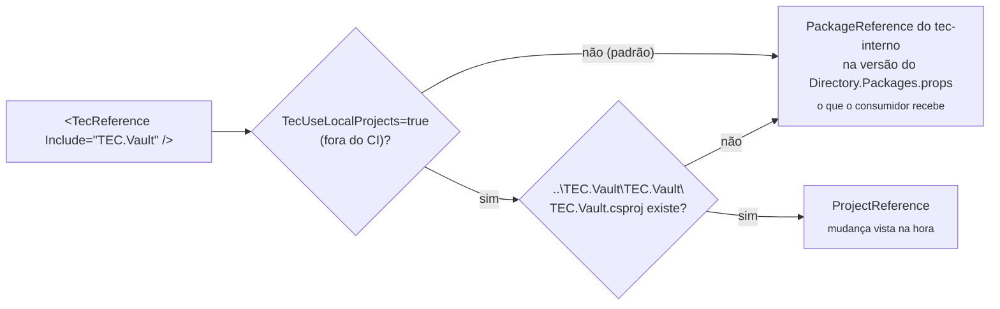

[🏠 TEC.Security](../README.md) › [📚 Documentação](README.md) › 💻 Desenvolvimento local

# 💻 Desenvolvimento local

> Como compilar, testar e empacotar o TEC.Security na sua máquina: por padrão com o TEC.Core e o TEC.Vault do feed
> `tec-interno` (o que o consumidor recebe) e, sob demanda, com os repositórios vizinhos, sem publicar pacote.

## 📑 Sumário

- [🎯 Visão geral](#-visão-geral)
- [🚀 Uso](#-uso)
  - [Pré-requisitos](#pré-requisitos)
  - [Clonar lado a lado](#clonar-lado-a-lado)
  - [Compilar, testar e empacotar](#compilar-testar-e-empacotar)
  - [Lock files](#lock-files)
  - [Arquivos canônicos](#arquivos-canônicos)
  - [Contribuição](#contribuição)
- [⚙️ Opções](#️-opções)
- [❌ Erros](#-erros)
- [🛡️ Segurança](#️-segurança)
- [❓ Perguntas frequentes](#-perguntas-frequentes)

---

## 🎯 Visão geral

Os componentes TEC.* são declarados nos csproj por `<TecReference>` (nunca `PackageReference`):

| Projeto | `TecReference` |
|---|---|
| `TEC.Security` | `TEC.Core` |
| `TEC.Security.EntraId` | `TEC.Vault` |
| `TEC.Security.Tests` | `TEC.Vault.AzureKeyVault`, `TEC.Vault.InMemory` |

O `build/Tec.Build.targets` decide como resolver cada uma:



| Modo | Quando | Referência | Lock file |
|---|---|---|---|
| Pacote | **Padrão**, na máquina e no CI (`CI=true` sempre usa pacote) | `PackageReference` na versão publicada declarada no `Directory.Packages.props` do feed `tec-interno` | `packages.lock.json` (versionado) |
| Local | Sob demanda: `-p:TecUseLocalProjects=true` fora do CI, com o repositório vizinho presente (sem ele, continua pacote) | `ProjectReference` para `<raiz>\<Componente>\<Projeto>\<Projeto>.csproj` | `packages.local.lock.json` (fora do git) |

> [!IMPORTANT]
> Como o padrão é o pacote, compilar o TEC.Security exige **leitura do feed `tec-interno`** na máquina (credencial
> configurada uma vez; veja [Pré-requisitos](#pré-requisitos)). O modo local serve para alterar o TEC.Core ou o
> TEC.Vault e testar a mudança aqui sem publicar pacote.

> [!TIP]
> **Versão dos TEC.* consumidos:** fica no `Directory.Packages.props` deste repositório, uma por pacote
> (`<PackageVersion Include="TEC.Core" Version="0.0.1" />`, idem para `TEC.Vault`, `TEC.Vault.AzureKeyVault` e
> `TEC.Vault.InMemory`); os csproj mantêm só `<TecReference Include="..." />`, sem versão. Para usar outra versão
> publicada, altere o `PackageVersion` (o Dependabot abre o PR) e regenere os `packages.lock.json`
> ([Lock files](#lock-files)). Os componentes evoluem de forma independente: o TEC.Core pode ficar em `0.0.1` enquanto
> o TEC.Vault ou o TEC.Security sobem a própria `<Version>`.

---

## 🚀 Uso

### Pré-requisitos

| Item | Detalhe |
|---|---|
| SDK | .NET 10 (`global.json`: `10.0.100`, `rollForward: latestFeature`) e os runtimes .NET 8 e ASP.NET Core 8 para os testes em `net8.0` |
| Azure CLI | Só para a integração com Entra ID e Key Vault (`az login`) |
| Feed `tec-interno` | Leitura obrigatória no modo pacote, o padrão (PAT classic com `read:packages`; o GitHub Packages exige token mesmo para pacote público) |

```bash
# Credencial do feed (uma vez por máquina, fora do repositório; no Linux/macOS acrescente --store-password-in-clear-text)
dotnet nuget update source tec-interno -u <usuario-github> -p <PAT>
# ou, se a origem ainda não existir no NuGet.Config do usuário:
dotnet nuget add source https://nuget.pkg.github.com/tudoemcodigo/index.json -n tec-interno -u <usuario-github> -p <PAT>
```

### Clonar lado a lado

```text
D:\Projetos\Componentes\
├── tec-workflows\   CI/CD e arquivos canônicos
├── TEC.Core\        ⟵ dependência do TEC.Security
├── TEC.Vault\       ⟵ dependência do TEC.Security.EntraId e dos testes
├── TEC.Security\    este repositório
└── ...              TEC.Cqrs, TEC.Observability, TEC.ORM
```

Só é necessário para o modo local. A raiz dos componentes é a pasta acima do repositório (`TecComponentsRoot`). Com
`TEC.Core` e `TEC.Vault` ali e `-p:TecUseLocalProjects=true`, tudo compila junto e uma mudança neles aparece aqui na
hora:

```bash
dotnet build TEC.Security.slnx -p:TecUseLocalProjects=true
dotnet test --project TEC.Security.Tests -p:TecUseLocalProjects=true --treenode-filter "/*/*/*/*[Category!=Integracao]"
```

### Compilar, testar e empacotar

```bash
dotnet build TEC.Security.slnx -c Release
dotnet test --project TEC.Security.Tests --treenode-filter "/*/*/*/*[Category!=Integracao]"
dotnet pack TEC.Security.slnx -c Release -o ./pacotes      # só os 4 projetos de pacote (IsTecPackage)
```

> [!IMPORTANT]
> Nos pacotes **todo aviso é erro** (analisadores CA/IDE, nullable, XML doc, IL de AOT/trimming). Rode o build em Release
> antes do PR. Categorias, integração e carga: [🧪 Testes](testes.md).

### Lock files

O `packages.lock.json` versionado é sempre o do **modo pacote**, o padrão (o CI restaura com `--locked-mode`). No modo
local (`-p:TecUseLocalProjects=true`) o NuGet usa `packages.local.lock.json`, ignorado pelo git. Depois de mudar uma
dependência, regenere o versionado:

```bash
dotnet restore TEC.Security.slnx --force-evaluate
```

> [!WARNING]
> Regenerar o lock versionado (e compilar no modo padrão) exige que as versões TEC.* referenciadas **já estejam publicadas** no feed (ordem: Core →
> Vault → Cqrs → Security → Observability → ORM). Enquanto `TEC.Core` e `TEC.Vault` 0.0.1 não estiverem no feed, esse
> restore falha.

### Arquivos canônicos

`build/`, `Directory.Build.targets`, `.editorconfig`, `nuget.config`, `.gitignore`, `.gitattributes`, `global.json`,
`LICENSE`, `Images/Logo.png`, `.github/dependabot.yml` e `.github/zizmor.yml` vêm do
[tec-workflows](https://github.com/tudoemcodigo/tec-workflows) e **não são editados aqui**: altere no tec-workflows e
sincronize com `scripts/sync-template.sh TEC.Security`. O job *Convenções* do CI falha se uma cópia divergir. O que é deste
repositório: `Directory.Build.props` (`TecComponent` e `Version`), `Directory.Packages.props` e os csproj.

### Contribuição

1. Crie uma branch a partir da `main` (push direto é bloqueado).
2. Código: identificadores em inglês; comentários, XML docs, mensagens e documentação em português.
3. Teste novo para todo comportamento novo ou corrigido; controle de segurança com teste que o prove
   ([🧪 Testes](testes.md#escrevendo-novos-testes)).
4. Atualize `docs/` (inclusive [🛡️ Segurança](seguranca.md), se mudar um controle) e o [CHANGELOG](../CHANGELOG.md).
5. Abra o PR: o check obrigatório é **`ci / ci-ok`**.

---

## ⚙️ Opções

| Propriedade MSBuild | Padrão | Descrição |
|---|---|---|
| `TecUseLocalProjects` | `false` (sempre `false` com `CI=true`) | `true` liga a troca de `TecReference` por `ProjectReference` quando o repositório vizinho existe |
| `TecComponentsRoot` | Pasta acima do repositório | Onde procurar os repositórios vizinhos |
| `PackageVersion` dos TEC.* (`Directory.Packages.props`) | `0.0.1` | Versão publicada de cada TEC.* consumido no modo pacote (o Dependabot atualiza) |
| `Version` (`Directory.Build.props`) | `0.0.1` | Versão única dos 4 pacotes deste repositório; base das prévias do CI (`<Version>-preview.N` a cada push na `main`). Suba depois de publicar `X.Y.Z` |

---

## ❌ Erros

| Erro | Quando ocorre | O que fazer |
|---|---|---|
| `NU1100 Unable to resolve 'TEC.Core'` (ou `TEC.Vault`) | Modo pacote sem a origem `tec-interno` (ou com outro nome) | Adicione a origem com o nome exato `tec-interno` (ou use o modo local com o vizinho clonado ao lado) |
| `401`/`403` no restore | PAT sem `read:packages` ou expirado | Gere outro PAT classic e refaça o `dotnet nuget update source tec-interno` |
| `NU1004` no restore | Lock file desatualizado | Regenere com `dotnet restore TEC.Security.slnx --force-evaluate` |
| `NU1901`–`NU1904` | Vulnerabilidade conhecida em dependência (inclusive transitiva) | Atualize o pacote no `Directory.Packages.props` e regenere os locks |
| `Use <TecReference ...> em vez de PackageReference` | `PackageReference` para um TEC.* | Troque por `<TecReference Include="TEC.X" />` |
| `dotnet test` roda 0 testes (código 5) | `-nologo` no Microsoft.Testing.Platform | Remova `-nologo` |

---

## 🛡️ Segurança

> [!WARNING]
> Nunca coloque o PAT do feed no `nuget.config` do repositório: ele fica só no NuGet.Config do usuário (no Windows,
> criptografado).

- `packageSourceMapping`: `TEC.*` só do `tec-interno`, o resto só do nuget.org (contra *dependency confusion*).
- `appsettings.Local.json` do projeto de testes e `packages.local.lock.json` ficam fora do git.

---

## ❓ Perguntas frequentes

<details>
<summary>Mudei o TEC.Core e o TEC.Security não viu a mudança.</summary>

Por padrão o TEC.Security usa o pacote publicado do TEC.Core. Compile com `-p:TecUseLocalProjects=true`, confira se o
`TEC.Core` está em `..\TEC.Core\TEC.Core\TEC.Core.csproj` em relação a este repositório e se a variável `CI` não está
definida como `true` no seu terminal (no CI a opção é ignorada).

</details>

<details>
<summary>Preciso commitar o <code>packages.local.lock.json</code>?</summary>

Não. Só o `packages.lock.json` (modo pacote) vai para o git.

</details>

---
⬅️ [🧪 Testes](testes.md) · [📚 Índice](README.md)
