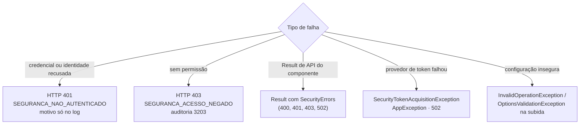

[🏠 TEC.Security](../README.md) › [📚 Documentação](README.md) › ❌ Erros

# ❌ Erros

> Os códigos de erro do TEC.Security, o formato das respostas 401/403, as exceções que cada API pode lançar e como
> diagnosticar cada caso.

## 📑 Sumário

- [🎯 Visão geral](#-visão-geral)
- [🚀 Uso](#-uso)
  - [Respostas HTTP](#respostas-http)
  - [Erros em Result](#erros-em-result)
  - [Exceção do provedor de token](#exceção-do-provedor-de-token)
- [⚙️ Opções](#️-opções)
- [❌ Erros](#-erros-1)
- [🛡️ Segurança](#️-segurança)
- [❓ Perguntas frequentes](#-perguntas-frequentes)

---

## 🎯 Visão geral



| Código (`SecurityErrors`) | Método | Tipo (TEC.Core) | HTTP | Mensagem |
|---|---|---|:---:|---|
| `SEGURANCA_NAO_AUTENTICADO` (`UnauthenticatedCode`) | `Unauthenticated()` | `Unauthorized` | 401 | `Não autenticado.` |
| `SEGURANCA_ACESSO_NEGADO` (`ForbiddenCode`) | `Forbidden()` | `Forbidden` | 403 | `Você não tem permissão para realizar esta operação.` |
| `SEGURANCA_TENANT_NAO_PERMITIDO` (`TenantNotAllowedCode`) | `TenantNotAllowed()` | `Unauthorized` | 401 | `Não autenticado.` (indistinguível de credencial inválida) |
| `SEGURANCA_ENTRADA_INVALIDA` (`InvalidInputCode`) | `InvalidInput(field, message)` | `Validation` | 400 | A informada (nunca repete o valor recebido) |
| `SEGURANCA_PROVEDOR_INDISPONIVEL` (`ProviderFailureCode`) | `ProviderFailure()` | `ExternalService` | 502 | `Serviço externo indisponível. Tente novamente mais tarde.` |

As mensagens vêm de `ApiResponse.DefaultMessages` do TEC.Core: são as mesmas de todo o ecossistema. Compare sempre pelo
**código**, nunca pelo texto.

---

## 🚀 Uso

### Respostas HTTP

O componente completa as respostas 401/403 sem corpo com o `ApiResponse` do TEC.Core (mesmo formato do
TEC.Cqrs.AspNetCore), `Cache-Control: no-store` e `traceId` (da `Activity` atual ou do `TraceIdentifier`):

```json
{
  "success": false,
  "statusCode": 401,
  "message": "Não autenticado.",
  "errors": [ { "code": "SEGURANCA_NAO_AUTENTICADO", "message": "Não autenticado." } ],
  "timestamp": "2026-10-07T12:00:00+00:00",
  "traceId": "<trace-id>"
}
```

| Situação | Status | Código no corpo | Log |
|---|:---:|---|---|
| Sem credencial em endpoint protegido | 401 | `SEGURANCA_NAO_AUTENTICADO` | — |
| Token inválido (assinatura, emissor, audiência, validade, tamanho) | 401 | `SEGURANCA_NAO_AUTENTICADO` | 3201 (tipo) |
| Credencial não reconhecida (Basic, emissor desconhecido, malformado, dois headers) | 401 | `SEGURANCA_NAO_AUTENTICADO` | 3202 |
| API key recusada | 401 | `SEGURANCA_NAO_AUTENTICADO` | 3110 / 3202 |
| Identidade recusada pela normalização (tenant, limites, store) | 401 | `SEGURANCA_NAO_AUTENTICADO` | 3001 / 3003 |
| Login web recusado | 401 | `SEGURANCA_NAO_AUTENTICADO` | 3207 / 3402 |
| Sem permissão, papel, escopo, tipo ou esquema | 403 | `SEGURANCA_ACESSO_NEGADO` | 3203 (auditoria) |
| Identidade sem normalização do TEC.Security | 403 | `SEGURANCA_ACESSO_NEGADO` | 3204 |
| Logout de outra origem | 403 | — (sem corpo) | — |

Toda recusa de token responde igual, e toda recusa de API key também (sem oráculo). `error_description` no
`WWW-Authenticate` só em Development. Redirecionamentos do login web e respostas já escritas não são alterados.

### Erros em Result

`SecurityIdentityFactory.CreateAsync`/`RevalidateAsync` e `ISecurityContext.CreateSystemPrincipalAsync` retornam
`Result<ClaimsPrincipal>`:

```csharp
using TEC.Security.Common;

var sistema = await seguranca.CreateSystemPrincipalAsync("fechamento-mensal", "contoso", cancellationToken: ct);
if (sistema.IsFailure)
{
    switch (sistema.Error!.Code)
    {
        case SecurityErrors.InvalidInputCode:     // nome ou tenant fora do formato (Field diz qual)
        case SecurityErrors.TenantNotAllowedCode: // tenant inexistente ou inativo
        case SecurityErrors.ProviderFailureCode:  // IPermissionStore falhou
        default:
            logger.LogError("Falha ao criar a identidade do job: {Codigo}", sistema.Error.Code);
            return;
    }
}
```

Na sua própria regra de negócio, devolva os mesmos erros: `return SecurityErrors.Forbidden();` (conversão implícita para
`Result`).

### Exceção do provedor de token

`SecurityTokenAcquisitionException` (`TEC.Security.Tokens`) deriva de `AppException` do TEC.Core:

| Membro | Valor |
|---|---|
| `Code` | `SEGURANCA_PROVEDOR_INDISPONIVEL` |
| `ErrorType` | `ExternalService` (HTTP 502) |
| `Errors` | Lista com o erro (mensagem genérica) |
| `ToResult()` / `ToResult<T>()` | `Result` de falha com o erro |
| `InnerException` | Causa original (não exposta ao cliente) |

```csharp
catch (SecurityTokenAcquisitionException exception)
{
    return exception.ToResult<PedidoDto>();
}
```

---

## ⚙️ Opções

Os erros não têm opções. Para o **cliente**, todo 401/403 é genérico por desenho; para **diagnóstico**, use os eventos de
log ([📈 Observabilidade](observabilidade.md#eventos-de-log)). Os detalhes do `WWW-Authenticate` (`error_description`)
aparecem só em Development (`JwtBearerOptions.IncludeErrorDetails`, ligado pelo componente apenas nesse ambiente).

---

## ❌ Erros

**Exceções** (todas, por API):

| Exceção | Lançada por | Quando |
|---|---|---|
| `InvalidOperationException` | Registro e subida | Configuração insegura ou inválida ([⚙️ Configuração](configuracao.md#-erros)); `AddTecSecurity`, `AddAspNetCore`, `AddApiKeys`, `AddEntraIdClient`, `UsePermissionStore` ou `UseTenantRegistry` repetidos; provedor sem `AddAspNetCore` |
| `OptionsValidationException` | Subida | Cadastro de API keys inválido; controle obrigatório do JWT, OIDC ou cookie desligado |
| `InvalidOperationException` | `ISecurityContext.RunAs` | Principal não normalizado pelo TEC.Security |
| `InvalidOperationException` | Credencial do Entra ID em uso | TEC.Vault ausente, item inexistente ou expirado, cofre recusou a assinatura, `AZURE_FEDERATED_TOKEN_FILE` ausente, vazio ou acima de 16 KB (nas chamadas de serviço, chega dentro de `SecurityTokenAcquisitionException`) |
| `InvalidOperationException` | `CachingAccessTokenProvider.GetTokenAsync` | Mais de 1024 conjuntos de escopos distintos |
| `HttpRequestException` | `AccessTokenHandler`, On-Behalf-Of | Destino fora de `AllowedHosts`/sem HTTPS; On-Behalf-Of sem usuário Entra ID |
| `SecurityTokenAcquisitionException` | `CachingAccessTokenProvider`, On-Behalf-Of | Falha ao obter token sem token válido em cache |
| `ObjectDisposedException` | `CachingAccessTokenProvider.GetTokenAsync`, `TestTokenIssuer.CreateToken` | Uso depois do `Dispose` |
| `ArgumentException` | `ApiKeyGenerator.Generate`, `GetTokenAsync`, `AccessToken`, `SecuritySchemes`, `TestTokenIssuer`, `RequirePermission` | Id de API key, escopos, token, nome de esquema, emissor/audiência ou permissões inválidos |
| `ArgumentOutOfRangeException` | `UsePermissionStore` | Cache fora de 0 a 1 hora |
| `NotSupportedException` | `TecAuthorizeAttribute` | Atribuição direta de `IAuthorizeData.Policy`/`Roles`/`AuthenticationSchemes` |

`OperationCanceledException` pedida pelo chamador é sempre propagada, sem log de erro.

**Diagnóstico:**

| Sintoma | Como resolver |
|---|---|
| 401 inesperado | Veja 3201/3202/3001 no log (motivo e tipo); confira emissor, audiência, tenant no cadastro e `RequireTenant` |
| 403 inesperado | Veja 3203 (motivo `permission`, `role`, `scope`, `kind` ou `scheme`); confira papéis e mapeamento |
| `SEGURANCA_PROVEDOR_INDISPONIVEL` | Veja 3003, 3120, 3401 e 3402; confira a fonte de permissões, a credencial e o cofre |
| A aplicação não sobe | Leia a mensagem: ela aponta o esquema e a regra violada |

---

## 🛡️ Segurança

> [!IMPORTANT]
> As mensagens nunca dizem **por que** a autenticação falhou (token expirado, assinatura, tenant...): o motivo detalhado
> vai só para o log e as métricas, para não orientar um atacante.

- `SEGURANCA_TENANT_NAO_PERMITIDO` nunca chega ao cliente HTTP como tal: a resposta é o 401 genérico, para não revelar
  quais tenants existem.
- `InvalidInput` nunca repete o valor recebido.
- `SecurityTokenAcquisitionException` não traz detalhes de infraestrutura na mensagem; a causa fica em `InnerException`
  (registre-a só em log).

---

## ❓ Perguntas frequentes

<details>
<summary>O front-end quer mostrar "sessão expirada" em vez de "não autenticado".</summary>

Trate o **código** `SEGURANCA_NAO_AUTENTICADO` (ou o status 401) e mostre o texto que quiser; o componente não diferencia
o motivo de propósito.

</details>

<details>
<summary>Como devolvo 403 no meu próprio código com o mesmo formato?</summary>

Retorne `SecurityErrors.Forbidden()` como `Result`; o TEC.Cqrs.AspNetCore converte em `ApiResponse` 403.

</details>

---
⬅️ [📈 Observabilidade](observabilidade.md) · [📚 Índice](README.md) · [🛡️ Segurança](seguranca.md) ➡️
