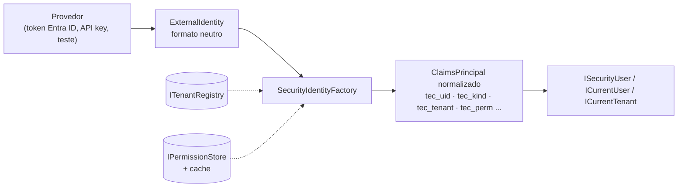
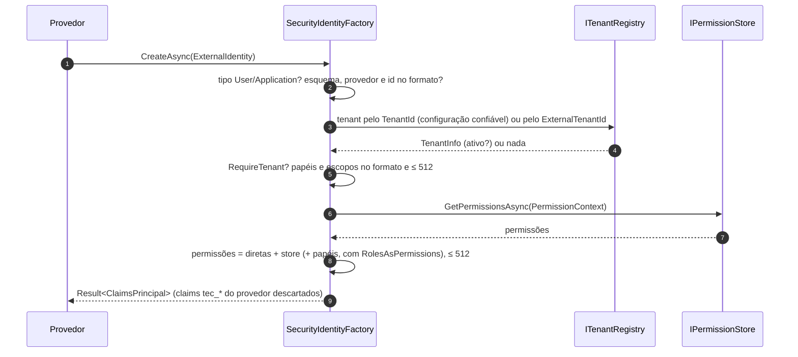

[🏠 TEC.Security](../README.md) › [📚 Documentação](README.md) › 👤 Identidade e permissões

# 👤 Identidade e permissões

> Como qualquer provedor de login vira a mesma identidade normalizada (`ISecurityUser`), de onde vêm as permissões e como
> plugar uma fonte própria (ex.: banco de dados) com cache.

## 📑 Sumário

- [🎯 Visão geral](#-visão-geral)
  - [Claims normalizados](#claims-normalizados)
  - [Como a identidade é normalizada](#como-a-identidade-é-normalizada)
- [🚀 Uso](#-uso)
  - [Ler a identidade no código](#ler-a-identidade-no-código)
  - [Permissões por papel no appsettings](#permissões-por-papel-no-appsettings)
  - [Fonte própria de permissões](#fonte-própria-de-permissões)
  - [Cache de permissões](#cache-de-permissões)
  - [Normalizar uma identidade manualmente](#normalizar-uma-identidade-manualmente)
- [⚙️ Opções](#️-opções)
- [❌ Erros](#-erros)
- [🛡️ Segurança](#️-segurança)
- [❓ Perguntas frequentes](#-perguntas-frequentes)

---

## 🎯 Visão geral



O código da aplicação lê **sempre** `ISecurityUser` (ou o `ICurrentUser` do TEC.Core), nunca os claims crus do token: o
mesmo código funciona com Entra ID, API key, identidade de sistema ou um provedor futuro.

### Claims normalizados

| Claim (`TecClaimTypes`) | Conteúdo | Propriedade |
|---|---|---|
| `tec_uid` (`UserId`) | Id estável: `oid` do Entra ID, `apikey:{id}`, `system:{nome}` | `Id` |
| `tec_kind` (`Kind`) | `User`, `Application` ou `System` | `Kind` |
| `tec_tenant` (`TenantId`) | Tenant **da aplicação**, sempre do cadastro (nunca copiado do token) | `TenantId`, `ICurrentTenant.Id` |
| `tec_ext_tenant` (`ExternalTenantId`) | Tenant no provedor (ex.: `tid`) | `ExternalTenantId` |
| `tec_scheme` / `tec_provider` | Esquema (ex.: `Funcionarios`) e provedor (`EntraId`, `ApiKey`, `System`, `Test`) | `Scheme`, `Provider` |
| `tec_client` (`ClientId`) | Aplicação cliente que obteve o token | `ClientId` |
| `tec_name` (`Name`) | Nome de exibição, saneado | `Name` |
| `tec_role` / `tec_scope` / `tec_perm` | Um claim por papel, escopo e permissão | `Roles`, `Scopes`, `Permissions` |
| `tec_normalized` (`Normalized`) | Marca `"1"`: só a identidade criada pelo componente tem | — (sem a marca, a identidade é anônima) |

A identidade normalizada usa `tec_name` como `NameClaimType` e `tec_role` como `RoleClaimType`: `User.IsInRole` e
`[Authorize(Roles = ...)]` enxergam os papéis normalizados. Os claims originais do provedor (exceto os `tec_*`) continuam
disponíveis em `ISecurityUser.Principal`.

### Como a identidade é normalizada



- **Falha fechada, sem exceção:** identidade incompleta, tenant desconhecido/inativo, excesso de itens ou falha do store
  viram `Result` de falha, log 3001/3003 e métrica `security.authentication.failures`; o esquema responde 401.
- **Valores fora do formato** são descartados um a um (log 3002 com a quantidade, nunca o valor).
- **Escopos** só existem em identidades `User`.
- **Nome de exibição** com caractere de controle, separador de linha/parágrafo (U+2028/U+2029), controle bidirecional
  (U+200E/F, U+202A–U+202E, U+2066–U+2069) ou surrogate solto é **recusado por inteiro** (o claim não é criado); acima de
  256 caracteres é cortado sem partir um par de surrogates.

---

## 🚀 Uso

### Ler a identidade no código

```csharp
using TEC.Core.Security;
using TEC.Security.Abstractions;

app.MapGet("/eu", (ISecurityUser usuario) => new
{
    usuario.Id,              // "oid" do Entra ID, "apikey:erp-contoso" ou "system:fechamento"
    usuario.Kind,            // PrincipalKind.User, Application ou System
    usuario.TenantId,        // tenant da aplicação (do cadastro)
    usuario.Name,            // só exibição
    Permissoes = usuario.Permissions,
    PodeCancelar = usuario.HasPermission("pedidos:cancelar")
});

// Componentes que só precisam de "quem" (auditoria, filas) dependem do contrato do TEC.Core
public sealed class Auditoria(ICurrentUser atual)
{
    public string Autor => atual.Id ?? "anônimo";
}
```

`ISecurityUser`, `ICurrentUser` e `ICurrentTenant` são Scoped e leem o principal **a cada acesso** (identidade do `RunAs`
primeiro, depois o `HttpContext.User`): um mesmo escopo de DI acompanha as trocas de identidade de um worker.

### Permissões por papel no appsettings

Padrão: `ConfigurationPermissionStore`, com recarga.

```json
"Security": {
  "RolesAsPermissions": false,
  "Permissions": {
    "Roles": {
      "Vendedor": [ "pedidos:ler", "pedidos:criar" ],
      "Gerente":  [ "pedidos:ler", "pedidos:criar", "pedidos:cancelar" ]
    },
    "Tenants": {
      "minha-empresa": { "Roles": { "Admin": [ "plataforma:admin" ] } }
    }
  }
}
```

| Fonte | Vale para |
|---|---|
| `Permissions:Roles` | Identidades de qualquer tenant |
| `Permissions:Tenants:{tenant}:Roles` | Somente identidades daquele tenant (somadas às de `Roles`) |
| Papéis da própria identidade | Todos, se `RolesAsPermissions = true` (padrão) |
| `Permissions` da API key | A própria chave ([🔑 API keys](api-keys.md)) |

Papéis sem mapeamento não geram permissões. Os nomes de papel são comparados exatamente (diferenciando maiúsculas).

### Fonte própria de permissões

```csharp
using Microsoft.Extensions.DependencyInjection;
using TEC.Security.Abstractions;

internal sealed class PermissoesDoBanco(IServiceScopeFactory scopes) : IPermissionStore
{
    public async ValueTask<IReadOnlyCollection<string>> GetPermissionsAsync(PermissionContext contexto, CancellationToken cancellationToken)
    {
        // Singleton: dependências Scoped (DbContext, repositórios) vêm de um escopo próprio
        await using var scope = scopes.CreateAsyncScope();
        var perfis = scope.ServiceProvider.GetRequiredService<IPerfilRepository>();
        return await perfis.PermissoesDosPapeisAsync(contexto.TenantId, contexto.Roles, cancellationToken);
    }
}

builder.Services.AddTecSecurity(builder.Configuration, security => security
    .AddAspNetCore()
    .AddEntraIdApi("Funcionarios", builder.Configuration.GetSection("Security:EntraId:Api"))
    .UsePermissionStore<PermissoesDoBanco>());   // cache padrão de 5 minutos
```

O store é consultado uma vez por autenticação (com o cache, uma vez por identidade a cada 5 minutos). Retorne coleção
vazia quando não houver permissões; `null` também vira lista vazia.

### Cache de permissões

`UsePermissionStore<T>(cacheDuration)` envolve a sua fonte num cache privado:

| Comportamento | Detalhe |
|---|---|
| Chave | Provedor + esquema + tenant + id + tipo + papéis (em ordem), como SHA-256 em Base64Url: tamanho fixo, mesmo com muitos papéis; mudar os papéis no token gera nova consulta |
| Uma consulta por chave | Requisições simultâneas da mesma identidade aguardam a **mesma** consulta (`SingleFlight` do TEC.Core): sem *cache stampede* |
| Cancelamento | Quem cancela só desiste da própria espera; a consulta à fonte só é cancelada quando **todas** as requisições que a aguardam desistem |
| Limite | 50.000 entradas (`IMemoryCache` próprio, não compartilhado com a aplicação) |
| O que não vai para o cache | Exceções da fonte e resultados acima de 512 permissões (recusados na autenticação de qualquer forma) |
| Duração | Padrão 5 minutos; `TimeSpan.Zero` desliga; máximo 1 hora |

### Normalizar uma identidade manualmente

Provedores novos (ou testes) usam o `SecurityIdentityFactory` diretamente:

```csharp
using TEC.Core.Security;
using TEC.Security.Claims;

var resultado = await factory.CreateAsync(new ExternalIdentity
{
    Scheme = "Parceiros",
    Provider = "Keycloak",
    UserId = "f6c1d2e0-1111-4222-8333-944455556666",
    Kind = PrincipalKind.User,
    ExternalTenantId = "realm-contoso",
    Roles = ["Gerente"],
    Scopes = ["pedidos.read"]
}, cancellationToken);

if (resultado.IsSuccess)
{
    var usuario = new SecurityUser(resultado.Value);   // ISecurityUser a partir do principal
}
```

`RevalidateAsync(principal)` refaz a normalização de um principal já normalizado (tenant e permissões atuais); é o que o
login web usa para que uma sessão longa reflita tenant desativado e permissão revogada.

---

## ⚙️ Opções

**`ISecurityUser`** (`TEC.Security.Abstractions`, herda `ICurrentUser` do TEC.Core)

| Membro | Tipo | Descrição |
|---|---|---|
| `Id`, `Kind`, `TenantId`, `IsAuthenticated` | (do `ICurrentUser`) | Id estável, tipo, tenant da aplicação |
| `Name` | `string?` | Nome de exibição (nunca use em decisão de acesso) |
| `Scheme` / `Provider` | `string?` | Esquema e tipo do provedor |
| `ExternalTenantId` / `ClientId` | `string?` | Tenant no provedor e aplicação cliente |
| `Roles` / `Scopes` / `Permissions` | `IReadOnlySet<string>` | Papéis, escopos delegados e permissões efetivas |
| `Principal` | `ClaimsPrincipal?` | Identidade completa (claims específicos do provedor) |
| `IsInRole(role)` / `HasScope(scope)` / `HasPermission(permission)` | `bool` | Comparação exata |

`SecurityUser` (`TEC.Security.Claims`) é a implementação lida de um `ClaimsPrincipal` (`new SecurityUser(principal)`,
`SecurityUser.Anonymous`).

**`ExternalIdentity`** (`TEC.Security.Claims`)

| Propriedade | Obrigatória | Descrição |
|---|:---:|---|
| `Scheme`, `Provider`, `UserId`, `Kind` | ✅ | Esquema, tipo do provedor, id estável e não reutilizável, `User`/`Application` |
| `ExternalTenantId` | — | Tenant no provedor, convertido pelo cadastro |
| `TenantId` | — | Tenant da aplicação já conhecido por configuração confiável (ex.: API key); tem precedência e também precisa existir e estar ativo |
| `Name`, `ClientId` | — | Exibição e aplicação cliente |
| `Roles`, `Scopes`, `Permissions` | — | Papéis, escopos (só `User`) e permissões diretas |
| `SourceClaims` | — | Claims originais, copiados exceto os `tec_*` |

**`SecurityIdentityFactory`** (Singleton): `CreateAsync(ExternalIdentity, CancellationToken)` e
`RevalidateAsync(ClaimsPrincipal, CancellationToken)`, ambos `Task<Result<ClaimsPrincipal>>`.

**`IPermissionStore`**: `ValueTask<IReadOnlyCollection<string>> GetPermissionsAsync(PermissionContext context, CancellationToken)`.
`PermissionContext(Provider, Scheme, UserId, TenantId, Kind, Roles)`.

**`PermissionOptions`** (seção `Security:Permissions`): `Roles` (`Dictionary<string, List<string>>`) e `Tenants`
(`Dictionary<string, TenantPermissionOptions>` com `Roles`).

**`SecurityRules`** (`TEC.Security.Common`)

| Membro | Valor / regra |
|---|---|
| `IsValidName` | Papel, escopo, permissão, esquema: `[A-Za-z0-9_.:/-]`, 1 a 128 (`MaxNameLength`) |
| `IsValidTenantId` | `[A-Za-z0-9][A-Za-z0-9_.-]`, até 64, começando com letra ou dígito |
| `IsValidServiceName` | Nome de sistema e id de API key: `[a-z0-9-]`, 3 a 40 |
| `IsValidUserId` | 1 a 256 (`MaxUserIdLength`) caracteres ASCII visíveis |
| `SanitizeDisplayName` | Nome sem espaços nas pontas, até 256 (`MaxDisplayNameLength`), ou `null` se recusado |
| `MaxItemsPerIdentity` | 512 papéis, escopos ou permissões por identidade |

Todos os padrões terminam em `\z` (uma quebra de linha final não passa) e aceitam só ASCII.

**`IPrincipalSource`** (`TEC.Security.Context`): fonte do principal atual. O núcleo registra o `ISecurityContext`; o
`AddAspNetCore()` troca por uma fonte que lê o `RunAs` e depois o `HttpContext.User`.

---

## ❌ Erros

| Erro (`Result`) | Quando ocorre | O que fazer |
|---|---|---|
| `SEGURANCA_NAO_AUTENTICADO` | Tipo não permitido para provedores (ex.: `System`), esquema/provedor/id fora do formato, mais de 512 papéis, escopos ou permissões | Confira o provedor; o motivo está no log 3001 |
| `SEGURANCA_TENANT_NAO_PERMITIDO` | `TenantId` explícito inexistente, tenant inativo, ou sem tenant com `RequireTenant` | Cadastre ou ative o tenant ([🏢 Tenants](tenants.md)) |
| `SEGURANCA_PROVEDOR_INDISPONIVEL` | O `IPermissionStore` lançou exceção (log 3003 com o tipo) | Verifique a fonte de permissões; a autenticação fica recusada até ela voltar |
| `ArgumentNullException` | `CreateAsync(null)`/`RevalidateAsync(null)` | — |
| `OperationCanceledException` | Cancelamento pedido pelo chamador | Propagada sem log de erro |

Para o cliente HTTP, todos viram **401** genérico; o detalhe fica só no log.

---

## 🛡️ Segurança

> [!CAUTION]
> Nunca use `Name`, e-mail ou `preferred_username` para decidir acesso ou como chave de auditoria: são mutáveis e
> reaproveitáveis. Use `Id` (`oid`).

> [!WARNING]
> Uma revogação na sua fonte de permissões só vale depois do cache (padrão 5 minutos). Para revogação imediata, use
> `UsePermissionStore<T>(TimeSpan.Zero)` ou uma duração menor.

- Todo claim `tec_*` que chega do provedor é **descartado** antes da normalização: um IdP mal configurado (atributo
  mapeado para `tec_perm`) não injeta permissão, tenant nem tipo.
- `PrincipalKind.System` não pode ser criado por provedores: só por `ISecurityContext.CreateSystemPrincipalAsync`.
- Uma identidade autenticada por outro mecanismo (sem a marca `tec_normalized`) é tratada como anônima e recebe 403.

---

## ❓ Perguntas frequentes

<details>
<summary>Qual a diferença entre papel e permissão?</summary>

Papel é o que o provedor informa (ex.: app role `Gerente`); permissão é o que a aplicação exige (`pedidos:cancelar`). O
`IPermissionStore` converte um no outro. Com `RolesAsPermissions = true`, um app role com nome de permissão já serve.

</details>

<details>
<summary>Como leio um claim específico do provedor (ex.: <code>preferred_username</code>)?</summary>

`usuario.Principal?.FindFirst("preferred_username")?.Value`. Só para exibição: decisões de acesso usam as propriedades
normalizadas.

</details>

<details>
<summary>Meu store demora; várias requisições do mesmo usuário chegam juntas.</summary>

Com o cache (`UsePermissionStore`), só uma consulta por identidade fica em andamento; as outras aguardam o mesmo
resultado.

</details>

---
⬅️ [🔐 Autorização](autorizacao.md) · [📚 Índice](README.md) · [🏢 Tenants](tenants.md) ➡️
