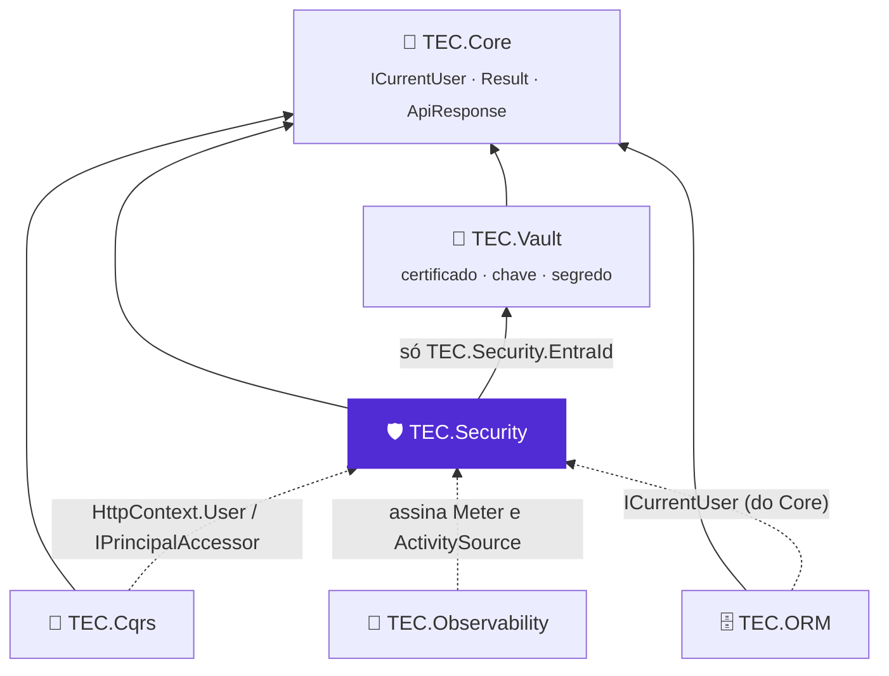

[🏠 TEC.Security](../README.md) › [📚 Documentação](README.md) › 🧬 Integrações TEC

# 🧬 Integrações TEC

> Como o TEC.Security se relaciona com os outros componentes do ecossistema: do que depende (TEC.Core, TEC.Vault) e como
> a identidade que ele normaliza chega ao TEC.Cqrs, ao TEC.ORM e ao TEC.Observability sem que eles dependam dele.

## 📑 Sumário

- [🎯 Visão geral](#-visão-geral)
- [🚀 Uso](#-uso)
  - [TEC.Core](#teccore)
  - [TEC.Vault](#tecvault)
  - [TEC.Cqrs](#teccqrs)
  - [TEC.ORM](#tecorm)
  - [TEC.Observability](#tecobservability)
- [⚙️ Opções](#️-opções)
- [❌ Erros](#-erros)
- [🛡️ Segurança](#️-segurança)
- [❓ Perguntas frequentes](#-perguntas-frequentes)

---

## 🎯 Visão geral



| Componente | Relação | O que o TEC.Security usa ou oferece |
|---|---|---|
| [TEC.Core](https://github.com/tudoemcodigo/lib-tec-core) | Dependência (`TEC.Security`) | `ICurrentUser`/`PrincipalKind`, `Result`/`Error`, `AppException`, `ApiResponse`, `SingleFlight`, `Base64UrlEncoder`, `BoundedFileReader`, `SensitiveDataMasker` |
| [TEC.Vault](https://github.com/tudoemcodigo/lib-tec-vault) | Dependência (só `TEC.Security.EntraId`) | Certificado e client secret da aplicação; assinatura da client assertion no cofre |
| [TEC.Cqrs](https://github.com/tudoemcodigo/lib-tec-cqrs) | Integração sem dependência | Identidade normalizada para `[AuthorizeRequest]` e `IPrincipalAccessor` |
| [TEC.ORM](https://github.com/tudoemcodigo/lib-tec-orm) | Integração sem dependência | Lê o `ICurrentUser` registrado pelo TEC.Security para a auditoria |
| [TEC.Observability](https://github.com/tudoemcodigo/lib-tec-observability) | Integração sem dependência | Exporta o Meter e o ActivitySource `TEC.Security` |

Cqrs, Security e Observability são independentes entre si: nenhum referencia o outro.

---

## 🚀 Uso

### TEC.Core

| Recurso do TEC.Core | Uso no TEC.Security |
|---|---|
| `ICurrentUser`, `PrincipalKind` | Contrato mínimo de **quem executa**: o TEC.Security o implementa e registra como Scoped (a mesma instância do `ISecurityUser`) |
| `Result`/`Error` | Retorno de `SecurityIdentityFactory` e `ISecurityContext`, com os códigos de [`SecurityErrors`](erros.md) |
| `ApiResponse`, `ApiError`, `ApiResponse.DefaultMessages` | Corpo e textos das respostas 401/403 (mesmo formato do TEC.Cqrs.AspNetCore) e mensagem do erro de provedor |
| `AppException` | Base da `SecurityTokenAcquisitionException` (`ToResult()`, `Errors`, `Code`) |
| `SingleFlight<TKey, TValue>` | Uma consulta por chave no cache de permissões e uma troca On-Behalf-Of por usuário + escopos |
| `Base64UrlEncoder` | Segredo e hash das API keys (estrito e canônico), client assertion, chave do cache |
| `BoundedFileReader` | Leitura do token federado (`AZURE_FEDERATED_TOKEN_FILE`) com teto de 16 KB |
| `SensitiveDataMasker.DescribeUntrusted` | Caminho da requisição na auditoria quando não há endpoint (só tamanho + HMAC) |
| `JsonDefaults` | Serialização do corpo 401/403 com metadados gerados (AOT) |

### TEC.Vault

Credenciais da aplicação no Entra ID sem segredo na configuração:

| Credencial | Interface do cofre | O que sai do cofre |
|---|---|---|
| `Certificate` | `ICertificateReader` + `IKeyCryptography` | Só a parte pública do certificado (relida a cada 30 min) e a **assinatura** PS256 da client assertion; a chave privada fica no cofre |
| `ClientSecret` | `ISecretReader` | O segredo, relido a cada 30 min (acompanha a rotação), uma leitura por vez |

```csharp
using TEC.Security.DependencyInjection;
using TEC.Security.EntraId;
using TEC.Vault.AzureKeyVault;
using TEC.Vault.DependencyInjection;

builder.Services.AddTecVault(vault => vault.UseAzureKeyVault(o =>
    o.VaultUri = new Uri("https://<nome-do-cofre>.vault.azure.net/")));

builder.Services.AddTecSecurity(builder.Configuration, security => security
    .AddEntraIdClient(builder.Configuration.GetSection("Security:EntraId:Client")));   // Credential:Type = Certificate
```

Papéis no cofre: *Key Vault Crypto User* + *Key Vault Certificate User* (`Certificate`) ou *Key Vault Secrets User*
(`ClientSecret`).

### TEC.Cqrs

- APIs: `[AuthorizeRequest(Roles = "...")]` e as policies de `[AuthorizeRequest(Policy = "...")]` avaliam o
  `HttpContext.User`, que já é a identidade normalizada (`RoleClaimType = tec_role`).
- Permissões no pipeline: registre uma policy por permissão (ex.:
  `o.AddPolicy("pedidos:cancelar", p => p.RequireClaim(TecClaimTypes.Permission, "pedidos:cancelar"))`) ou use um
  `IRequestAuthorizer<T>` com `ISecurityUser.HasPermission(...)`.
- Workers (inclusive `BackgroundService` dentro da API): registre um `IPrincipalAccessor` sobre o `ISecurityUser`
  ([🤖 Workers](workers.md#teccqrs-fora-do-http)).
- `SecurityTokenAcquisitionException` é uma `AppException`: o TEC.Cqrs a converte em `Result` (502).

### TEC.ORM

O TEC.ORM **não** referencia o TEC.Security: consome o `ICurrentUser` do TEC.Core, que o TEC.Security registra. Assim o
ORM continua sem ASP.NET Core e sem Entra ID, funciona em workers (identidade de sistema) e em testes (um `ICurrentUser`
falso).

| Campo de `IAuditable` | Valor |
|---|---|
| `CreatedBy` / `UpdatedBy` / `DeletedBy` | `ICurrentUser.Id` (`oid`, `apikey:{id}`, `system:{nome}`), nunca nome ou e-mail |
| `CreatedByTenant` / `UpdatedByTenant` / `DeletedByTenant` | `ICurrentUser.TenantId` no momento da operação |

Sem identidade autenticada, a gravação de entidade auditada é recusada (`ORM_AUDITORIA_SEM_IDENTIDADE`). Referência:
[auditoria do TEC.ORM](https://github.com/tudoemcodigo/lib-tec-orm/blob/main/docs/auditoria.md).

### TEC.Observability

`AddTecObservability` assina as fontes `TEC.*`: o Meter e o ActivitySource `TEC.Security` entram sem configuração
([📈 Observabilidade](observabilidade.md)). Com hubs SignalR o token vai na query string: o TEC.Observability redige os
valores da query string nos traces, mas confira os logs de acesso de proxies e do servidor.

---

## ⚙️ Opções

| Integração | Configuração |
|---|---|
| TEC.Core | Nenhuma (dependência direta) |
| TEC.Vault | `AddTecVault(...)` com um provedor de certificados/chaves (`Certificate`) ou segredos (`ClientSecret`); `Credential:CertificateName`/`ClientSecretName` |
| TEC.Cqrs | `IPrincipalAccessor` em workers; policies por permissão |
| TEC.ORM | Nenhuma: o `ICurrentUser` já está registrado |
| TEC.Observability | Nenhuma; sem ele: `AddSource(SecurityDiagnostics.ActivitySourceName)` e `AddMeter(SecurityDiagnostics.MeterName)` |

---

## ❌ Erros

| Erro | Quando ocorre | O que fazer |
|---|---|---|
| `InvalidOperationException`: `Credencial Certificate exige o TEC.Vault com chaves/certificados` | `Certificate` sem `IKeyCryptography`/`ICertificateReader` registrados | Registre o TEC.Vault com o provedor do cofre |
| `InvalidOperationException`: `Credencial ClientSecret exige o TEC.Vault com segredos` | `ClientSecret` sem `ISecretReader` | Registre o TEC.Vault |
| `InvalidOperationException`: `... não encontrado no cofre (<código>)` / `O cofre recusou a assinatura` | Item inexistente, sem permissão ou desabilitado | Confira o nome e os papéis no cofre |
| 401 em `Send` do TEC.Cqrs num worker | `IPrincipalAccessor` lendo só o `HttpContext` | Veja [🤖 Workers](workers.md#teccqrs-fora-do-http) |
| `ORM_AUDITORIA_SEM_IDENTIDADE` | Gravação auditada sem identidade (ex.: job sem `RunAs`) | Use uma identidade de sistema |

Nas chamadas de serviço, as falhas de credencial chegam como `SecurityTokenAcquisitionException`
([🔁 Chamadas entre serviços](chamadas-entre-servicos.md#-erros)).

---

## 🛡️ Segurança

> [!IMPORTANT]
> Os campos "por tenant" da auditoria do TEC.ORM são informativos: o ORM **não** filtra linhas por tenant. O isolamento
> de dados entre tenants é responsabilidade da aplicação ([🏢 Tenants](tenants.md#️-segurança)).

- Conceda à identidade da aplicação só os papéis mínimos no cofre (`Crypto User` + `Certificate User`, ou `Secrets User`).
- Traces e métricas do TEC.Security não levam token, id de usuário, nome nem e-mail: podem ir para terceiros.

---

## ❓ Perguntas frequentes

<details>
<summary>Preciso do TEC.Vault para usar o TEC.Security?</summary>

Só o `TEC.Security.EntraId` depende dele, e só as credenciais `Certificate` e `ClientSecret` o usam em tempo de execução.
`ManagedIdentityFederation`, `WorkloadIdentity`, `ManagedIdentity` e `Developer` não leem o cofre.

</details>

<details>
<summary>O TEC.Cqrs precisa referenciar o TEC.Security?</summary>

Não: ele avalia o `ClaimsPrincipal` (normalizado pelo TEC.Security) pelo `IPrincipalAccessor`.

</details>

---
⬅️ [🧱 Novo provedor](novo-provedor.md) · [📚 Índice](README.md) · [📈 Observabilidade](observabilidade.md) ➡️
