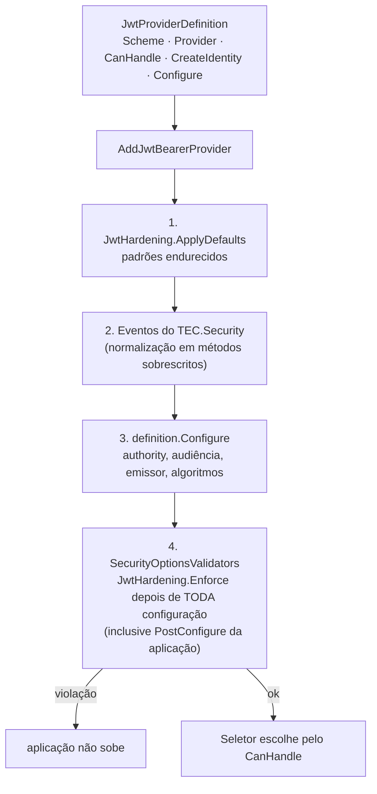

[🏠 TEC.Security](../README.md) › [📚 Documentação](README.md) › 🧱 Novo provedor

# 🧱 Criando um novo provedor

> Como plugar outro provedor de identidade (Keycloak, OIDC genérico...) herdando a validação endurecida, a normalização e
> a conferência dos controles obrigatórios: o provedor só diz como reconhecer o token e como lê-lo.

## 📑 Sumário

- [🎯 Visão geral](#-visão-geral)
- [🚀 Uso](#-uso)
  - [Provedor de tokens bearer](#provedor-de-tokens-bearer)
  - [Provedor de login web](#provedor-de-login-web)
  - [Checklist do provedor](#checklist-do-provedor)
- [⚙️ Opções](#️-opções)
- [❌ Erros](#-erros)
- [🛡️ Segurança](#️-segurança)
- [❓ Perguntas frequentes](#-perguntas-frequentes)

---

## 🎯 Visão geral



| O provedor decide | O TEC.Security garante |
|---|---|
| Como reconhecer o token (normalmente pelo emissor) | Escolha do esquema por requisição e falha para credencial não reconhecida |
| Authority, audiências, emissor e algoritmos | Validação de assinatura, emissor, audiência e validade sempre ligada; lista de permissão de algoritmos |
| Como converter claims em `ExternalIdentity` | Descarte de `tec_*`, tenant pelo cadastro, permissões, limites, auditoria e métricas |

O pacote `TEC.Security.Testing` (`AddTestJwt`) e o `TEC.Security.EntraId` são exemplos completos.

---

## 🚀 Uso

### Provedor de tokens bearer

```csharp
using Microsoft.AspNetCore.Authentication.JwtBearer;
using Microsoft.IdentityModel.JsonWebTokens;
using Microsoft.IdentityModel.Tokens;
using TEC.Core.Security;
using TEC.Security.AspNetCore;
using TEC.Security.AspNetCore.Authentication;
using TEC.Security.Claims;
using TEC.Security.DependencyInjection;

public static class KeycloakExtensions
{
    public const string ProviderName = "Keycloak";

    public static SecurityBuilder AddKeycloakApi(this SecurityBuilder builder, string scheme, string realmUrl, string audience)
    {
        string issuer = realmUrl.TrimEnd('/');   // ex.: https://sso.contoso.com/realms/contoso

        return builder.AddJwtBearerProvider(new JwtProviderDefinition
        {
            Scheme = scheme,
            Provider = ProviderName,
            // Lido SEM validação, só para escolher o esquema: o esquema escolhido valida tudo de novo
            CanHandle = jwt => string.Equals(jwt.Issuer, issuer, StringComparison.Ordinal),
            CreateIdentity = (TokenValidatedContext _, JsonWebToken token, out string reason) =>
            {
                if (!token.TryGetPayloadValue("sub", out string? subject) || string.IsNullOrEmpty(subject))
                {
                    reason = "sub ausente";   // vai para o log 3201; nunca coloque dados do token aqui
                    return null;
                }

                token.TryGetPayloadValue("scope", out string? scope);
                reason = string.Empty;
                return new ExternalIdentity
                {
                    Scheme = scheme,
                    Provider = ProviderName,
                    UserId = subject,
                    Kind = string.IsNullOrEmpty(scope) ? PrincipalKind.Application : PrincipalKind.User,
                    ExternalTenantId = "contoso",   // ex.: o realm, vinculado em Security:Tenants:*:IdentityProviders:Keycloak
                    Roles = [.. token.Claims.Where(c => c.Type == "roles").Select(c => c.Value)],
                    Scopes = scope?.Split(' ', StringSplitOptions.RemoveEmptyEntries) ?? [],
                    SourceClaims = [.. token.Claims]
                };
            },
            Configure = (o, sp) =>
            {
                o.Authority = issuer;                                           // JWKS só deste emissor, por HTTPS
                o.TokenValidationParameters.ValidIssuer = issuer;
                o.TokenValidationParameters.ValidAudience = audience;
                o.TokenValidationParameters.ValidAlgorithms = [SecurityAlgorithms.RsaSha256];
            }
        });
    }
}

// Uso
builder.Services.AddTecSecurity(builder.Configuration, security => security
    .AddAspNetCore()
    .AddKeycloakApi("Parceiros", "https://sso.contoso.com/realms/contoso", "api-pedidos"));
```

- `CreateIdentity` recebe o token **já validado**. Retorne `null` com o motivo para recusar; exceções
  `ArgumentException`, `FormatException`, `InvalidOperationException` e `JsonException` também viram recusa (claim com tipo
  inesperado), nunca erro 500.
- Exceções desses tipos em `CanHandle` significam "não é deste provedor".
- O `Provider` é a chave em `Security:Tenants:*:IdentityProviders` e aparece em `ISecurityUser.Provider`.

### Provedor de login web

```csharp
using Microsoft.AspNetCore.Authentication.OpenIdConnect;
using TEC.Core.Security;
using TEC.Security.AspNetCore;
using TEC.Security.AspNetCore.Authentication;
using TEC.Security.Claims;

builder.Services.AddTecSecurity(builder.Configuration, security => security
    .AddAspNetCore()
    .AddWebLoginProvider(new WebLoginDefinition
    {
        Scheme = "Web",
        Provider = "Keycloak",
        CreateIdentity = (TokenValidatedContext context, out string reason) =>
        {
            string? sub = context.Principal?.FindFirst("sub")?.Value;
            reason = sub is null ? "sub ausente" : string.Empty;
            return sub is null ? null : new ExternalIdentity
            {
                Scheme = "Web", Provider = "Keycloak", UserId = sub, Kind = PrincipalKind.User,
                Name = context.Principal!.FindFirst("name")?.Value,
                SourceClaims = [.. context.Principal.Claims]
            };
        },
        Configure = (o, sp) =>
        {
            o.Authority = "https://sso.contoso.com/realms/contoso";
            o.ClientId = "site-pedidos";
            o.TokenValidationParameters.ValidAudience = "site-pedidos";
            // credencial do cliente: prefira private_key_jwt (client assertion) a client secret
        },
        RevalidationInterval = TimeSpan.FromMinutes(5),
        MaxSessionLifetime = TimeSpan.FromHours(8)
    }));
```

O TEC.Security aplica Authorization Code + PKCE, nonce, state, `form_post`, cookie `__Host-` endurecido, revalidação da
sessão e 401 para chamadas de API ([🪪 Provedor Entra ID](provedor-entra-id.md#login-web) descreve o comportamento).

### Checklist do provedor

- [ ] `CanHandle` reconhece pelo **emissor exato** (e audiência, se houver vários esquemas do mesmo emissor).
- [ ] `Configure` define `Authority` (ou `Configuration`), `ValidIssuer`/`ValidIssuers`/`IssuerValidator`,
      `ValidAudience(s)` e `ValidAlgorithms` só com RS\*, PS\* ou ES\*.
- [ ] `UserId` é estável e não reutilizável (`sub`/`oid`), nunca e-mail ou login.
- [ ] Tokens de ID não são aceitos como access token (exija claims que só o access token tem).
- [ ] Multi-tenant: o emissor/tenant aceito vem do cadastro (`ITenantRegistry.GetEnabledExternalIds(Provider)`).
- [ ] O motivo da recusa (`reason`) não contém dados do token.
- [ ] Testes: token de outra chave, expirado, de outra audiência, `alg: none`, HS256 e claims `tec_*` injetados.

---

## ⚙️ Opções

**`JwtProviderDefinition`** (`TEC.Security.AspNetCore.Authentication`)

| Propriedade | Obrigatória | Descrição |
|---|:---:|---|
| `Scheme` | ✅ | Nome do esquema, único (letras, dígitos e `_ . : / -`; não pode ser `TEC` nem `TEC.None`) |
| `Provider` | ✅ | Tipo do provedor (`ExternalIdentity.Provider`) |
| `CanHandle` | ✅ | `Func<JsonWebToken, bool>`: o token (lido sem validação) é deste provedor? |
| `CreateIdentity` | ✅ | `CreateIdentityDelegate(TokenValidatedContext context, JsonWebToken token, out string reason)` → `ExternalIdentity?` |
| `Configure` | — | `Action<JwtBearerOptions, IServiceProvider>`, aplicada depois dos padrões |

**`WebLoginDefinition`**

| Propriedade | Padrão | Descrição |
|---|---|---|
| `Scheme`, `Provider`, `CreateIdentity` | obrigatórias | Esquema do cookie, tipo do provedor, conversão do ID token (`CreateWebIdentityDelegate`) |
| `Configure` | — | `Action<OpenIdConnectOptions, IServiceProvider>` |
| `ConfigureCookie` | — | Ajustes no cookie (ex.: `ExpireTimeSpan`, até 12 h) |
| `RevalidationInterval` | 5 min | 1 minuto a 1 hora |
| `MaxSessionLifetime` | 8 h | 1 a 24 horas |
| `IsSessionAllowed` | — | `Func<ISecurityUser, IServiceProvider, bool>` conferida a cada revalidação; `false` encerra a sessão |
| `ChallengeScheme` | `{Scheme}.oidc` | Nome do esquema OIDC |

**`JwtHardening`** (estático)

| Membro | Descrição |
|---|---|
| `DefaultClockSkew` / `MaxClockSkew` | 30 segundos / 2 minutos |
| `DefaultAlgorithms` | `RS256`, `PS256`, `ES256` |
| `ApplyDefaults(JwtBearerOptions, int maxTokenLength, bool isDevelopment)` | Padrões endurecidos (abaixo) |
| `Enforce(JwtBearerOptions, string scheme, bool allowSymmetricKeys = false)` | Confere os controles; lança `InvalidOperationException` na violação |

Padrões de `ApplyDefaults`: emissor, audiência, validade e assinatura validados; `exp`, assinatura e audiência
obrigatórios; `TryAllIssuerSigningKeys = false`; tolerância de 30 s; `MapInboundClaims = false`; `SaveToken = false`;
`RequireHttpsMetadata = true`; `IncludeErrorDetails` só em Development; `JsonWebTokenHandler` com tamanho máximo;
recarga do JWKS no máximo a cada 5 min (`RefreshInterval`) e automática a cada 12 h.

**Lista de permissão de algoritmos** (`ValidAlgorithms`, conferida por `Enforce` e pela validação do OIDC):

| Família | Nomes curtos | URIs equivalentes (XML DSig) | Aceita |
|---|---|---|:---:|
| RSA PKCS#1 | `RS256`, `RS384`, `RS512` | `...#rsa-sha256` etc. | ✅ |
| RSA-PSS | `PS256`, `PS384`, `PS512` | `...#sha256-rsa-MGF1` etc. | ✅ |
| ECDSA | `ES256`, `ES384`, `ES512` | `...#ecdsa-sha256` etc. | ✅ |
| HMAC | `HS256`, `HS384`, `HS512` | `...#hmac-sha256` etc. | Só com `allowSymmetricKeys: true` |
| `none`, nomes desconhecidos, lista vazia | — | — | ❌ |

> [!NOTE]
> Os esquemas registrados pelo TEC.Security (`AddJwtBearerProvider`, login web) chamam `Enforce` **sem**
> `allowSymmetricKeys`: HMAC nunca é aceito neles. O parâmetro existe para quem usa `JwtHardening` num esquema JwtBearer
> próprio, fora do TEC.Security.

**`SecuritySchemes`** (Singleton): `Bearer` (lista de `BearerProviderRegistration(Scheme, Provider, CanHandle)`),
`CookieScheme`, `ApiKeyScheme`, `All`. Obtido no registro por `builder.GetSchemes()`.

---

## ❌ Erros

| Erro | Quando ocorre | O que fazer |
|---|---|---|
| `InvalidOperationException` no registro | Sem `AddAspNetCore` antes; esquema repetido ou reservado (`TEC`, `TEC.None`); segundo login web; intervalos do login web fora da faixa | Corrija o registro |
| `ArgumentException` | Nome de esquema fora do formato | Letras, dígitos e `_ . : / -` |
| `OptionsValidationException` na subida (`Esquema '<nome>': ...`) | Validação de emissor/audiência/validade/assinatura desligada; `exp`/assinatura/audiência não exigidos; `SignatureValidator`/`LifetimeValidator`/`AlgorithmValidator` personalizados; `ClockSkew` fora de 0–2 min; `MapInboundClaims`/`SaveToken` ligados; `RequireHttpsMetadata` desligado; sem audiência ou emissor; algoritmo fora da lista de permissão; `Events`/`EventsType` substituídos | Remova o ajuste |
| `OptionsValidationException` (login web) | Fluxo diferente de `code`; PKCE, nonce ou state desligados; `SaveTokens` ou `MapInboundClaims` ligados; `GetClaimsFromUserInfoEndpoint`; algoritmo fora da lista (HMAC nunca); sem `ClientId` ou `Authority`; cookie sem HttpOnly/Secure/SameSite, acima de 12 h ou `__Host-` com `Domain`/`Path` | Remova o ajuste |
| 401 + log 3201 | `CreateIdentity` recusou (motivo) ou a validação falhou (tipo da exceção) | Veja o motivo no log |

---

## 🛡️ Segurança

> [!WARNING]
> Não substitua `Events` nem `EventsType`: a normalização mora nos métodos sobrescritos dos eventos do TEC.Security, e a
> troca é recusada na subida. Para lógica extra, atribua os delegates (`o.Events.OnMessageReceived = ...`): eles rodam
> **antes** e não conseguem pular a normalização (um `OnTokenValidated` que aprove sozinho vira recusa).

- O token é lido sem validação **só** para escolher o esquema; um valor adulterado leva no máximo a uma recusa.
- Chaves vêm só do JWKS do emissor configurado (`jku`, `x5u` e `jwk` do cabeçalho são ignorados).
- A mensagem de exceção da validação nunca vai para o log (pode conter partes do token): só o tipo.

---

## ❓ Perguntas frequentes

<details>
<summary>Posso usar <code>PostConfigure&lt;JwtBearerOptions&gt;</code> para ajustar meu esquema?</summary>

Sim, desde que não desligue nenhum controle obrigatório: a conferência roda depois de toda configuração, inclusive
`PostConfigure`.

</details>

<details>
<summary>Meu IdP assina com HS256.</summary>

Não é aceito em esquemas do TEC.Security: chave simétrica compartilhada permite que qualquer detentor emita tokens.
Configure o IdP para RS256/PS256/ES256.

</details>

---
⬅️ [🤖 Workers](workers.md) · [📚 Índice](README.md) · [🧬 Integrações TEC](integracoes-tec.md) ➡️
