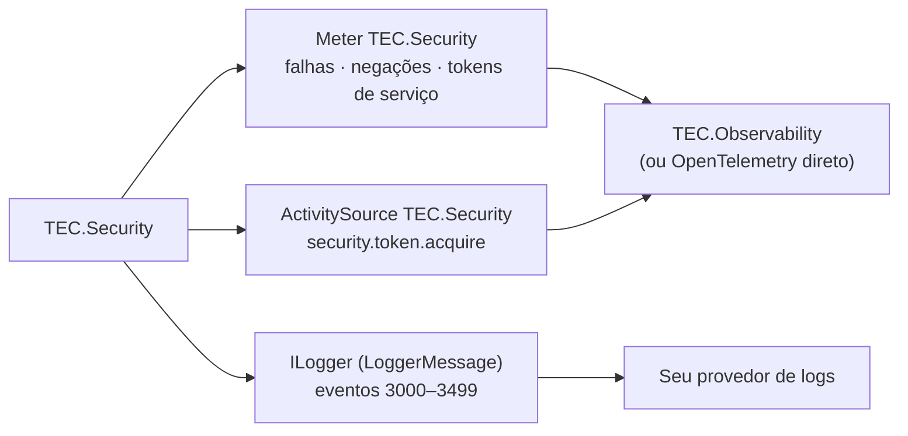

[🏠 TEC.Security](../README.md) › [📚 Documentação](README.md) › 📈 Observabilidade

# 📈 Observabilidade

> Quais métricas, traces e eventos de log o TEC.Security emite, como coletá-los e quais alertas configurar, sem nunca
> registrar token, segredo ou dado pessoal.

## 📑 Sumário

- [🎯 Visão geral](#-visão-geral)
- [🚀 Uso](#-uso)
  - [Coletar](#coletar)
  - [Métricas](#métricas)
  - [Traces](#traces)
  - [Eventos de log](#eventos-de-log)
  - [Alertas sugeridos](#alertas-sugeridos)
- [⚙️ Opções](#️-opções)
- [❌ Erros](#-erros)
- [🛡️ Segurança](#️-segurança)
- [❓ Perguntas frequentes](#-perguntas-frequentes)

---

## 🎯 Visão geral



| Sinal | Nome | Cardinalidade |
|---|---|---|
| Meter | `TEC.Security` (versão do assembly) | Baixa: esquema, motivo, provedor, cache, tipo de erro |
| ActivitySource | `TEC.Security` | Um span por obtenção de token de serviço sem cache |
| Logs | Categorias das classes (`SecurityIdentityFactory`, `ApiKeyValidator`...) e `TEC.Security.AspNetCore.*`, `TEC.Security.EntraId*` | Mensagens por *source generator*, sem alocação com o nível desligado |

Faixas de eventos: núcleo 3000–3199, ASP.NET Core 3200–3399, Entra ID 3400–3499.

---

## 🚀 Uso

### Coletar

Com o TEC.Observability, nada a fazer: `AddTecObservability` assina as fontes `TEC.*`. Sem ele:

```csharp
using TEC.Security.Diagnostics;

builder.Services.AddOpenTelemetry()
    .WithTracing(t => t.AddSource(SecurityDiagnostics.ActivitySourceName))
    .WithMetrics(m => m.AddMeter(SecurityDiagnostics.MeterName));
```

### Métricas

| Instrumento | Tipo | Unidade | Dimensões |
|---|---|---|---|
| `security.authentication.failures` | Contador | `{failure}` | `security.scheme`, `security.reason` |
| `security.authorization.denied` | Contador | `{denial}` | `security.scheme` (`none` sem esquema), `security.reason` |
| `security.token.acquisition.duration` | Histograma | `s` | `security.provider` (`EntraId`, `EntraId.OnBehalfOf`, o nome do seu provedor), `security.cache` (`hit`/`miss`), `error.type` (só em falha: nome do tipo da exceção) |
| `security.circuit.state_changes` | Contador | `{change}` | `security.provider` (`EntraId`, `EntraId.OnBehalfOf`), `security.circuit.state` (`open`, `half_open`, `closed`) |

| `security.reason` (autenticação) | Origem |
|---|---|
| `token` | Token inválido (JwtBearer) ou credencial não reconhecida (`TEC.None`) |
| `identity` | Identidade recusada pela normalização ou pelo `CreateIdentity` do provedor |
| `tenant` | Tenant inexistente, inativo ou ausente com `RequireTenant` |
| `permission_store` | O `IPermissionStore` lançou exceção |
| `api_key` | API key recusada |
| `session` | Sessão do login web encerrada na revalidação |
| `remote` | Falha remota no login web (resposta do provedor) |

| `security.reason` (autorização) | Origem |
|---|---|
| `permission`, `role`, `scope`, `kind`, `scheme` | Requisito do `[TecAuthorize]` não atendido |
| `not_normalized` | Identidade autenticada sem a normalização do TEC.Security |

### Traces

| Span | Tipo | Quando | Atributos |
|---|---|---|---|
| `security.token.acquire` | Client | Obtenção de token de serviço sem cache (client credentials e On-Behalf-Of) | `security.provider`; em falha, status `Error` (e `error.type` no client credentials) |

A validação de tokens de entrada não gera span próprio: o tempo aparece no span HTTP do ASP.NET Core.

### Eventos de log

| Id | Nível | Origem | Conteúdo |
|:-:|---|---|---|
| 3001 | Warning | `SecurityIdentityFactory` | Identidade recusada, com o motivo (tenant inativo, id inválido, limite de papéis...) |
| 3002 | Warning | `SecurityIdentityFactory` | Papéis/escopos/permissões fora do formato descartados (só a quantidade) |
| 3003 | Error | `SecurityIdentityFactory` | O `IPermissionStore` lançou exceção (tipo); autenticação recusada |
| 3100 | Information | `ConfigurationTenantRegistry` | Cadastro de tenants recarregado (quantidade) |
| 3101 | Error | `ConfigurationTenantRegistry` | Recarga do cadastro recusada; o anterior continua |
| 3110 | Warning | `ApiKeyValidator` | **Auditoria:** API key recusada (motivo e id, nunca o segredo) |
| 3111 | Error | `ApiKeyValidator` | API key ignorada por cadastro inválido (uma vez por versão) |
| 3120 | Error | Provedor de token | Falha ao obter token de serviço sem token válido em cache (tipo da exceção) |
| 3121 | Warning | `AccessTokenHandler` | Requisição bloqueada: destino fora de `AllowedHosts`/sem HTTPS (host) |
| 3122 | Warning | Provedor de token | Renovação falhou; o token atual, ainda válido por mais de 30 s, continua em uso |
| 3123 | Warning | Circuit breaker | Circuito aberto após falhas repetidas do provedor de identidade (duração da pausa) |
| 3124 | Information | Circuit breaker | Circuito meio-aberto: chamada de teste |
| 3125 | Information | Circuit breaker | Circuito fechado: o provedor voltou a responder |
| 3201 | Information | `TEC.Security.AspNetCore.JwtBearer` | Token recusado (tipo da exceção ou motivo; nunca a mensagem) |
| 3202 | Information | Esquemas `TEC.None` e de API key | Credencial recusada (não reconhecida, dois headers de API key, API key sem HTTPS) |
| 3203 | Information | `TecAuthorizationHandler` | **Auditoria:** acesso negado (endpoint, tipo, id, esquema, tenant, motivo). Sem endpoint, o caminho aparece só como tamanho + HMAC (`SensitiveDataMasker.DescribeUntrusted`) |
| 3204 | Warning | `TecAuthorizationHandler` | Identidade autenticada sem normalização do TEC.Security |
| 3205 | Information | `TEC.Security.AspNetCore.WebLogin` | Sessão web encerrada na revalidação (motivo) |
| 3206 | Information | `EndpointSecurityValidator` | Endpoints conferidos na subida (quantidade) |
| 3207 | Information | `TEC.Security.AspNetCore.WebLogin` | Login web recusado (tipo ou motivo) |
| 3401 | Error | `EntraIdOnBehalfOfHandler` | On-Behalf-Of falhou: id do usuário e tipo do erro, com a exceção anexada (sem token; erro do Entra só como código OAuth validado) |
| 3402 | Error | `TEC.Security.EntraId.WebLogin` | Credencial da aplicação indisponível na troca do código do login web |
| 3403 | Warning | `TEC.Security.EntraId` | API multi-tenant com `RolesAsPermissions = true` |

### Alertas sugeridos

- Pico de 3201/3202 e de `security.authentication.failures` (varredura de tokens).
- 3110 repetido para o mesmo id (chave vazada ou integração quebrada); 3110 com `chave expirada` (rotação esquecida).
- 3203 repetido para o mesmo id (tentativa de escalonamento).
- 3123 (circuito aberto: o provedor de identidade está falhando para todos os usuários).
- Qualquer 3003, 3101, 3111, 3120, 3401 ou 3402 (falha de infraestrutura ou configuração); 3122 frequente (provedor
  instável).
- 3403 em produção (multi-tenant sem permissões por tenant).

---

## ⚙️ Opções

**`SecurityDiagnostics`** (`TEC.Security.Diagnostics`)

| Membro | Valor / uso |
|---|---|
| `ActivitySourceName` / `MeterName` | `"TEC.Security"` |
| `AuthenticationFailuresName` | `"security.authentication.failures"` |
| `AuthorizationDeniedName` | `"security.authorization.denied"` |
| `TokenAcquisitionDurationName` | `"security.token.acquisition.duration"` |
| `CircuitStateChangesName` | `"security.circuit.state_changes"` |
| `RecordAuthenticationFailure(scheme, reason)` | Para pacotes de provedor |
| `RecordAuthorizationDenied(scheme, reason)` | Para pacotes de provedor |
| `RecordTokenAcquisition(provider, cacheHit, seconds, errorType)` | Para provedores de token próprios |
| `StartTokenAcquisition(provider)` | `Activity?` da obtenção de token (`null` sem ouvinte) |

Os níveis de log seguem a configuração normal do `ILogger`. Todas as categorias começam com `TEC.Security` (nome completo
da classe, ou `TEC.Security.AspNetCore.JwtBearer`, `TEC.Security.AspNetCore.WebLogin`, `TEC.Security.EntraId`...), então
`"Logging": { "LogLevel": { "TEC.Security": "Information" } }` cobre o componente inteiro (o filtro é por prefixo).

---

## ❌ Erros

| Sintoma | Causa | O que fazer |
|---|---|---|
| Nenhuma métrica `security.*` | Meter não assinado | `AddMeter(SecurityDiagnostics.MeterName)` ou TEC.Observability |
| Sem span `security.token.acquire` | Tokens vindos do cache (não há obtenção) ou ActivitySource não assinado | Esperado no cache; assine a fonte |
| Log 3203 sem nome de endpoint | Requisição sem endpoint roteado (ex.: middleware próprio) | O caminho aparece como `<N caracteres, hmac:...>` de propósito |

---

## 🛡️ Segurança

> [!IMPORTANT]
> Nenhum trace ou métrica leva token, id de usuário, nome ou e-mail (costumam ir para terceiros). Os logs de auditoria
> (3110, 3203) levam ids técnicos (`oid`, id da API key, tenant) para investigação: trate o destino de logs como dado
> pessoal.

- Mensagens de exceção de validação de token nunca são registradas (podem conter partes do token): só o tipo.
- Erros do endpoint de token do Entra ID chegam ao log só como o código OAuth validado (`invalid_grant`...) ou
  `codigo-invalido`.
- Valores do usuário nos logs passam por formatos validados; injeção de linha no log não é possível.

---

## ❓ Perguntas frequentes

<details>
<summary>Como sei por que um usuário recebeu 401?</summary>

Procure 3201 (token), 3202 (credencial), 3001 (identidade/tenant), 3003 (store) ou 3110 (API key) no horário. A resposta
ao cliente é sempre genérica.

</details>

<details>
<summary>Posso desligar a auditoria 3203?</summary>

Pelo nível de log da categoria `TEC.Security.AspNetCore.Authorization.TecAuthorizationHandler`. Não recomendado: é a trilha
de tentativas de acesso negadas.

</details>

---
⬅️ [🧬 Integrações TEC](integracoes-tec.md) · [📚 Índice](README.md) · [❌ Erros](erros.md) ➡️
