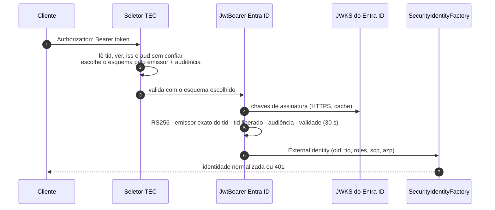
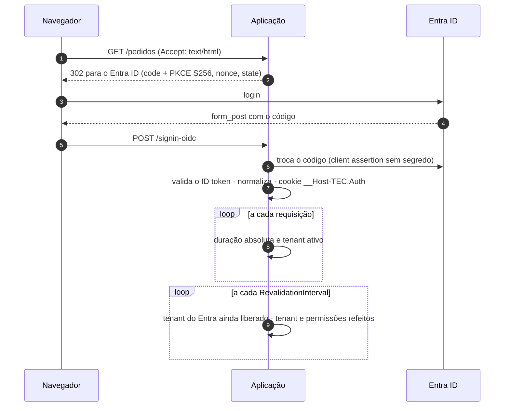

[🏠 TEC.Security](../README.md) › [📚 Documentação](README.md) › 🪪 Provedor Entra ID

# 🪪 Provedor Microsoft Entra ID

> Como proteger APIs com tokens do Entra ID, fazer login de usuários em sites (OIDC + PKCE), aceitar vários tenants pelo
> cadastro e autenticar a aplicação sem segredo na configuração.

## 📑 Sumário

- [🎯 Visão geral](#-visão-geral)
- [🚀 Uso](#-uso)
  - [API protegida](#api-protegida)
  - [Várias app registrations](#várias-app-registrations)
  - [Login web](#login-web)
  - [Credencial da aplicação](#credencial-da-aplicação)
  - [Multi-tenant](#multi-tenant)
  - [Configurando a app registration](#configurando-a-app-registration)
- [⚙️ Opções](#️-opções)
- [❌ Erros](#-erros)
- [🛡️ Segurança](#️-segurança)
- [❓ Perguntas frequentes](#-perguntas-frequentes)

---

## 🎯 Visão geral



| Recurso | Método | Pacote |
|---|---|---|
| API (tokens bearer) | `AddEntraIdApi` | `TEC.Security.EntraId` |
| Login web (MVC, Razor Pages, Blazor) | `AddEntraIdWebLogin` + `MapTecWebLogin` | `TEC.Security.EntraId` + `TEC.Security.AspNetCore` |
| Chamadas entre serviços e On-Behalf-Of | `AddEntraIdClient`, `AddEntraIdAccessToken`, `AddEntraIdOnBehalfOf` | [🔁 Chamadas entre serviços](chamadas-entre-servicos.md) |

**Validado em cada access token:** assinatura **RS256** com as chaves do JWKS; emissor **exatamente**
`https://<instância>/{tid}/v2.0` com o `tid` do próprio token, e esse `tid` liberado; audiência; validade (30 s de
tolerância); `oid` e `tid` GUIDs; presença de `scp` ou `roles`; `azp`/`appid` obrigatório e `nonce` proibido (um ID token
é recusado mesmo com a audiência certa); sem `scp`, só vira aplicação com `idtyp=app` ou `sub == oid`; `azp` na lista,
quando configurada.

**Normalização:** `oid` → `Id` (minúsculas); `tid` → `ExternalTenantId` e tenant do cadastro; `roles` → papéis (e
permissões, com `RolesAsPermissions`); `scp` → escopos; com `scp` → `User`, sem `scp` → `Application`; `azp`/`appid` →
`ClientId`; `name`/`preferred_username` → `Name` (usuário) ou o client id (aplicação).

| Claim | Uso |
|---|---|
| `oid` | Id estável (nunca `email`/`upn`/`preferred_username`) |
| `tid` | Tenant no Entra ID → tenant da aplicação |
| `roles` / `scp` | App roles → papéis/permissões · escopos delegados |
| `azp` / `appid` | Aplicação cliente (obrigatório no access token) |
| `idtyp` / `sub` | `idtyp=app` ou `sub == oid` marcam token de aplicação |
| `nonce` | Proibido no access token (indica ID token) |
| `ver` | `2.0`; `1.0` só com `AcceptV1Tokens` |
| `groups` | **Não usado** (estoura com muitos grupos e carrega GUIDs): use app roles atribuídos a grupos |

---

## 🚀 Uso

### API protegida

```json
"Security": {
  "EntraId": {
    "Api": {
      "TenantId": "<tenant-id>",
      "ClientId": "<client-id-da-api>",
      "AllowedClientApplications": [ "<client-id-do-front>", "<client-id-do-servico-de-estoque>" ]
    }
  }
}
```

```csharp
using TEC.Security.AspNetCore;
using TEC.Security.DependencyInjection;
using TEC.Security.EntraId;

builder.Services.AddTecSecurity(builder.Configuration, security => security
    .AddAspNetCore()
    .AddEntraIdApi("Funcionarios", builder.Configuration.GetSection("Security:EntraId:Api")));
```

As opções são validadas **no registro**: configuração errada derruba a subida.

### Várias app registrations

```csharp
builder.Services.AddTecSecurity(builder.Configuration, security => security
    .AddAspNetCore()
    .AddEntraIdApi("Funcionarios", builder.Configuration.GetSection("Security:EntraId:Api"))
    .AddEntraIdApi("Parceiros", o =>
    {
        o.TenantId = builder.Configuration["Parceiros:TenantId"];
        o.ClientId = builder.Configuration["Parceiros:ClientId"];
        o.AllowApplicationTokens = true;
    }));
```

O seletor escolhe o esquema pelo emissor **e** pela audiência do token (lidos sem confiar, só para escolher); o esquema
escolhido valida tudo de novo. Restrinja um endpoint a um deles com `[TecAuthorize(Schemes = "Parceiros")]`.

### Login web

```json
"Security": {
  "EntraId": {
    "WebLogin": {
      "TenantId": "<tenant-id>",
      "ClientId": "<client-id-do-site>",
      "Credential": { "Type": "ManagedIdentityFederation", "ManagedIdentityClientId": "<client-id-da-identidade-gerenciada>" },
      "RevalidationInterval": "00:02:00",
      "MaxSessionLifetime": "04:00:00"
    }
  }
}
```

```csharp
builder.Services.AddTecSecurity(builder.Configuration, security => security
    .AddAspNetCore()
    .AddEntraIdWebLogin("Web", builder.Configuration.GetSection("Security:EntraId:WebLogin")));

var app = builder.Build();
app.MapTecWebLogin();   // GET /account/login?returnUrl=/pedidos  e  POST /account/logout
```

```html
<a href="/account/login?returnUrl=/pedidos">Entrar</a>
<form method="post" action="/account/logout"><button type="submit">Sair</button></form>
```



| Controle | Detalhe |
|---|---|
| Fluxo | Authorization Code + PKCE (`S256`), `response_mode=form_post`, nonce e state validados, escopos `openid profile` |
| ID token | Mesmas regras de emissor e tenant da API; RS256; papéis do claim `roles` |
| Tokens | **Não** guardados no cookie (`SaveTokens = false`); `MapInboundClaims = false`; `GetClaimsFromUserInfoEndpoint` proibido |
| Cookie | `__Host-TEC.Auth`: HttpOnly, Secure, SameSite=Lax, `Path=/`, sem `Domain`; deslizante (`SessionDuration`, máximo 12 h) |
| Sessão | Duração absoluta `MaxSessionLifetime` desde o login (o uso não estende); revalidação a cada `RevalidationInterval` |
| Chamadas de API | Sem `Accept: text/html` (ou com `X-Requested-With: XMLHttpRequest`): 401 em vez de redirecionar, sem gravar cookies de nonce/correlação |
| `returnUrl` | Só caminho local (começa com `/`, sem `//`, `/\`, controle; até 2048); fora disso volta para `/` |
| Logout | Só `POST` e só da mesma origem (`Sec-Fetch-Site: same-origin` ou `Origin` igual ao host); encerra a sessão local e no Entra ID |

Só um login web por aplicação. O esquema OIDC se chama `{scheme}.oidc` (ex.: `Web.oidc`).

### Credencial da aplicação

O login web (troca do código), as chamadas entre serviços e o On-Behalf-Of precisam que a aplicação prove a própria
identidade. Nenhum valor secreto vai para a configuração: só o **tipo** e, quando for o caso, o **nome** do item no
TEC.Vault.

| `Credential:Type` | Segredo? | Login web / OBO | Client credentials | Quando usar |
|---|:-:|:-:|:-:|---|
| `ManagedIdentityFederation` (padrão) | Não | ✅ | ✅ | **No Azure.** A identidade gerenciada é federada à app registration (audiência `api://AzureADTokenExchange`, ou as variantes US Gov/China) |
| `WorkloadIdentity` | Não | ✅ | ✅ | AKS, GitHub Actions (OIDC): lê o token de `AZURE_FEDERATED_TOKEN_FILE` (até 16 KB, UTF-8 estrito) |
| `Certificate` | Chave no cofre, **não sai de lá** | ✅ | ✅ | Fora do Azure. Client assertion PS256 assinada **no** cofre (`IKeyCryptography`), identificada por `x5t#S256`; parte pública relida a cada 30 min |
| `ClientSecret` | Sim, no cofre | ✅ | ✅ | Último recurso. Relido do cofre a cada 30 min (acompanha a rotação), uma leitura por vez |
| `ManagedIdentity` | Não | ❌ | ✅ | Chamar serviços com a própria identidade gerenciada, sem app registration |
| `Developer` | — | ❌ | ✅ | Só em Development: Azure CLI, Azure Developer CLI e Visual Studio |

```csharp
using TEC.Vault.AzureKeyVault;
using TEC.Vault.DependencyInjection;

// Certificate e ClientSecret exigem o TEC.Vault registrado
builder.Services.AddTecVault(vault => vault.UseAzureKeyVault(o =>
    o.VaultUri = new Uri("https://<nome-do-cofre>.vault.azure.net/")));
```

```json
"Credential": { "Type": "Certificate", "CertificateName": "<certificado-no-cofre>" }
```

Papéis no cofre: **Key Vault Crypto User** (assinar) e **Key Vault Certificate User** (ler a parte pública) para
`Certificate` (o certificado pode ser **não exportável**); **Key Vault Secrets User** para `ClientSecret`.

### Multi-tenant

```json
"Security": {
  "RequireTenant": true,
  "RolesAsPermissions": false,
  "EntraId": { "Api": { "TenantId": "<tenant-id-da-app>", "ClientId": "<client-id-da-api>", "MultiTenant": true } },
  "Tenants": {
    "contoso":       { "IdentityProviders": { "EntraId": [ "<tenant-id-da-contoso>" ] } },
    "minha-empresa": { "IdentityProviders": { "EntraId": [ "<tenant-id-da-app>" ] } }
  },
  "Permissions": {
    "Roles": { "Leitor": [ "pedidos:ler" ] },
    "Tenants": { "minha-empresa": { "Roles": { "Admin": [ "plataforma:admin" ] } } }
  }
}
```

- Passam na validação do emissor **só** os tenants ativos no cadastro (`IdentityProviders:EntraId`), os de
  `AllowedTenantIds` e o `TenantId`. Nunca "qualquer tenant": a authority `organizations` serve só para descobrir as chaves.
- Liberar ou desativar um tenant no cadastro vale na próxima requisição; sessões do login web caem na revalidação.
- Cada tenant cliente precisa consentir a app (admin consent) no Entra ID; o cadastro decide se a **sua** aplicação aceita.
- Contas pessoais Microsoft (MSA) não são aceitas.
- Com `MultiTenant` e `RolesAsPermissions = true`, a subida registra o aviso **3403**: veja a seção de segurança.

### Configurando a app registration

<details>
<summary>API</summary>

1. *App registrations* → **New registration** (single ou multitenant, conforme `MultiTenant`).
2. *Expose an API* → Application ID URI `api://<client-id-da-api>` → escopo `access_as_user` (chamadas em nome do usuário).
3. *App roles* → papéis com valor no formato de permissão (ex.: `pedidos:ler`), para **Users/Groups** e/ou **Applications**.
4. *Manifest* → `"requestedAccessTokenVersion": 2` (tokens v2; senão use `AcceptV1Tokens`).
5. *Token configuration* → opcional `idtyp` (marca tokens de aplicação).
6. *Enterprise applications* → *Properties* → **Assignment required = Yes** (só quem recebeu papel consegue token).

</details>

<details>
<summary>Aplicação cliente (chamadas entre serviços)</summary>

1. *API permissions* → *My APIs* → a API acima → **Application permissions** → papéis → *Grant admin consent*.
2. Credencial: *Certificates & secrets* → **Federated credentials** (identidade gerenciada, GitHub, AKS) ou certificado (o
   mesmo do cofre). Evite client secret.

</details>

<details>
<summary>Site (login web)</summary>

1. *Authentication* → plataforma **Web** → Redirect URI `https://<host>/signin-oidc` e logout
   `https://<host>/signout-callback-oidc`. Desmarque *Access tokens* e *ID tokens* (fluxo implícito desligado).
2. Credencial como acima.

</details>

---

## ⚙️ Opções

**`EntraIdAppOptions`** (base de `EntraIdApiOptions` e `EntraIdWebLoginOptions`)

| Opção | Padrão | Descrição |
|---|---|---|
| `Instance` | `https://login.microsoftonline.com/` | Nuvem. Só as oficiais: pública, US Gov (`login.microsoftonline.us`) e China (`login.chinacloudapi.cn`, `login.partner.microsoftonline.cn`); HTTPS, sem porta, caminho ou query |
| `TenantId` | `null` | Tenant da app registration (GUID). Obrigatório sem `MultiTenant` (e sempre no login web); nunca `common`/`organizations` |
| `ClientId` | `null` | Client id da app registration (GUID). Obrigatório |
| `MultiTenant` | `false` | Aceita outros tenants: só os ativos no cadastro e os de `AllowedTenantIds` |
| `AllowedTenantIds` | vazio | Tenants fixos (GUIDs), além do cadastro. Exige `MultiTenant` |

**`EntraIdApiOptions`** (`AddEntraIdApi`)

| Opção | Padrão | Descrição |
|---|---|---|
| `Audiences` | vazio = `ClientId` e `api://{ClientId}` | Audiências aceitas |
| `AllowedClientApplications` | vazio (qualquer) | Client ids aceitos em `azp`/`appid` (GUIDs). **Recomendado** |
| `AllowApplicationTokens` | `true` | Aceita tokens de aplicação (client credentials) |
| `AcceptV1Tokens` | `false` | Aceita tokens v1.0 (emissor `sts.windows.net`); não existe na nuvem US Gov |

**`EntraIdWebLoginOptions`** (`AddEntraIdWebLogin`)

| Opção | Padrão | Descrição |
|---|---|---|
| `CallbackPath` | `/signin-oidc` | Caminho local do retorno do login |
| `SignedOutCallbackPath` | `/signout-callback-oidc` | Caminho local do retorno do logout |
| `Credential` | `ManagedIdentityFederation` | Credencial da troca do código (`ManagedIdentity` e `Developer` não servem) |
| `SessionDuration` | 1 hora | Sessão deslizante do cookie (máximo 12 h) |
| `RevalidationInterval` | 5 minutos | Tenant e permissões consultados de novo (1 min a 1 h) |
| `MaxSessionLifetime` | 8 horas | Duração absoluta desde o login (1 a 24 h) |

**`EntraIdCredentialOptions`**

| Opção | Padrão | Descrição |
|---|---|---|
| `Type` | `ManagedIdentityFederation` | `EntraIdCredentialType` |
| `ManagedIdentityClientId` | `null` (do sistema) | Identidade gerenciada atribuída pelo usuário (GUID) |
| `CertificateName` | `null` | Nome do certificado no TEC.Vault (`Certificate`) |
| `ClientSecretName` | `null` | Nome do segredo no TEC.Vault (`ClientSecret`) |
| `AllowDeveloperCredentialsOutsideDevelopment` | `false` | Libera `Developer` fora de Development (CI, ferramentas) |

**Métodos**

| Método | Descrição |
|---|---|
| `AddEntraIdApi(string scheme, IConfiguration section)` / `(string scheme, Action<EntraIdApiOptions>)` | API protegida; pode ser chamado várias vezes com esquemas diferentes |
| `AddEntraIdWebLogin(string scheme, IConfiguration section)` / `(string scheme, Action<EntraIdWebLoginOptions>)` | Login web; um por aplicação |
| `MapTecWebLogin(this IEndpointRouteBuilder, string prefix = "/account")` | `GET {prefix}/login` e `POST {prefix}/logout` (no `TEC.Security.AspNetCore`) |
| `EntraIdExtensions.SectionName` | `"Security:EntraId"` (seção sugerida) |
| `SecurityBuilderWebLoginExtensions.CookieName` | `"__Host-TEC.Auth"` |

---

## ❌ Erros

| Erro | Quando ocorre | O que fazer |
|---|---|---|
| `InvalidOperationException` no registro | `Instance` fora das oficiais (ou com porta, caminho, query); `ClientId` não GUID; `TenantId` ausente sem `MultiTenant` ou não GUID (inclusive `common`); `AllowedTenantIds` sem `MultiTenant` ou com valor não GUID; `AllowedClientApplications` não GUID; `Audiences` com valor vazio | Corrija as opções; a mensagem cita o esquema |
| `InvalidOperationException` no registro (login web) | Credencial `ManagedIdentity`/`Developer`; `CertificateName`/`ClientSecretName` ausentes; `CallbackPath`/`SignedOutCallbackPath` não locais; `RevalidationInterval` fora de 1 min–1 h; `MaxSessionLifetime` fora de 1–24 h; segundo login web | Corrija as opções |
| `InvalidOperationException`: `credencial Developer só é permitida no ambiente Development` | `Developer` fora de Development | Use `ManagedIdentityFederation`/`WorkloadIdentity`; em CI, `AllowDeveloperCredentialsOutsideDevelopment` |
| `OptionsValidationException` na subida | `SessionDuration` acima de 12 h; um ajuste posterior desligou PKCE, nonce, state, validação do ID token, ligou `SaveTokens`/`MapInboundClaims`/userinfo ou trocou os eventos | Remova o ajuste |
| `InvalidOperationException`: `Nenhum login web registrado` | `GET /account/login` sem `AddEntraIdWebLogin` | Registre o login web |
| 401 (log 3201) | Token recusado: assinatura, emissor, tenant, audiência, validade, versão | Veja o tipo no log; confira tenant no cadastro, `Audiences`, `requestedAccessTokenVersion: 2` |
| 401 (log 3201 com motivo) | `tid/oid` ausente, sem `scp` nem `roles`, ID token como access token, aplicação fora de `AllowedClientApplications`, token de aplicação com `AllowApplicationTokens = false` | Ajuste a app registration ou as opções |
| 401 no login (log 3207/3402) | Falha remota no login, ID token recusado, credencial indisponível na troca do código | Veja o log; confira a credencial e o acesso ao cofre |
| 403 no logout | `POST /account/logout` de outra origem | Faça o logout por formulário do próprio site |

---

## 🛡️ Segurança

> [!CAUTION]
> Em APIs multi-tenant, administradores de cada tenant cliente podem atribuir **qualquer** app role da sua app aos próprios
> usuários. Use `RolesAsPermissions: false` e permissões por tenant (`Security:Permissions:Tenants`), com as permissões
> administrativas só no tenant da sua empresa. O aviso 3403 lembra disso a cada subida.

> [!WARNING]
> O cookie do login web é protegido pelo Data Protection do ASP.NET Core. Com mais de uma instância, persista as chaves em
> local compartilhado e protegido (ex.: `PersistKeysToAzureBlobStorage(...).ProtectKeysWithAzureKeyVault(...)`); senão cada
> deploy ou instância invalida as sessões.

- Preencha `AllowedClientApplications`: limita quem chama a API mesmo com consentimento indevido.
- Ative *Assignment required* na enterprise application.
- `SameSite=Lax` bloqueia POSTs de outros sites na maioria dos navegadores; em formulários use também o antiforgery do
  ASP.NET Core.
- Papéis do login web vêm do ID token: só mudam no próximo login (no máximo `MaxSessionLifetime`).
- A instância é validada (só hosts oficiais): uma configuração adulterada não envia o código nem a client assertion a outro
  servidor.

---

## ❓ Perguntas frequentes

<details>
<summary>Toda chamada com token válido retorna 401.</summary>

O seletor não reconheceu o token (emissor ou audiência diferentes), o token é v1 sem `AcceptV1Tokens`, o `tid` não está
liberado, ou falta `scp`/`roles` (ID token ou app sem permissão). Os eventos 3201, 3202 e 3001 trazem o motivo.

</details>

<details>
<summary>401 só para usuários de um tenant cliente.</summary>

Com `MultiTenant`, o `tid` precisa estar ativo em `Security:Tenants:*:IdentityProviders:EntraId` (ou em
`AllowedTenantIds`); com `RequireTenant`, toda identidade precisa de tenant.

</details>

<details>
<summary>Uma chamada <code>fetch</code> do site recebe 401 em vez de ir para o login.</summary>

Esperado: chamadas sem `Accept: text/html` recebem 401 para não acumular cookies de nonce. Trate o 401 no front-end
redirecionando para `/account/login?returnUrl=...`.

</details>

<details>
<summary>Posso usar grupos do Entra ID?</summary>

Não diretamente. Crie app roles e atribua-os a grupos na enterprise application: o token traz o claim `roles`.

</details>

---
⬅️ [🏢 Tenants](tenants.md) · [📚 Índice](README.md) · [🔁 Chamadas entre serviços](chamadas-entre-servicos.md) ➡️
