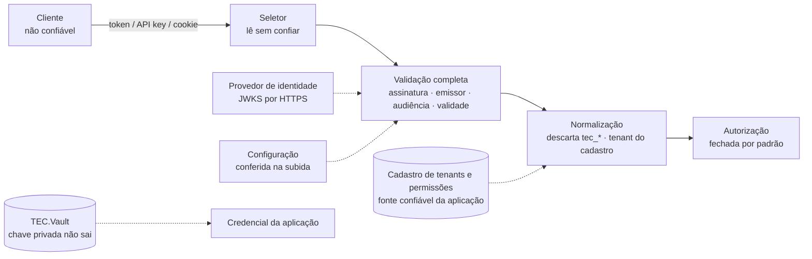

[🏠 TEC.Security](../README.md) › [📚 Documentação](README.md) › 🛡️ Segurança

# 🛡️ Segurança

> O modelo de confiança do TEC.Security, cada ameaça com o controle e o teste que o prova, os controles que nenhuma
> configuração consegue desligar, os riscos que continuam com você e o checklist de produção.

## 📑 Sumário

- [🎯 Visão geral](#-visão-geral)
- [🚀 Uso](#-uso)
  - [Ameaças e controles](#ameaças-e-controles)
  - [Controles obrigatórios conferidos na subida](#controles-obrigatórios-conferidos-na-subida)
  - [Limites contra abuso de recursos](#limites-contra-abuso-de-recursos)
  - [Rate limiting](#rate-limiting)
  - [Checklist de produção](#checklist-de-produção)
- [⚙️ Opções](#️-opções)
- [❌ Erros](#-erros)
- [🛡️ Segurança](#️-segurança-1)
- [❓ Perguntas frequentes](#-perguntas-frequentes)

---

## 🎯 Visão geral

| Princípio | Aplicação |
|---|---|
| **Nunca confiar, sempre verificar** | Todo token é validado por inteiro; nada lido antes da validação decide acesso; claims do provedor não viram tenant nem permissão sem passar pelo cadastro |
| **Fechado por padrão** | `FallbackPolicy`; credencial não reconhecida = 401; configuração insegura = aplicação não sobe |
| **Menor privilégio** | Permissões explícitas; escopo × permissão; `Kinds`; `AllowedClientApplications`; token de serviço só para `AllowedHosts` |
| **Sem segredo na aplicação** | Identidade gerenciada federada / Workload Identity; certificado assinando no cofre; API key só como hash |
| **Assumir violação** | Nada de token/segredo em log; respostas genéricas; tenant e permissões revalidados na sessão; auditoria de negações |

| O componente garante | Quem usa é responsável por |
|---|---|
| Validação de token endurecida e não desligável | Configurar a app registration (assignment required, tokens v2, app roles) |
| Fechado por padrão | Não marcar `[AllowAnonymous]` sem necessidade |
| Tenant só do cadastro | **Filtrar dados por tenant** na camada de dados (autorização não isola dados) |
| Identidade estável (`oid`) | Usar `ICurrentUser.Id` em auditoria, nunca nome/e-mail |
| Credencial sem segredo por padrão | Não usar `ClientSecret` quando houver alternativa; RBAC mínimo no cofre |
| Nada de token/segredo nos logs do componente | Não registrar `Authorization`, `X-Api-Key` e `access_token` em logs de acesso, proxies e APM |
| `AllowedHosts` nos tokens de serviço | Manter a lista mínima |
| Limites de tamanho e quantidade | **Rate limiting** nos endpoints públicos, de login e de API key |

---

## 🚀 Uso

### Ameaças e controles

Os testes citados ficam em `TEC.Security.Tests` ([🧪 Testes](testes.md)).

<b>Tokens</b>

| Ameaça | Controle | Prova |
|---|---|---|
| Token `alg: none` | `ValidAlgorithms` explícito; `none` recusado na configuração | `HttpSecurityTests.Alg_none_token_is_rejected` |
| Confusão de algoritmo (HS256 com a chave pública como segredo) | Lista de **permissão**: só RS\*, PS\*, ES\* (nomes curtos e URIs); HMAC nunca nos esquemas do TEC.Security; nomes desconhecidos recusados | `HS256_token_signed_with_arbitrary_key_is_rejected`, `Jwt_enforcement_rejects_HMAC_in_any_spelling_and_unknown_algorithms`, `Oidc_enforcement_rejects_HMAC_uri_and_saved_tokens` |
| `AlgorithmValidator` personalizado contornando a lista | Recusado na subida | `Jwt_enforcement_accepts_asymmetric_algorithms_and_rejects_custom_algorithm_validator` |
| Chave do atacante via `jku`/`x5u`/`jwk` | Chaves só do JWKS do emissor configurado; `TryAllIssuerSigningKeys = false` | `Token_from_another_key_expired_or_for_another_audience_is_rejected` |
| Token de outra API | `ValidAudiences` obrigatório; `RequireAudience` | idem; `EntraIdApiTests.Audience_of_another_API_is_rejected` |
| **ID token usado como access token** | Exige `scp` ou `roles`, `azp`/`appid`, recusa `nonce`; sem `scp`, só aplicação com `idtyp=app` ou `sub == oid` | `ID_token_without_scp_or_roles_is_rejected_as_access_token`, `ID_token_with_roles_does_not_become_application_identity` |
| Tenant não autorizado ("aceita todos") | Emissor exato `/{tid}/v2.0` + `tid` ativo no cadastro ou lista fixa; nunca `common` | `Unregistered_or_inactive_tenant_is_rejected`, `TenantId_common_or_missing_without_MultiTenant_prevents_startup` |
| `tid` liberado com emissor de outro tenant | Emissor comparado com o `tid` do próprio token | `Issuer_of_a_tenant_other_than_tid_is_rejected` |
| Aplicação cliente não autorizada | `AllowedClientApplications` (`azp`/`appid`) | `Client_application_outside_the_list_is_rejected` |
| JWKS por HTTP | `RequireHttpsMetadata` obrigatório | `HTTP_metadata_prevents_startup` |
| Configuração tardia (`PostConfigure`, troca de `Events`) desligando a validação ou pulando a normalização | `IValidateOptions` depois de toda configuração; normalização em métodos sobrescritos; aprovação antecipada vira recusa | `PostConfigure_disabling_audience_prevents_startup`, `Replacing_the_events_prevents_startup`, `OnTokenValidated_delegate_approving_alone_does_not_skip_normalization` |
| Token na query string vazando em logs | Aceito só em `HubPaths` | `Query_token_is_only_accepted_on_configured_hubs` |

<b>Identidade, tenants e autorização</b>

| Ameaça | Controle | Prova |
|---|---|---|
| **Injeção de permissão/tenant/tipo via claim** (`tec_perm`, `tec_tenant`, `tec_kind`) | Todo `tec_*` do provedor é descartado; só a marca criada pelo componente vale | `Injected_tec_perm_claim_does_not_grant_permission`, `Tec_claims_from_the_provider_are_discarded`, `Identity_without_normalization_mark_is_anonymous` |
| Identidade por e-mail/login (mutável) | Id = `oid`/`sub`; nome só exibição | `User_token_of_registered_tenant_is_normalized` |
| Nome de exibição forjado (texto invertido por U+202E, quebra por U+2028) | Nome com controle bidirecional, separador de linha/parágrafo ou surrogate solto é recusado inteiro; corte respeita pares | `Display_name_with_bidi_override_or_line_separator_is_rejected`, `Display_name_truncation_never_splits_a_surrogate_pair` |
| Id externo fora do ASCII resolvendo para outro tenant (`ſ` → `S`) | Ids externos só ASCII visível antes de montar a chave | `SecurityRegressionTests.TenantRegistry_ExternalIdOutsideAscii_NeverResolvesToAnotherTenant` |
| Cadastro inválido liberando ou bloqueando por engano | Versão inválida recusada (anterior continua); inicial inválida impede a subida | `Invalid_reload_is_rejected_and_previous_catalog_remains`, `Same_external_id_in_two_tenants_prevents_startup` |
| Falha da fonte de permissões autorizando | Exceção do store recusa a autenticação | `Permission_store_failure_rejects_the_identity` |
| Admin de tenant cliente atribuindo app role privilegiado (multi-tenant) | Permissões por tenant; aviso 3403 | `Per_tenant_mapping_applies_only_to_that_tenant` |
| Endpoint esquecido sem autorização | `FallbackPolicy` exige identidade normalizada | `Endpoint_without_attribute_requires_authentication_and_returns_ApiResponse` |
| `[AllowAnonymous]` anulando `[TecAuthorize]` | Aplicação não sobe | `TecAuthorize_with_AllowAnonymous_prevents_startup` |
| Regra vazia degradando para "qualquer autenticado" | Aplicação não sobe | `TecAuthorize_with_empty_value_is_rejected_at_mapping` |
| `[TecAuthorize]` ignorado em hubs SignalR e Blazor | Regra como policy codificada, lida pelo `IAuthorizeData` | `TecAuthorize_applies_through_IAuthorizeData_as_in_SignalR_hubs_and_Blazor`, `Malformed_TEC_policy_name_fails_closed` |
| Escopo delegado satisfeito por token de aplicação | `Scopes` nega aplicação | `Required_scope_denies_application_token_and_accepts_user_with_scope` |
| Credencial desconhecida tratada como anônima | Esquema `TEC.None` falha a autenticação | `Unknown_issuer_Basic_and_malformed_token_are_401_not_anonymous`, `Two_Authorization_headers_are_rejected` |
| Identidade de sistema forjada | `System` só por `CreateSystemPrincipalAsync`; `RunAs` só com principal normalizado | `Provider_cannot_create_system_identity`, `RunAs_with_system_identity_applies_only_inside_the_scope` |
| Identidade vazando entre containers no mesmo processo | `AsyncLocal` por instância | `RunAs_in_one_container_is_not_visible_in_another_container` |
| Identidade trocada entre fluxos paralelos do mesmo escopo | Cache (principal, usuário) numa referência imutável | `Parallel_RunAs_in_same_scope_does_not_mix_identities` |

<b>API keys</b>

| Ameaça | Controle | Prova |
|---|---|---|
| Chave vazada no repositório ou log | Só hash na configuração; prefixo `tec_` para secret scanning; segredo nunca em log | `ApiKeyTests.Tampered_secret_is_rejected_and_never_logged` |
| Enumeração de ids pelo tempo | Hash sempre calculado e comparado em tempo constante, inclusive para id desconhecido | `ConstantTimeTests.ApiKey_UnknownIdIsIndistinguishable_FromExistingIdWithWrongSecret` |
| Variações da mesma chave aceitas | Base64Url estrito e canônico do TEC.Core; hash cadastrado não canônico recusado | `ApiKey_AnySingleEditOfAValidKey_IsRejected`, `Non_canonical_hash_in_the_catalog_is_rejected` |
| Chave por HTTP ou na URL | Só header, só HTTPS | `API_key_without_HTTPS_or_in_query_string_is_rejected` |
| Chave eterna | `ExpiresOn` obrigatório | `Expired_disabled_or_unbounded_key_is_rejected` |
| Cadastro inválido amplificando carga (uma exceção por requisição) | Releitura do cadastro inválido no máximo 1×/s | `Invalid_api_key_configuration_is_not_reevaluated_on_every_request` |
| Troca do header deixando clientes sem acesso | Header lido a cada requisição | `API_key_header_change_applies_without_restart` |

<b>Login web</b>

| Ameaça | Controle | Prova |
|---|---|---|
| Fluxo implícito / interceptação do código | Só Authorization Code + PKCE S256; nonce e state | `Navigation_redirects_to_provider_with_PKCE_and_code` |
| Roubo do cookie (XSS, HTTP, subdomínio) | `__Host-`, HttpOnly, Secure, SameSite=Lax, sem Domain | `Cookie_is_hardened`, `Cookie_without_Secure_or_with_SameSite_None_prevents_startup` |
| Tokens guardados no cookie | `SaveTokens` e `MapInboundClaims` impedem a subida | `Oidc_enforcement_rejects_HMAC_uri_and_saved_tokens` |
| Open redirect após login | `returnUrl` só caminho local | `ReturnUrl_only_accepts_local_path`, `Login_with_external_returnUrl_returns_to_root` |
| Logout forçado por CSRF | Só `POST` e só da mesma origem | `Logout_from_another_site_is_rejected` |
| Tenant desativado continua acessando | Tenant a cada requisição; tenant e permissões a cada intervalo; duração absoluta | `Revalidation_reflects_disabled_tenant` |
| Cookies de nonce acumulados por chamadas de API | 401 antes do OIDC para chamadas sem `Accept: text/html` | `API_call_without_session_does_not_write_OIDC_cookies` |

<b>Chamadas entre serviços e credenciais</b>

| Ameaça | Controle | Prova |
|---|---|---|
| **Exfiltração do token de serviço** (SSRF) | `AllowedHosts` exato + HTTPS + sem usuário na URL | `Token_is_attached_only_for_allowed_host_over_HTTPS`, `FuzzingTests.ServiceTokenDestination_OnlyHttpsToTheExactAllowedHost` |
| Instância do Entra adulterada | Só instâncias oficiais, sem caminho/porta/query | `Unofficial_instance_prevents_startup` |
| Chave privada da aplicação exposta | Client assertion PS256 assinada **no** cofre | `Client_assertion_is_signed_in_vault_with_PS256_and_x5t_S256` |
| Credencial de desenvolvedor em servidor | `Developer` só em Development | `Developer_credential_outside_Development_is_rejected` |
| Provedor de teste esquecido em produção | `AddTestJwt` impede a subida fora de Development/Testing/Test | `Test_provider_does_not_start_in_production` |
| Erro do Entra com texto arbitrário no log | Só código OAuth validado | `Entra_error_code_is_filtered_before_logging` |
| Resposta gigante ou validade absurda do endpoint de token | Leitura com teto de 64 KB; `expires_in` entre 1 s e 24 h, pelo `TimeProvider` | `Token_endpoint_response_without_length_is_read_with_a_ceiling`, `Token_endpoint_expiration_uses_the_injected_clock_and_rejects_absurd_values` |
| Arquivo de token federado gigante | `BoundedFileReader` com 16 KB | `Federated_token_file_is_read_with_a_size_limit` |
| Instabilidade do provedor derrubando chamadas | Token atual em uso enquanto valer mais de 30 s | `Refresh_failure_keeps_using_the_current_token_while_it_is_still_valid` |
| Crescimento sem limite do cache de tokens | No máximo 1024 conjuntos de escopos | `Token_provider_limits_the_number_of_distinct_scope_sets` |

<b>Negação de serviço e vazamento</b>

| Ameaça | Controle | Prova |
|---|---|---|
| Token gigante / claims inflados | `MaxTokenLength`; 512 papéis/escopos/permissões | `Token_above_maximum_length_is_rejected`, `Malformed_roles_are_discarded_and_excess_is_rejected`, `DosResistanceTests` |
| Recarga do JWKS forçada com `kid` desconhecido | No máximo a cada 5 min | `DosResistanceTests.Http_FloodOfTokensFromUnknownKeys_StaysFastAndRejected` |
| *Cache stampede* na fonte de permissões | Uma consulta por chave; cancelar só desiste da própria espera | `Concurrent_cache_misses_for_the_same_identity_query_the_store_once`, `Cancellation_of_the_first_caller_does_not_fail_the_other_waiters` |
| Memória do cache esgotada | Chave de tamanho fixo; 50.000 entradas | `Permission_cache_key_has_fixed_size_even_with_many_roles`, `PermissionCache_DistinctIdentitiesBeyondLimit_FailsNothing` |
| Token/segredo em log | Só o tipo da exceção; `ToString()` mascarado | `Failure_log_does_not_contain_the_token`, `LeakageTests` |
| Motivo da recusa orientando o atacante | 401/403 genéricos e idênticos | `LeakageTests.RejectedTokens_AllReasons_IdenticalResponse_AndTokenNeverLogged` |
| Injeção de linha no log | Valores validados antes do log | `LeakageTests.IdentityRejection_LogInjection_IsNotPossible` |

### Controles obrigatórios conferidos na subida

Conferidos por `IValidateOptions` **depois** de toda configuração (inclusive `PostConfigure` da aplicação) e materializados
por um `IHostedService` na subida: a violação impede a aplicação de subir.

| Esquema | Controles |
|---|---|
| Bearer (JWT) | Emissor, audiência, validade e chave de assinatura validados; `exp`, assinatura e audiência exigidos; sem `SignatureValidator`, `LifetimeValidator` ou `AlgorithmValidator` personalizados; `ClockSkew` de 0 a 2 min; `MapInboundClaims` e `SaveToken` desligados; `RequireHttpsMetadata`; audiência e emissor informados; algoritmos só RS\*/PS\*/ES\*; `Events`/`EventsType` não substituídos |
| Login web (OIDC) | `ResponseType = code`; PKCE; nonce e state; validação do ID token completa; sem validadores personalizados; algoritmos só RS\*/PS\*/ES\*; `SaveTokens` e `MapInboundClaims` desligados; sem `GetClaimsFromUserInfoEndpoint`; `ClientId` e `Authority`; eventos não substituídos |
| Cookie | HttpOnly, `Secure` sempre, SameSite Lax ou Strict; `ExpireTimeSpan` de até 12 h; `__Host-` com `Path=/` e sem `Domain`; eventos não substituídos |
| Endpoints | `[TecAuthorize]` com valores válidos e sem `[AllowAnonymous]` |
| Cadastros | Tenants e API keys válidos |
| Ambiente | `Developer` só em Development; `AddTestJwt` só em Development/Testing/Test |

### Limites contra abuso de recursos

| Limite | Valor |
|---|---|
| Tamanho do token | 16.384 caracteres (`MaxTokenLength`, 1.024 a 262.144) |
| Papéis, escopos ou permissões por identidade | 512 |
| Papel, escopo, permissão | 128 caracteres; id de identidade 256; nome de exibição 256 |
| Chave de API apresentada | 128 caracteres |
| Cache de permissões | 50.000 entradas, chave de tamanho fixo |
| Cache On-Behalf-Of | 10.000 entradas |
| Conjuntos de escopos no provedor de token | 1.024 |
| Resposta do endpoint de token | 64 KB; `expires_in` de 1 s a 24 h |
| Token federado | 16 KB |
| Policies `TEC\|...` em cache | 10.000 |
| `returnUrl` | 2.048 caracteres |

### Rate limiting

O TEC.Security **não** limita a taxa de requisições. Use o `RateLimiter` do ASP.NET Core
(`AddRateLimiter`/`RequireRateLimiting`) ou o gateway/WAF nos endpoints públicos, de login e que aceitam API key
([🔑 API keys](api-keys.md#limitar-tentativas) tem um exemplo).

### Checklist de produção

- [ ] `RequireTenant: true` em sistemas multi-tenant e filtro por tenant no acesso a dados.
- [ ] `AllowedClientApplications` preenchido nas APIs.
- [ ] App registration com *Assignment required*, `requestedAccessTokenVersion: 2` e app roles.
- [ ] Credencial `ManagedIdentityFederation`/`WorkloadIdentity` (ou `Certificate` no cofre, não exportável).
- [ ] Data Protection persistido e protegido (login web com várias instâncias).
- [ ] HTTPS obrigatório, HSTS e `UseForwardedHeaders` atrás de proxy.
- [ ] Rate limiting nos endpoints públicos, de login e de API key.
- [ ] Alertas nos eventos 3110, 3203, 3003, 3101, 3120, 3401 e na métrica `security.authentication.failures`.
- [ ] Logs de acesso sem `Authorization`, `X-Api-Key` e `access_token`.
- [ ] `RolesAsPermissions: false` e permissões por tenant em APIs multi-tenant (sem aviso 3403).
- [ ] Nenhum `AddTestJwt` alcançável fora de Development, Testing e Test.

---

## ⚙️ Opções

As opções que afetam segurança e os seus limites seguros:

| Opção | Padrão seguro | Cuidado ao mudar |
|---|---|---|
| `SecurityAspNetCoreOptions.ApiKeyRequiresHttps` | `true` | Só desligue atrás de proxy que exige HTTPS |
| `SecurityAspNetCoreOptions.HubPaths` | vazio | Liste só hubs reais; mascare `access_token` nos logs |
| `SecurityAspNetCoreOptions.MaxTokenLength` | 16.384 | Aumente só se o IdP emitir tokens maiores |
| `SecurityOptions.RolesAsPermissions` | `true` | Use `false` em multi-tenant |
| `EntraIdApiOptions.AllowedClientApplications` | vazio | Preencha |
| `EntraIdWebLoginOptions.MaxSessionLifetime` / `RevalidationInterval` | 8 h / 5 min | Reduza em sistemas críticos |
| `UsePermissionStore` (cache) | 5 min | Menor = revogação mais rápida |
| `AccessTokenHandlerOptions.AllowHttpForLoopback` | `false` | Só em desenvolvimento |
| `EntraIdCredentialOptions.AllowDeveloperCredentialsOutsideDevelopment` | `false` | Só CI e ferramentas |

---

## ❌ Erros

Riscos residuais (o que o componente não resolve sozinho):

| Risco | Por quê | Mitigação |
|---|---|---|
| Token roubado vale até expirar | JWT é autocontido; sem introspecção | Tokens curtos no IdP (Entra: 60–90 min) |
| Permissão revogada vale até o fim do cache | Cache de 5 min (configurável) | Reduza ou desligue o cache |
| Papéis do login web só atualizam no próximo login | Vêm do ID token | `MaxSessionLifetime` menor |
| Sem rate limiting | Fora do escopo do componente | `RateLimiter` do ASP.NET Core ou gateway |
| Grupos do Entra ID não são usados | Overage e GUIDs instáveis | App roles atribuídos a grupos |
| Tokens v1 na nuvem US Gov | Emissor v1 não mapeado | Use tokens v2 |
| CSRF em APIs autenticadas por cookie | `SameSite=Lax` cobre a maioria dos navegadores | Antiforgery do ASP.NET Core |
| Data Protection sem persistência | Sessões invalidadas a cada deploy | Persistir as chaves (Blob + Key Vault) |

---

## 🛡️ Segurança

> [!CAUTION]
> Vulnerabilidades: não abra *issue* pública. Escreva para [roberto@roberto.inf.br](mailto:roberto@roberto.inf.br) com os
> passos para reproduzir.

Cadeia de suprimentos do próprio componente: `NuGetAudit` (inclusive transitivos) como erro, lock files com restore
`--locked-mode`, `packageSourceMapping` (TEC.\* só do feed interno), analisadores de segurança como erro e Actions fixadas
por SHA ([⚙️ CI/CD](../.github/workflows/README.md)).

---

## ❓ Perguntas frequentes

Posso desligar um controle "só neste ambiente"?

Não: os controles obrigatórios valem em todos os ambientes. As exceções previstas são explícitas e limitadas
(`IncludeErrorDetails` e `ApiKeyRequiresHttps` em Development; `AllowHttpForLoopback`; `Developer`).

Como provo um controle novo?

Com um teste de regressão em `Security/SecurityRegressionTests` e, para entrada não confiável, uma propriedade em
`FuzzingTests` ([🧪 Testes](testes.md#escrevendo-novos-testes)).

---
⬅️ [❌ Erros](erros.md) · [📚 Índice](README.md) · [🧪 Testes](testes.md) ➡️
