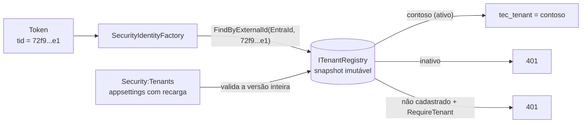

[🏠 TEC.Security](../README.md) › [📚 Documentação](README.md) › 🏢 Tenants

# 🏢 Tenants

> Como cadastrar os tenants da aplicação, vinculá-los aos tenants dos provedores de identidade (ex.: `tid` do Entra ID) e
> liberar ou bloquear um cliente sem reiniciar.

## 📑 Sumário

- [🎯 Visão geral](#-visão-geral)
- [🚀 Uso](#-uso)
  - [Cadastro no appsettings](#cadastro-no-appsettings)
  - [Ler o tenant atual](#ler-o-tenant-atual)
  - [Cadastro em outra fonte](#cadastro-em-outra-fonte)
- [⚙️ Opções](#️-opções)
- [❌ Erros](#-erros)
- [🛡️ Segurança](#️-segurança)
- [❓ Perguntas frequentes](#-perguntas-frequentes)

---

## 🎯 Visão geral



- O tenant **da aplicação** (`contoso`) vem sempre do cadastro, nunca do token, de header ou de query. O id externo
  (`tid`) só serve para encontrá-lo.
- Um tenant pode ter vários ids externos por provedor (ex.: dois tenants do Entra ID da mesma empresa).
- Incluir, desativar ou remover um tenant vale **na próxima requisição**, sem reiniciar, inclusive para sessões do login
  web já abertas.
- Em APIs Entra ID multi-tenant, o cadastro também decide **quais tenants do Entra ID são aceitos** na validação do token
  ([🪪 Provedor Entra ID](provedor-entra-id.md#multi-tenant)).

| Situação | `RequireTenant = false` (padrão) | `RequireTenant = true` |
|---|---|---|
| Id externo cadastrado e ativo | Tenant resolvido | Tenant resolvido |
| Id externo cadastrado e **inativo** | 401 | 401 |
| Id externo não cadastrado | Autentica **sem** tenant (`TenantId = null`) | 401 |
| Sem id externo | Autentica sem tenant | 401 (exceto identidade de sistema) |
| `TenantId` explícito (API key, sistema) inexistente ou inativo | 401 | 401 |

---

## 🚀 Uso

### Cadastro no appsettings

```json
"Security": {
  "RequireTenant": true,
  "Tenants": {
    "contoso": {
      "Name": "Contoso Ltda",
      "Enabled": true,
      "IdentityProviders": { "EntraId": [ "<tenant-id-da-contoso>" ] }
    },
    "fabrikam": {
      "Name": "Fabrikam",
      "Enabled": false,
      "IdentityProviders": { "EntraId": [ "<tenant-id-da-fabrikam>", "<segundo-tenant-id-da-fabrikam>" ] }
    },
    "parceiro-x": {
      "IdentityProviders": { "Test": [ "tenant-de-teste" ] }
    }
  }
}
```

Cada chave é o id do tenant na aplicação. A chave de `IdentityProviders` é o tipo do provedor (`EntraId`, `Test` ou o
`Provider` de um provedor próprio).

### Ler o tenant atual

```csharp
using TEC.Security.Abstractions;

app.MapGet("/tenant", (ICurrentTenant tenant) => new { tenant.Id, Nome = tenant.Info?.Name });

// Liberar um tenant do Entra ID na hora (ex.: tela de administração) = mudar a configuração com recarga
public sealed class PainelTenants(ITenantRegistry tenants)
{
    public bool Ativo(string tenantId) => tenants.Find(tenantId) is { Enabled: true };
}
```

`ICurrentTenant` é Scoped e resolvido a partir da identidade autenticada.

### Cadastro em outra fonte

Para guardar o cadastro no banco, implemente `ITenantRegistry` mantendo os dados **em memória** (as consultas são
síncronas e acontecem a cada autenticação):

```csharp
using System.Collections.Frozen;
using TEC.Security.Abstractions;

public sealed class TenantsDoBanco : ITenantRegistry
{
    private volatile Snapshot _atual = Snapshot.Vazio;

    // Chamado por um BackgroundService que relê a tabela periodicamente (troca o snapshot inteiro)
    public void Atualizar(IEnumerable<(TenantInfo Tenant, string Provider, string ExternalId)> linhas) =>
        _atual = Snapshot.De(linhas);

    public TenantInfo? FindByExternalId(string provider, string externalTenantId) =>
        _atual.PorExterno.TryGetValue($"{provider}\n{externalTenantId}".ToUpperInvariant(), out var t) ? t : null;

    public TenantInfo? Find(string tenantId) => _atual.PorId.GetValueOrDefault(tenantId);

    public IReadOnlySet<string> GetEnabledExternalIds(string provider) =>
        _atual.Ativos.TryGetValue(provider, out var ids) ? ids : FrozenSet<string>.Empty;

    private sealed record Snapshot(
        FrozenDictionary<string, TenantInfo> PorId,
        FrozenDictionary<string, TenantInfo> PorExterno,
        FrozenDictionary<string, FrozenSet<string>> Ativos)
    {
        public static readonly Snapshot Vazio = De([]);

        public static Snapshot De(IEnumerable<(TenantInfo Tenant, string Provider, string ExternalId)> linhas)
        {
            var lista = linhas.ToList();
            return new Snapshot(
                lista.Select(l => l.Tenant).DistinctBy(t => t.Id).ToFrozenDictionary(t => t.Id, StringComparer.OrdinalIgnoreCase),
                lista.ToFrozenDictionary(l => $"{l.Provider}\n{l.ExternalId}".ToUpperInvariant(), l => l.Tenant),
                lista.Where(l => l.Tenant.Enabled).GroupBy(l => l.Provider, StringComparer.OrdinalIgnoreCase)
                    .ToFrozenDictionary(g => g.Key, g => g.Select(l => l.ExternalId).ToFrozenSet(StringComparer.OrdinalIgnoreCase),
                        StringComparer.OrdinalIgnoreCase));
        }
    }
}

builder.Services.AddTecSecurity(builder.Configuration, security => security
    .UseTenantRegistry<TenantsDoBanco>()   // Singleton; Security:Tenants deixa de ser lido
    .AddAspNetCore()
    .AddEntraIdApi("Funcionarios", builder.Configuration.GetSection("Security:EntraId:Api")));
```

> [!IMPORTANT]
> Valide os ids externos antes de montar a chave (só ASCII visível, como `SecurityRules.IsValidUserId`): fora do ASCII,
> `ToUpperInvariant` junta letras diferentes (ex.: `ſ` vira `S`) e um id forjado poderia resolver para o tenant de outro.
> O `ConfigurationTenantRegistry` já faz isso.

---

## ⚙️ Opções

**`TenantOptions`** (seção `Security:Tenants`; `Items` por id da aplicação) → **`TenantDefinition`**

| Chave | Padrão | Descrição |
|---|---|---|
| `Name` | `null` | Nome de exibição (saneado como o nome de usuário) |
| `Enabled` | `true` | Tenant ativo. Inativo: identidades dele não autenticam, inclusive sessões abertas |
| `IdentityProviders` | vazio | Ids externos por tipo de provedor (`EntraId` → lista de `tid`). O mesmo id externo não pode estar em dois tenants |

| Regra de validação | Formato |
|---|---|
| Id do tenant | `SecurityRules.IsValidTenantId`: letras, dígitos, `_ . -`, até 64, começando com letra ou dígito; ids que diferem só por maiúsculas são recusados |
| Tipo do provedor | `SecurityRules.IsValidName` |
| Id externo | `SecurityRules.IsValidUserId` (ASCII visível, 1 a 256) |

**`ITenantRegistry`** (`TEC.Security.Abstractions`, Singleton)

| Método | Descrição |
|---|---|
| `FindByExternalId(string provider, string externalTenantId)` | Tenant vinculado ao id externo (sem diferenciar maiúsculas ASCII), ou `null` |
| `Find(string tenantId)` | Tenant pelo id da aplicação (sem diferenciar maiúsculas), ou `null` |
| `GetEnabledExternalIds(string provider)` | Ids externos dos tenants **ativos** do provedor (usado pela API Entra ID multi-tenant) |

`TenantInfo(string Id, string? Name, bool Enabled)` · `ICurrentTenant` (Scoped): `Id`, `Info`.

`ConfigurationTenantRegistry` (padrão, `IDisposable`): snapshot imutável trocado por inteiro a cada recarga válida;
consultas sem bloqueio.

---

## ❌ Erros

| Erro | Quando ocorre | O que fazer |
|---|---|---|
| `InvalidOperationException` na subida: `Cadastro de tenants (Security:Tenants) inválido: ...` | Id fora do formato, ids que diferem só por maiúsculas, tenant vazio (`null`), provedor fora do formato, id externo vazio ou fora do formato, o mesmo id externo em dois tenants | Corrija o cadastro; a mensagem diz a regra (sem repetir ids externos) |
| Log 3101 (`Error`) na recarga | Mesmas regras, numa versão recarregada | A versão é **recusada** e a anterior continua valendo; corrija o arquivo |
| Log 3100 (`Information`) | Recarga válida aplicada (com a quantidade de tenants) | — |
| 401 `SEGURANCA_TENANT_NAO_PERMITIDO` (no log; para o cliente, 401 genérico) | Tenant inativo, inexistente ou ausente com `RequireTenant` | Ative/cadastre o tenant |

---

## 🛡️ Segurança

> [!CAUTION]
> O cadastro decide quem entra, não **o que** cada um vê: filtre todas as consultas pelo `TenantId` da identidade (filtro
> global no acesso a dados). O TEC.ORM grava o tenant na auditoria, mas não filtra linhas.

> [!WARNING]
> Em APIs multi-tenant, o administrador de cada tenant cliente consegue atribuir **qualquer** app role da sua app aos
> próprios usuários. Use `RolesAsPermissions: false` e deixe permissões privilegiadas só em
> `Security:Permissions:Tenants:<tenant-da-sua-empresa>:Roles`. Enquanto isso não for feito, a API Entra ID registra o
> aviso 3403 na subida.

- Falha fechada na recarga: um `appsettings` quebrado não libera nem bloqueia tenants por engano.
- Para o cliente, tenant não permitido é indistinguível de credencial inválida (401 genérico): não revela quais tenants
  existem.
- Erros de cadastro nunca contêm ids externos.

---

## ❓ Perguntas frequentes

<details>
<summary>Desativei um tenant; as sessões abertas caem?</summary>

Sim. Tokens bearer são recusados na próxima requisição (o emissor e o tenant são conferidos a cada token), e o login web
confere o tenant a cada requisição do cookie.

</details>

<details>
<summary>Posso usar a aplicação sem tenants?</summary>

Sim: deixe `Security:Tenants` vazio e `RequireTenant: false`. As identidades autenticam sem `TenantId`.

</details>

<details>
<summary>Por que minha lista de ids externos ficou misturada entre arquivos?</summary>

O `IConfiguration` mescla listas JSON por índice. Mantenha o cadastro numa única fonte.

</details>

---
⬅️ [👤 Identidade e permissões](identidade-e-permissoes.md) · [📚 Índice](README.md) · [🪪 Provedor Entra ID](provedor-entra-id.md) ➡️
