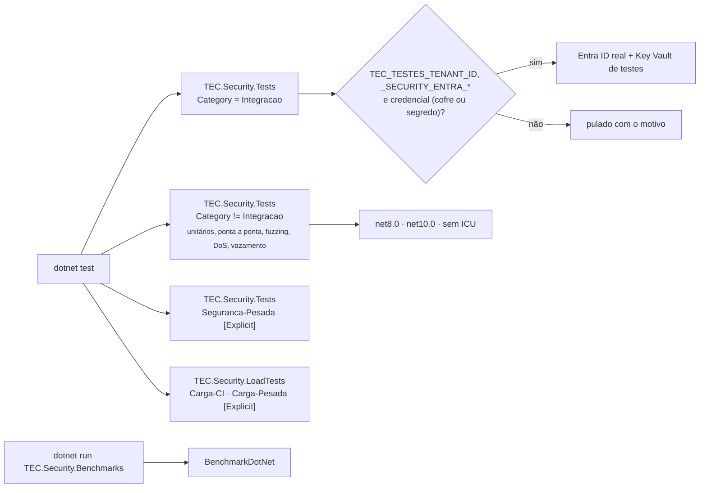

[🏠 TEC.Security](../README.md) › [📚 Documentação](README.md) › 🧪 Testes

# 🧪 Testes

> Como testar a **sua** API protegida com o `TEC.Security.Testing` e como o próprio componente é testado: categorias,
> suítes de segurança, integração com Entra ID e Key Vault reais, carga, benchmarks e as variáveis
> `TEC_TESTES_*`/`TEC_CARGA_*`.

## 📑 Sumário

- [🎯 Visão geral](#-visão-geral)
- [🚀 Uso](#-uso)
  - [Testando a sua API](#testando-a-sua-api)
  - [Rodar localmente](#rodar-localmente)
  - [Suítes](#suítes)
  - [Testes de segurança](#testes-de-segurança)
  - [Integração com Entra ID e Key Vault](#integração-com-entra-id-e-key-vault)
  - [Carga](#carga)
  - [Benchmarks](#benchmarks)
  - [No CI](#no-ci)
  - [Escrevendo novos testes](#escrevendo-novos-testes)
- [⚙️ Opções](#️-opções)
- [❌ Erros](#-erros)
- [🛡️ Segurança](#️-segurança)
- [❓ Perguntas frequentes](#-perguntas-frequentes)

---

## 🎯 Visão geral



| Projeto | Categoria | Conteúdo | Quantidade |
|---|---|---|---:|
| `TEC.Security.Tests` | *(sem categoria)* | Unitários, ponta a ponta (TestServer), regressão, fuzzing (FsCheck), DoS, vazamento, tempo constante rápido | 181 por TFM |
| `TEC.Security.Tests` | `Integracao` | Entra ID e Key Vault reais (pulam sem ambiente) | 2 |
| `TEC.Security.Tests` | `Seguranca-Pesada` | Canais laterais de tempo (teste t de Welch) | 3 |
| `TEC.Security.LoadTests` | `Carga-CI` | Concorrência nos singletons e fumaça de carga HTTP (segundos) | 8 |
| `TEC.Security.LoadTests` | `Carga-Pesada` | Volume, soak, carga sustentada e inundação (minutos) | 6 |
| `TEC.Security.Benchmarks` | — | BenchmarkDotNet do caminho quente (sob demanda) | — |

- Framework: **TUnit** sobre o Microsoft.Testing.Platform (`global.json` → `"test": { "runner": "Microsoft.Testing.Platform" }`),
  com **FsCheck** para as propriedades. Projetos `Exe`, `net8.0` e `net10.0`, fora dos pacotes.
- As categorias ficam numa classe `TestCategories` por projeto: `Integration = "Integracao"` e
  `SecurityHeavy = "Seguranca-Pesada"` em `TEC.Security.Tests`; `LoadCi = "Carga-CI"` e `LoadHeavy = "Carga-Pesada"` em
  `TEC.Security.LoadTests`. A seleção é **sempre por categoria**; os pesados têm `[Explicit]` e só rodam quando a categoria
  é pedida.
- Nomes de teste em inglês, descrevendo o comportamento (`Injected_tec_perm_claim_does_not_grant_permission`).

---

## 🚀 Uso

### Testando a sua API

O pacote **TEC.Security.Testing** emite tokens JWT assinados (RS256) por um par de chaves RSA gerado na memória do processo
de teste, validados com as **mesmas** regras endurecidas dos provedores reais. Nenhuma chave vai para o disco, e o
provedor de teste impede a aplicação de subir fora de Development, Testing e Test.

```csharp
// Program.cs: o emissor de teste só existe quando os testes o definem
using TEC.Security.AspNetCore;
using TEC.Security.DependencyInjection;
using TEC.Security.EntraId;
using TEC.Security.Testing;

builder.Services.AddTecSecurity(builder.Configuration, security =>
{
    security.AddAspNetCore();
    if (Program.TestIssuer is { } emissor)
        security.AddTestJwt(emissor);   // não sobe fora de Development/Testing/Test
    else
        security.AddEntraIdApi("Funcionarios", builder.Configuration.GetSection("Security:EntraId:Api"));
});

public partial class Program
{
    internal static TestTokenIssuer? TestIssuer { get; set; }
}
```

```csharp
// Teste (TUnit + Microsoft.AspNetCore.Mvc.Testing)
using System.Net;
using Microsoft.AspNetCore.Mvc.Testing;
using TEC.Security.Testing;

public sealed class OrdersApiTests
{
    [Test]
    public async Task Manager_cancels_order()
    {
        using var emissor = new TestTokenIssuer();
        Program.TestIssuer = emissor;
        await using var factory = new WebApplicationFactory<Program>().WithWebHostBuilder(web => web.UseEnvironment("Testing"));

        var client = factory.CreateClient();
        client.DefaultRequestHeaders.Authorization = new("Bearer", emissor.CreateToken(t =>
        {
            t.ExternalTenantId = "tenant-de-teste";   // Security:Tenants:*:IdentityProviders:Test
            t.Roles.Add("Gerente");
            t.Scopes.Add("access_as_user");
        }));

        var resposta = await client.DeleteAsync("/pedidos/123");
        await Assert.That(resposta.StatusCode).IsEqualTo(HttpStatusCode.NoContent);
    }
}
```

| Claim do token de teste | Vira |
|---|---|
| `sub` (`Subject`, padrão GUID novo) | `Id` |
| `tid` (`ExternalTenantId`) | Tenant pelo cadastro (`IdentityProviders:Test`) |
| `roles` / `scp` | Papéis / escopos (escopos ignorados em token de aplicação) |
| `idtyp=app` (`IsApplication`) | `Kind = Application` (senão `User`) |
| `name` | `Name` |

Casos de erro: `Lifetime`, `IssuedAt` (token expirado ou ainda não válido), `Audience`/`Issuer` diferentes e
`ExtraClaims` (ex.: tentar injetar `tec_perm`, que é descartado).

### Rodar localmente

```bash
# Unitários (os dois alvos), como no CI
dotnet test --project TEC.Security.Tests --treenode-filter "/*/*/*/*[Category!=Integracao]"

# Um alvo só
dotnet test --project TEC.Security.Tests -f net8.0 --treenode-filter "/*/*/*/*[Category!=Integracao]"

# Sem ICU (como em containers mínimos)
DOTNET_SYSTEM_GLOBALIZATION_INVARIANT=1 dotnet test --project TEC.Security.Tests -f net10.0 --treenode-filter "/*/*/*/*[Category!=Integracao]"

# Integração (se pula sem ambiente)
dotnet test --project TEC.Security.Tests -f net10.0 --treenode-filter "/*/*/*/*[Category=Integracao]"

# Uma classe (assembly/namespace/classe/teste)
dotnet test --project TEC.Security.Tests -f net10.0 --treenode-filter "/*/*/FuzzingTests/*"

# Carga rápida
dotnet test --project TEC.Security.LoadTests -c Release -f net10.0 --treenode-filter "/*/*/*/*[Category=Carga-CI]"
```

```powershell
# PowerShell
$env:DOTNET_SYSTEM_GLOBALIZATION_INVARIANT = "1"; dotnet test --project TEC.Security.Tests -f net10.0 --treenode-filter "/*/*/*/*[Category!=Integracao]"
```

> [!WARNING]
> Não use `-nologo` com `dotnet test` no Microsoft.Testing.Platform: a opção é repassada ao executável de testes, que roda
> **0 testes** e sai com código 5.

> [!NOTE]
> O `TEC.Core` e o `TEC.Vault` vêm do feed `tec-interno` por padrão; entram como projeto só com
> `-p:TecUseLocalProjects=true` e os repositórios vizinhos presentes ([💻 Desenvolvimento local](desenvolvimento.md)).

### Suítes

<details>
<summary>Suítes de <code>TEC.Security.Tests</code></summary>

| Suíte | Rede | O que cobre |
|---|:---:|---|
| `IdentityFactoryTests` | ❌ | Normalização, descarte de `tec_*`, tenant, `RequireTenant`, limites, store de permissões, `RolesAsPermissions`, revalidação |
| `TenantRegistryTests` | ❌ | Cadastro, id externo sem diferenciar maiúsculas, duplicidade, recarga válida e inválida, appsettings |
| `ApiKeyTests` | ❌ | Geração, hash, expiração, formato, log sem segredo, validação do cadastro |
| `HttpSecurityTests` | ❌ | Ponta a ponta: fechado por padrão, 401/403, `alg:none`, HS256, chave/audiência/validade, emissor desconhecido, headers duplicados, tamanho, SignalR, API key, subida, `RunAs` |
| `EntraIdApiTests` | ❌ | Tokens no formato Entra v2: tenant por emissor, cadastro com recarga, ID token, `azp`, v1, aplicação, audiência, instância |
| `WebLoginTests` | ❌ | PKCE, 401 para API, `returnUrl`, cookie endurecido |
| `TokenAndCredentialTests` | ❌ | `AllowedHosts`, cache e renovação, concorrência, client assertion assinada no cofre (falso), credenciais inválidas, código de erro do Entra filtrado |
| `ReviewRegressionTests` | ❌ | Policy pelo `IAuthorizeData`, `PostConfigure`/eventos substituídos, logout de outra origem, permissões por tenant, `RunAs` paralelo, cookies OIDC, header de API key, metadados por HTTP |
| `HardeningRegressionTests` | ❌ | Hash não canônico, Base64Url do Core, cadastro inválido relido 1×/s, nome de exibição (bidi, surrogates), cache de permissões (uma consulta, cancelamento, chave fixa, `null`), `RunAs` entre containers, registro duplicado, renovação com token atual, `Dispose`, limite de escopos, lista de algoritmos, OIDC, endpoint de token, token federado, `TestTokenIssuer` |
| `Security/SecurityRegressionTests` | ❌ | Regressões achadas pelos testes de segurança (id externo fora do ASCII) |
| `Security/Fuzzing/`, `Security/Adversarial/` | ❌ | Veja [Testes de segurança](#testes-de-segurança) |
| `Integration/EntraIdIntegrationTests` | ✅ | Entra ID e Key Vault reais (categoria `Integracao`) |

</details>

### Testes de segurança

Ficam em `TEC.Security.Tests/Security`, sobre a mesma API de referência (`SecuredTestApp`: JWT de teste, API key válida e
expirada, tenant ativo e inativo, `RequireTenant`).

| Classe | Técnica | O que garante |
|---|---|---|
| `Fuzzing/FuzzingTests` | Propriedades com FsCheck (separadores das codificações internas, prefixo `tec_` em várias caixas, controles, homógrafos, `ſ`/`ı`, surrogates soltos) | Formatos iguais a uma implementação de referência; nome de exibição seguro e idempotente; nenhuma API key forjada aceita e qualquer edição de uma válida recusada; normalização nunca lança e nunca aceita `tec_*` injetado; id externo só resolve se igual a um cadastrado; chave do cache injetiva; policy `TEC\|...` faz ida e volta; destino do token só HTTPS no host exato; tokens mutados nunca autorizam nem geram 5xx |
| `Adversarial/DosResistanceTests` | Credenciais gigantes, repetidas ou malformadas, medindo tempo e volume processado | 401 rápido para headers de 1 MB e repetidos; token com milhares de papéis recusado como inflado; JSON aninhado sem 5xx; inundação de `kid` desconhecido rápida; formatos em tempo linear; 1 milhão de papéis recusado sem processar tudo; cache além do limite sem erro |
| `Adversarial/LeakageTests` | Marcador secreto procurado em logs, respostas e exceções; respostas de recusa comparadas | **Sem oráculo** (toda recusa de token e de API key responde igual); token e segredo nunca no log; 403 sem a permissão exigida; `error_description` só em Development; falha do provedor sem detalhes; erros de cadastro sem ids externos nem hashes; injeção de linha impossível |
| `Adversarial/ConstantTimeTests` | Rápido: razão entre lotes em pares. Pesado (`Seguranca-Pesada`): teste t de Welch estilo dudect | API key de id inexistente custa o mesmo que id existente com segredo errado; a posição da diferença não muda o tempo; controle prova que o método detecta `string.Equals` |

```bash
# Testes estatísticos de tempo (≈ 1 min; feche outros programas)
dotnet test --project TEC.Security.Tests -c Release -f net10.0 --treenode-filter "/*/*/*/*[Category=Seguranca-Pesada]" --output detailed
```

> [!NOTE]
> Falha de propriedade do FsCheck mostra o contraexemplo e a semente; reproduza com `Config.QuickThrowOnFailure.WithReplay(...)`.
> `|t|` de Welch acima de 10 indica diferença de tempo detectável. As duas classes passam pelo **mesmo** delegate (um
> delegate por classe é compilado em separado pelo JIT e dava falso vazamento) e cada entrada existe em 64 cópias, em
> posições de memória sorteadas, usadas em rodízio. Exceção: no teste "id existente × inexistente" o critério é a
> diferença relativa das médias (< 5%), não o `|t|`: o id não é segredo e a busca no `Dictionary` (acerto × falha)
> difere por natureza em poucos nanossegundos; o que precisa ser igual é o SHA-256 e a comparação do segredo.

### Integração com Entra ID e Key Vault

`Integration/EntraIdIntegrationTests` obtém um token real de aplicação (client credentials) e chama uma API protegida por
`AddEntraIdApi`, validada com o JWKS real:

| Teste | Garante |
|---|---|
| `Real_application_token_is_accepted_by_the_API_and_normalized` | Token real aceito e normalizado (`Application`, client id, tenant, app role) e nunca registrado em log |
| `Real_token_issued_for_another_audience_is_rejected` | Token real de outra audiência recusado |

A credencial da aplicação cliente vem primeiro do **Key Vault de testes** (certificado, com a client assertion assinada
dentro do cofre, ou segredo); com o cofre offline, de um segredo local entregue ao TEC.Vault em memória. Cada valor é
procurado nesta ordem: variável de ambiente → `dotnet user-secrets` (id `tudoemcodigo-tec-testes`, seção `TecTestes`) →
`appsettings.Local.json` na saída do projeto (ignorado pelo git). Sem configuração, os testes **se pulam** com o motivo.

```bash
# Uma vez por máquina (o mesmo id de user-secrets vale para todos os lib-tec-*)
az login --tenant <tenant-id>
dotnet user-secrets set TecTestes:TenantId <tenant-id> --id tudoemcodigo-tec-testes
dotnet user-secrets set TecTestes:VaultUri https://<cofre-de-testes>.vault.azure.net/ --id tudoemcodigo-tec-testes
dotnet user-secrets set TecTestes:Entra:ApiClientId <client-id-da-api-de-testes> --id tudoemcodigo-tec-testes
dotnet user-secrets set TecTestes:Entra:ClientId <client-id-do-cliente-de-testes> --id tudoemcodigo-tec-testes
dotnet user-secrets set TecTestes:Entra:CertificateName <certificado-no-cofre> --id tudoemcodigo-tec-testes
dotnet user-secrets set TecTestes:Entra:Role <app-role-concedido> --id tudoemcodigo-tec-testes
```

| Recurso | Permissão mínima |
|---|---|
| Cofre exclusivo de testes | Identidade do `az login` (ou do OIDC no CI): **Key Vault Certificate User** + **Crypto User** (certificado) ou **Secrets User** (segredo) |
| API de testes (app registration) | App role para aplicações (opcional, conferido nas permissões) |
| Aplicação cliente de testes | Permissão de aplicação na API, com *admin consent* |

O acesso ao cofre usa as credenciais do desenvolvedor (Azure CLI); no CI, o `az login` federado feito pelo workflow.

### Carga

`TEC.Security.LoadTests` usa a `SecuredApiHost`: API protegida pelo TEC.Security em **Kestrel real** (`127.0.0.1`), com JWT
de teste, API key e um store de permissões que simula o banco. Cada cenário tem o status esperado; qualquer outro conta
como erro, **inclusive um ataque que passe**.

| Legítimos | Hostis (todos 401) |
|---|---|
| `jwt-autorizado` (usuários distintos) · `jwt-negado` (403) · `api-key` · `publico` | `sem-credencial` · `token-adulterado` · `token-expirado` · `token-outra-chave` · `token-alg-none` · `token-gigante` · `api-key-invalida` · `api-key-id-desconhecido` |

| Teste | Categoria | O que garante |
|---|---|---|
| `ConcurrencyTests` (7): `ApiKeyValidator_*`, `IdentityFactory_*`, `PermissionCache_ConcurrentMisses_FewSourceQueries`, `TenantRegistry_ReadsDuringReloads_*`, `ServiceTokenProvider_SingleAcquisitionPerScopeSet_*`, `AccessTokenHandler_*`, `SecurityContext_ParallelRunAs_*` | Carga-CI | Resultado concorrente igual ao sequencial; nenhuma identidade com tenant/permissão de outra; versão inválida do cadastro nunca em uso; um token por conjunto de escopos; token nunca para destino proibido |
| `SmokeLoad_AllScenarios_ExpectedStatusOnly` | Carga-CI | Fumaça de carga HTTP em todos os cenários, zero erros |
| `SustainedLoad_ErrorRateLatencyAndPermissionCacheWithinLimits` | Carga-Pesada | Carga sustentada (`TEC_CARGA_API_SEGUNDOS`): zero erros, p99 e memória dentro dos limites, poucas consultas ao store |
| `HostileFlood_DoesNotStarveLegitimateTraffic` | Carga-Pesada | 80% de credenciais forjadas: nenhum ataque aceito, nenhuma requisição legítima recusada |
| `TenantRegistry_LargeCatalog_BuildLookupAndReload` | Carga-Pesada | Cadastro com `TEC_CARGA_TENANTS` tenants: montagem, consultas e recarga com leituras simultâneas |
| `PermissionCache_ManyDistinctIdentities_MemoryBounded` | Carga-Pesada | `TEC_CARGA_IDENTIDADES` identidades: memória para de crescer no limite de 50.000 |
| `InflatedIdentities_AtAndAboveItemLimit` | Carga-Pesada | 512 itens aceitos; acima, recusado rápido |
| `MixedWorkload_MemoryHandlesAndThroughputStayStable` | Carga-Pesada | Soak (`TEC_CARGA_SOAK_SEGUNDOS`): memória, handles e vazão estáveis |

```bash
# Pesados com os padrões (≈ 6 min), com relatório Markdown
TEC_CARGA_RELATORIOS=./relatorios \
  dotnet test --project TEC.Security.LoadTests -c Release -f net10.0 --treenode-filter "/*/*/*/*[Category=Carga-Pesada]"

# Soak de 10 minutos
TEC_CARGA_SOAK_SEGUNDOS=600 dotnet test --project TEC.Security.LoadTests -c Release -f net10.0 --treenode-filter "/*/*/SoakTests/*"
```

Os pesados rodam um de cada vez (`[NotInParallel]`), porque medem memória e vazão do processo. Cada um escreve o relatório
na saída do teste e, com `TEC_CARGA_RELATORIOS`, acrescenta em `carga.md` nessa pasta (o CI publica no resumo).

<details>
<summary>Resultados de referência (06/10/2026, Windows 11, 32 núcleos lógicos, .NET 10, Release)</summary>

Ordem de grandeza, não meta: os testes só falham em regressões grosseiras.

| Cenário | Resultado |
|---|---|
| API protegida, 64 conexões, 12 cenários | ~100 mil req/s, p50 0,3 ms, p99 4,3 ms, zero erros |
| Inundação com 80% de credenciais forjadas | ~90 mil req/s, todos os ataques recusados; p99 legítimo 4,8 → 5,6 ms |
| Soak em processo, carga mista | ~45–60 mil op/s; memória retida estável (~40 MB) |
| Cadastro com 100 mil tenants | Montagem 0,3 s; ~1,8 milhão de consultas/s; ~460 bytes por tenant |
| Cache de permissões com 200 mil identidades | ~420 mil normalizações/s; memória estável depois de 50 mil entradas |
| Tempo constante da API key | `\|t\|` ≈ 2 (id existente × inexistente); controle `string.Equals` ≈ 700–1.100 |

</details>

### Benchmarks

`TEC.Security.Benchmarks` (BenchmarkDotNet) não faz parte do `dotnet test`: rode sempre em **Release**.

| Classe | Mede |
|---|---|
| `ApiKeyBenchmarks` | Geração; validação aceita, com segredo errado, com id desconhecido (devem empatar) e malformada |
| `IdentityBenchmarks` | Normalização típica e inflada (512 itens), revalidação de sessão, leitura do `SecurityUser` |
| `TenantBenchmarks` | `FindByExternalId`, `Find` e montagem do cadastro, com 10 e 10 mil tenants |
| `ServiceTokenBenchmarks` | Token de serviço do cache, conferência de destino e envio pelo `AccessTokenHandler` |
| `RulesBenchmarks` | Validação de nomes, ids e nome de exibição, inclusive entrada hostil |
| `HttpPipelineBenchmarks` | Requisição completa em TestServer: anônima, JWT autorizado, 403, assinatura inválida, API key, sem credencial |

```bash
dotnet run -c Release --project TEC.Security.Benchmarks -f net10.0 -- --filter "*"
dotnet run -c Release --project TEC.Security.Benchmarks -f net10.0 -- --filter "*ApiKey*" --runtimes net8.0 net10.0
dotnet run -c Release --project TEC.Security.Benchmarks -f net10.0 -- --filter "*Http*" --job short
```

Resultados em `BenchmarkDotNet.Artifacts/results`. No CI, só pelo `performance.yml` manual (opção `benchmarks`).

### No CI

| Evento | Testes | Workflow |
|---|---|---|
| Pull request / merge queue | Unitários (`net10.0` com cobertura, `net8.0`, sem ICU) e `Integracao` (se pula: sem OIDC em PR) | `ci.yml` |
| `main` (push, agendado segunda 06:00 UTC / manual) | Os mesmos, com Entra ID e Key Vault reais via OIDC; no push, depois do `ci-ok`, a prévia é publicada | `ci.yml` |
| Manual (**Performance**) | `suite` = `pesadas` (padrão: `Carga-Pesada` + `Seguranca-Pesada`), `rapida` (`Carga-CI`) ou `todas`; benchmarks opcionais | `performance.yml` |
| Publicar versão | Só os unitários (matriz + cobertura), antes da tag | `release.yml` |

Os testes de carga e os `Seguranca-Pesada` não rodam no PR nem na publicação: tempo de parede em runner compartilhado é
ruidoso e não pode bloquear PR nem versão.

Variables e parâmetros: [⚙️ CI/CD](../.github/workflows/README.md).

### Escrevendo novos testes

- Correção de segurança ganha teste de regressão (em `Security/SecurityRegressionTests` ou `HardeningRegressionTests`);
  entrada não confiável nova ganha uma propriedade em `FuzzingTests` e, se houver limite de tamanho, um caso em
  `DosResistanceTests`.
- Toda recusa nova precisa responder igual às existentes: inclua o caso em `LeakageTests.Rejected*`.
- Singleton novo ou estado compartilhado: um teste em `ConcurrencyTests` comparando o resultado concorrente com o
  sequencial.
- Teste de tempo, memória ou vazão: rápido e com limites folgados → `Carga-CI`; longo ou sensível à máquina →
  `[Explicit]`, `Carga-Pesada` (ou `Seguranca-Pesada`) e `[NotInParallel(LoadSettings.HeavyExclusiveKey)]`.
- Cenário HTTP novo: acrescente em `SecurityScenarios` com o status esperado.
- Use as constantes de `TestCategories`, nunca a string da categoria.

---

## ⚙️ Opções

| Variável | Chave (user-secrets / `appsettings.Local.json`) | Padrão | Uso |
|---|---|---|---|
| `TEC_TESTES_TENANT_ID` | `TecTestes:TenantId` | nenhum (pula) | Tenant do Entra ID (compartilhada pelos componentes) |
| `TEC_TESTES_VAULT_URI` | `TecTestes:VaultUri` | nenhum | Key Vault de testes com a credencial da aplicação cliente |
| `TEC_TESTES_SECURITY_ENTRA_API_CLIENT_ID` | `TecTestes:Entra:ApiClientId` | nenhum (pula) | App registration da API de testes |
| `TEC_TESTES_SECURITY_ENTRA_CLIENT_ID` | `TecTestes:Entra:ClientId` | nenhum (pula) | App registration da aplicação cliente |
| `TEC_TESTES_SECURITY_ENTRA_CERTIFICATE_NAME` | `TecTestes:Entra:CertificateName` | nenhum | Certificado da aplicação cliente no cofre (preferido) |
| `TEC_TESTES_SECURITY_ENTRA_CLIENT_SECRET_NAME` | `TecTestes:Entra:ClientSecretName` | nenhum | Segredo da aplicação cliente no cofre (alternativa) |
| `TEC_TESTES_SECURITY_ENTRA_CLIENT_SECRET` | `TecTestes:Entra:ClientSecret` | nenhum | Fallback com o cofre offline: valor do segredo, entregue ao TEC.Vault em memória (certificado não tem fallback) |
| `TEC_TESTES_SECURITY_ENTRA_ROLE` | `TecTestes:Entra:Role` | nenhum | App role esperado nas permissões |
| `TEC_TESTES_SECURITY_ENTRA_ACCEPT_V1` | `TecTestes:Entra:AcceptV1` | `false` | API que ainda emite tokens v1 |
| `TEC_CARGA_SOAK_SEGUNDOS` | — | `120` | Duração do soak |
| `TEC_CARGA_API_SEGUNDOS` | — | `60` | Duração da carga sustentada na API |
| `TEC_CARGA_API_CONCORRENCIA` | — | `64` | Conexões simultâneas na carga sustentada e na inundação |
| `TEC_CARGA_TENANTS` | — | `100000` | Tenants no teste de volume do cadastro |
| `TEC_CARGA_IDENTIDADES` | — | `200000` | Identidades no teste de volume do cache |
| `TEC_CARGA_RELATORIOS` | — | nenhum | Pasta onde os testes de carga acrescentam `carga.md` (o CI define e publica) |
| `DOTNET_SYSTEM_GLOBALIZATION_INVARIANT` | — | — | `1` roda sem ICU |

Valores `TEC_CARGA_*` inválidos ou vazios usam o padrão.

> [!NOTE]
> Variáveis antigas **removidas**: `TEC_TESTES_INTEGRACAO`, `TEC_SECURITY_ENTRA_INTEGRACAO` (não há mais liga/desliga: a
> seleção é por categoria) e `TEC_SECURITY_ENTRA_*`, renomeadas para `TEC_TESTES_SECURITY_ENTRA_*`.

---

## ❌ Erros

| Sintoma | Quando ocorre | O que fazer |
|---|---|---|
| `dotnet test` roda **0 testes** e sai com código 5 | `-nologo` (ou filtro que não casa nada) | Remova `-nologo`; confira o `--treenode-filter` |
| Integração pulada: `Integração Entra ID não configurada: defina TEC_TESTES_TENANT_ID, TEC_TESTES_SECURITY_ENTRA_API_CLIENT_ID e ...` | Faltam tenant ou app registrations | Configure as variáveis ou o user-secrets |
| Integração pulada: `Sem credencial da aplicação cliente (Key Vault: ...)` | Cofre não configurado, inacessível, sem o item ou sem `CertificateName`/`ClientSecretName`, e sem segredo local | Leia o motivo do cofre; `az login`; papéis no cofre; ou defina o segredo local |
| Os pesados não rodam | `[Explicit]`: só com a categoria | `--treenode-filter "/*/*/*/*[Category=Carga-Pesada]"` |
| Teste de tempo/memória falhou uma vez | CPU disputada (os dois alvos em paralelo, outros programas) | Repita em Release com `-f net10.0` e a máquina ociosa |
| `HTTP 431` num cenário de carga | Header acima do limite do Kestrel (32 KB) | Cenários de token grande ficam entre `MaxTokenLength` e o limite do Kestrel |
| Testes `net8.0` não rodam | Runtimes .NET 8 / ASP.NET Core 8 ausentes | Instale-os ou use `-f net10.0` |

---

## 🛡️ Segurança

> [!CAUTION]
> Use app registrations e cofre **exclusivos de testes**, sem dados reais e sem permissões em recursos de produção.

- A identidade de CI (OIDC) só existe na `main`, fora de pull request; em PR os testes de integração se pulam.
- Nenhum recurso real tem valor padrão no código: sem configuração, o teste se pula com o motivo.
- O `TestTokenIssuer` gera a chave na memória do processo e não grava nada; `AddTestJwt` impede a subida em produção.

---

## ❓ Perguntas frequentes

<details>
<summary>Como testo um usuário de outro tenant ou um token expirado?</summary>

`emissor.CreateToken(t => { t.ExternalTenantId = "outro"; t.IssuedAt = DateTimeOffset.UtcNow.AddHours(-1); })`. Para um
relógio controlado, passe um `TimeProvider` falso no construtor: `new TestTokenIssuer(time: fakeTime)`.

</details>

<details>
<summary>Posso usar o <code>TestTokenIssuer</code> com um emissor e audiência próprios?</summary>

Sim: `new TestTokenIssuer("https://emissor.meu-teste/", "api://minha-api")`. Valores vazios lançam `ArgumentException`.
Depois do `Dispose`, `CreateToken` lança `ObjectDisposedException`.

</details>

<details>
<summary>Por que os testes de integração aparecem como pulados no meu PR?</summary>

O login OIDC no Azure só acontece na `main`, fora de pull request; sem ele, as variáveis do Entra ID e do cofre não chegam
aos testes.

</details>

---
⬅️ [🛡️ Segurança](seguranca.md) · [📚 Índice](README.md) · [💻 Desenvolvimento local](desenvolvimento.md) ➡️
