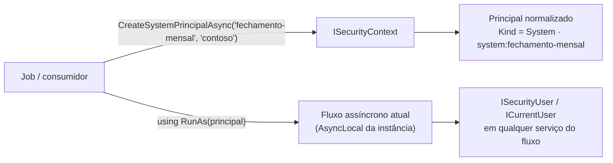

[🏠 TEC.Security](../README.md) › [📚 Documentação](README.md) › 🤖 Workers

# 🤖 Workers, jobs e mensageria

> Como definir **quem** executa uma operação fora de uma requisição HTTP (jobs, consumidores de fila, `BackgroundService`)
> com uma identidade de sistema que nenhum token externo consegue forjar.

## 📑 Sumário

- [🎯 Visão geral](#-visão-geral)
- [🚀 Uso](#-uso)
  - [Identidade de sistema](#identidade-de-sistema)
  - [Mensagens com usuário](#mensagens-com-usuário)
  - [TEC.Cqrs fora do HTTP](#teccqrs-fora-do-http)
- [⚙️ Opções](#️-opções)
- [❌ Erros](#-erros)
- [🛡️ Segurança](#️-segurança)
- [❓ Perguntas frequentes](#-perguntas-frequentes)

---

## 🎯 Visão geral



- `ISecurityContext` é Singleton. A identidade de `RunAs` vale para o fluxo assíncrono que o chamou e tem precedência
  sobre o `HttpContext.User` até o `IDisposable` ser descartado; escopos podem ser aninhados.
- O estado (`AsyncLocal`) é **por instância** do container: dois hosts no mesmo processo (ex.: testes paralelos, hosts lado
  a lado) não enxergam a identidade um do outro.
- `ISecurityUser`/`ICurrentUser` leem o principal a cada acesso: o mesmo escopo de DI acompanha as trocas de `RunAs`, e
  fluxos paralelos no mesmo escopo (ex.: `RunAs` dentro de `Parallel.ForEachAsync`) não misturam identidades.

---

## 🚀 Uso

### Identidade de sistema

```csharp
using TEC.Security.Abstractions;
using TEC.Security.DependencyInjection;

builder.Services.AddTecSecurity(builder.Configuration);   // worker puro: AddAspNetCore não é necessário
builder.Services.AddHostedService<FechamentoJob>();

public sealed class FechamentoJob(ISecurityContext seguranca, IServiceScopeFactory scopes) : BackgroundService
{
    protected override async Task ExecuteAsync(CancellationToken stoppingToken)
    {
        var sistema = await seguranca.CreateSystemPrincipalAsync("fechamento-mensal", tenantId: "contoso",
            roles: ["pedidos:fechar"], cancellationToken: stoppingToken);
        if (sistema.IsFailure)
            throw new InvalidOperationException(sistema.Error!.Message);

        using (seguranca.RunAs(sistema.Value))
        {
            await using var scope = scopes.CreateAsyncScope();
            await scope.ServiceProvider.GetRequiredService<FechamentoService>().ExecutarAsync(stoppingToken);
            // ICurrentUser.Id = "system:fechamento-mensal", Kind = System, TenantId = "contoso"
        }
    }
}
```

| Característica | Detalhe |
|---|---|
| Id | `system:{serviceName}` (minúsculas, dígitos e hífen, 3 a 40) |
| Esquema e provedor | `System` |
| Tenant | Opcional; se informado, precisa existir e estar ativo. `RequireTenant` não se aplica a sistema |
| Papéis | Convertidos em permissões como os de qualquer identidade (`IPermissionStore`, `RolesAsPermissions`) |
| `[TecAuthorize]` | Aceita `System` só com `Kinds = TecPrincipalKinds.System` ou `Any` |
| Fim do escopo | Ao descartar, volta a identidade anterior; tarefas filhas que continuam depois do escopo também deixam de vê-la |

### Mensagens com usuário

Para processar uma mensagem "em nome" de quem a enviou, transporte **id e tenant** (nunca o token, que expira e não deve
ir para filas) e execute como sistema, registrando o usuário original como dado de auditoria da mensagem. Se a fila exige
autorização por usuário, valide no **produtor** (que tinha o token) e trate a mensagem como comando confiável.

```csharp
public sealed record PedidoCriado(Guid PedidoId, string TenantId, string CriadoPor);

public async Task ConsumirAsync(PedidoCriado mensagem, CancellationToken cancellationToken)
{
    var sistema = await seguranca.CreateSystemPrincipalAsync("consumidor-pedidos", mensagem.TenantId,
        cancellationToken: cancellationToken);
    using (seguranca.RunAs(sistema.Value))
        await faturamento.FaturarAsync(mensagem.PedidoId, solicitante: mensagem.CriadoPor, cancellationToken);
}
```

### TEC.Cqrs fora do HTTP

O `[AuthorizeRequest]` do TEC.Cqrs lê o `IPrincipalAccessor` (`TEC.Cqrs.Authorization`). Este accessor lê o
`ISecurityUser`, que enxerga a identidade do `RunAs` e, fora dele, o `HttpContext.User`:

```csharp
using System.Security.Claims;
using TEC.Cqrs.Authorization;
using TEC.Security.Abstractions;

internal sealed class SecurityPrincipalAccessor(ISecurityUser usuario) : IPrincipalAccessor
{
    public ClaimsPrincipal? Principal => usuario.Principal;
}
```

| Aplicação | Registro |
|---|---|
| Worker puro (sem TEC.Cqrs.AspNetCore) | `builder.Services.AddScoped<IPrincipalAccessor, SecurityPrincipalAccessor>();` |
| API só HTTP | Nada: o `.AddAspNetCore()` do TEC.Cqrs já usa o `HttpContext.User`, que é a identidade normalizada |
| API com worker no mesmo processo | `builder.Services.Replace(ServiceDescriptor.Scoped<IPrincipalAccessor, SecurityPrincipalAccessor>());` **depois** do `.AddAspNetCore()` do TEC.Cqrs |

> [!WARNING]
> Na API com worker, o accessor do `.AddAspNetCore()` do TEC.Cqrs lê só o `HttpContext.User`, que não existe no
> `BackgroundService`: os `Send`s com `[AuthorizeRequest]` do worker retornam 401 mesmo dentro de `RunAs`. Registrar o
> accessor **antes** do `.AddAspNetCore()` faz a subida falhar, e `ReplaceExistingPrincipalAccessor = true` faz o contrário
> do desejado; use `Replace` depois.

---

## ⚙️ Opções

**`ISecurityContext`** (`TEC.Security.Abstractions`, Singleton)

| Membro | Retorno | Descrição |
|---|---|---|
| `Current` | `ClaimsPrincipal?` | Identidade definida para o fluxo atual |
| `RunAs(ClaimsPrincipal principal)` | `IDisposable` | Executa o fluxo atual com `principal` (só principais normalizados pelo TEC.Security) |
| `CreateSystemPrincipalAsync(string serviceName, string? tenantId = null, IEnumerable<string>? roles = null, CancellationToken cancellationToken = default)` | `Task<Result<ClaimsPrincipal>>` | Identidade `System`, opcionalmente num tenant ativo, com os papéis informados |

Origem do principal lido por `ISecurityUser`, nesta ordem: `RunAs` → `HttpContext.User` (com `AddAspNetCore`).

---

## ❌ Erros

| Erro | Quando ocorre | O que fazer |
|---|---|---|
| `SEGURANCA_ENTRADA_INVALIDA` (`Field` = `serviceName` ou `tenantId`) | Nome fora do formato; tenant fora do formato. A mensagem nunca repete o valor | Corrija o nome (minúsculas, dígitos e hífen, 3 a 40) |
| `SEGURANCA_TENANT_NAO_PERMITIDO` | Tenant inexistente ou inativo | Cadastre/ative o tenant |
| `SEGURANCA_NAO_AUTENTICADO` | Mais de 512 papéis ou permissões | Reduza os papéis |
| `SEGURANCA_PROVEDOR_INDISPONIVEL` | O `IPermissionStore` falhou | Verifique a fonte de permissões |
| `InvalidOperationException` | `RunAs` com principal não criado pelo TEC.Security | Use `CreateSystemPrincipalAsync` ou o `HttpContext.User` autenticado |
| `ArgumentNullException` | `RunAs(null)` | — |

---

## 🛡️ Segurança

> [!IMPORTANT]
> `PrincipalKind.System` só existe dentro do processo: provedores só criam `User` ou `Application`, e claims `tec_*` vindos
> de tokens são descartados. Mesmo assim, dê à identidade de sistema só os papéis de que o job precisa.

- `RunAs` recusa principais "montados à mão" (sem a marca de normalização).
- Nunca coloque tokens em mensagens de fila: transporte id e tenant.
- Use nomes de serviço distintos por job (`fechamento-mensal`, `consumidor-pedidos`): a auditoria (`CreatedBy`) mostra
  quem fez.

---

## ❓ Perguntas frequentes

<details>
<summary>Posso usar <code>RunAs</code> dentro de uma requisição HTTP?</summary>

Sim: a identidade do `RunAs` tem precedência sobre o `HttpContext.User` até o escopo ser descartado. Útil para um trecho
que precisa rodar como sistema (ex.: tarefa administrativa disparada pelo usuário).

</details>

<details>
<summary>O worker com TEC.Cqrs recebe 401 mesmo dentro de <code>RunAs</code>.</summary>

Registre o `SecurityPrincipalAccessor` com `services.Replace(...)` **depois** do `.AddAspNetCore()` do TEC.Cqrs (veja
[TEC.Cqrs fora do HTTP](#teccqrs-fora-do-http)).

</details>

---
⬅️ [🔑 API keys](api-keys.md) · [📚 Índice](README.md) · [🧱 Novo provedor](novo-provedor.md) ➡️
